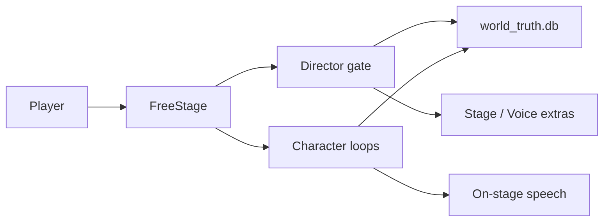

# Causal Anew

《不如我们从头来过》——把已完结长篇《存在的意义：因果之外》做成可玩的 AI 原生叙事。

玩家自由文本进场；角色按知情与记忆自己说话；导演是冷的世界接口，把行动收束回正典节点。真值只在 `data/world_truth.db`。

仓库：<https://github.com/killbynothing/causal-anew>

## 怎么分工

| 层 | 职责 |
|---|---|
| 真值库 | 正典事实。run=0 只读，run≥1 只追加 |
| 角色环 | 要活。Decide → 开口 → Reflect，有边界、能拒绝 |
| 导演闸 | 要冷。四端口 + 闭集招；不写主卡台词，不加入感情 |
| 硬闸 | 固定底与四支柱不走 LLM |



## 目录

| 路径 | 内容 |
|---|---|
| `data/` | 真值库与 SQL dump |
| `source/` | 原著文本（只读） |
| `corpus/` | 声纹摘句 |
| `contracts/` | 节点契约 |
| `runtime/` | 运行时（角色环、导演闸、场卡） |
| `c1_web_console/` | 玩家舱与观测台（历史目录名，暂不改以免断路径） |
| `scripts/` | 入库、校验、`verify.py` |
| `design/` | 架构备忘 |
| `docs/` | 计划与索引，见 [docs/README.md](docs/README.md) |
| `analysis/` | 原著细剖表，见 [analysis/README.md](analysis/README.md) |
| `play_logs/` | 人验记录 |

规则与当日进度：`AGENTS.md`、`STATUS.md`。Git 纪律：`GIT工作流_GIT_WORKFLOW.md`。

## 运行

需要 Python 3.10+。控制台密钥放在 `c1_web_console/config.json`（不入库，可从 `config.example.json` 复制）。

```bash
python scripts/import_db.py
python scripts/mech_invariant_suite.py --db data/world_truth.db
python scripts/verify.py --quick
python c1_web_console/server.py
```

浏览器打开控制台（默认本机端口见该目录说明）。现玩场：龙也咖啡馆闪回、天安门开场。

## 状态

机制：导演闸刀 1 已接（主卡词不由导演写；店员薄声走 Voice）。周目登记与关局回执未接。角色环仍在人验。

默认分支上的目录页若还停在一周前的提交，看分支 `loop/director-gate-2026-08-14`，或等合入 `main`。
