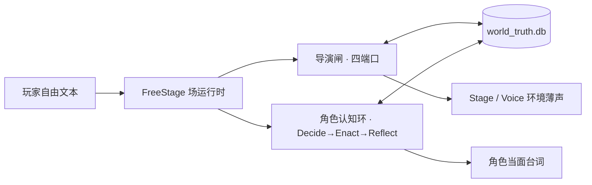

# Causal Anew（不如我们从头来过）

> 把已完结长篇《存在的意义：因果之外》做成可玩的 AI 原生叙事。
> 玩家自由文本进场；角色按知情与记忆自己说话；导演是冷的世界接口，把行动收束回正典节点。

仓库：<https://github.com/killbynothing/causal-anew>

---

## 为什么做这个

当前大模型角色扮演有三个没解决的问题：

1. **角色无内心**——收到输入直接输出对白，没有人类社交中的心理权衡和事后反思。说出来的话永远是即时反应，不是经过思考的回应。
2. **多人场抢话**——几个 NPC 同时在场时，每人都秒回长篇大论。真实社交里的附和（"嗯"）、侧聊、沉默观察全部丢失。
3. **世界失真**——所有人设塞在一个 Prompt 里，角色在长对话中性格漂移、知晓不该知道的剧情、无原则顺从玩家。

本项目的做法：把 LLM 拆成**独立自治的角色认知环**和**冷酷控场的导演闸**，用真值数据库而非 Prompt 守住世界因果。

---

## 核心设计决策

**1. 角色要活，导演要冷**

角色走 `Decide → Enact → Reflect` 认知三拍：拍前内心权衡要不要说、怎么说；拍中按声纹和已知事实开口；拍后产生私有反思并更新关系账本。

导演绝不写角色台词——试过让导演代写，所有角色说话一个味。拆开后角色自己开口；导演只能递咖啡、敲钟、引入路人、收窗、静默。

**2. 分层装配，正交解耦**

拒绝把所有人设塞进一段文本。角色状态拆成正交层次：

| 层 | 内容 | 变化速度 |
|---|---|---|
| PersonaCore | 5-7 句不可覆写的人格底色 | 从不变 |
| RelBaseline | 对各人物的信任阈值与禁忌 | 极慢 |
| KnowledgeSlice | 按 `learn_ch ≤ current_ch` 截断的知识 | 每场变 |
| MemoryRecall | 语义+情绪 Top-K 召回的情景记忆 | 每拍变 |
| WantNow / Affect | 即时意图与情绪 | 每拍变 |

**3. 对话要像人**

多人场里 NPC 一句话同时质问身份、索要物品、评价外貌——这不像人，所以单回合只允许一个意图。配角不该跟主角一起长篇大论，所以主对话和轻声附和拆成两条通道。玩家心里想的，NPC 物理上听不见。

**4. 确定性硬闸优先**

核心因果（四支柱法则、不可逆生死、关键道具流转）用 Python 断言和数据库约束实现，不交给概率模型。Goodhart 护栏：不准为了测试变绿而删测试或放宽阈值。

→ 详见 [Design Philosophy & Lessons](docs/design-philosophy.md)

---

## 从 Badcase 到机制

| 现象 | 根因 | 解法 |
|---|---|---|
| NPC 反复自我介绍 | 事实检测依赖双全名匹配，写入时机先于去重查询 | `solidified_facts` + 半截谓词检测 |
| 开场每次说同一句话 | 固定模板牺牲了涌现 | 角色包驱动即兴生成 + Voice 约束 |
| 多人场三个 NPC 轮流长篇大论 | 无话轮竞价和主次位判定 | `MAX_BID_SPEAKERS=1` + Companion 侧聊分流 |
| NPC 能读到玩家内心 | 上下文组装混入 Thought | `thought_delta` 物理通道隔离 |
| 所有角色说话口吻一样 | Prompt 只给"性格温柔"等形容词 | 原著行号锚定声纹语料库 |

---

## 架构



---

## 目录

| 路径 | 内容 |
|---|---|
| `data/` | 真值库（SQLite）与 SQL dump |
| `source/` | 原著文本（只读） |
| `corpus/` | 原著精确到行号的声纹摘句 |
| `contracts/` | 节点 Storylet 契约 |
| `runtime/` | 运行时：角色环、导演闸、话轮流、场卡 |
| `web/` | 玩家舱、观测台、本地服务端 |
| `scripts/` | 入库、校验、`verify.py` 心跳自检 |
| `design/` | 宪章级设计备忘 |
| `docs/` | 计划、索引与演进记录，见 [docs/README.md](docs/README.md) |
| `analysis/` | 原著细剖事件表，见 [analysis/README.md](analysis/README.md) |
| `play_logs/` | 人验记录（纳入 git） |

规则与当日进度：`AGENTS.md`、`STATUS.md`。

---

## 运行

Python 3.10+，无重量级外部依赖。

```bash
python scripts/import_db.py                                      # 初始化真值库
python scripts/mech_invariant_suite.py --db data/world_truth.db  # 四支柱断言 12/12
python scripts/verify.py --quick                                 # 心跳自检 30 PASS / 0 FAIL
cp web/config.example.json web/config.json                       # 填入模型 API Key
python web/server.py                                             # 启动本地控制台
```

浏览器打开 `http://127.0.0.1:8000/observer.html`（观测台）或 `player.html`（玩家舱）。

现玩场：龙也咖啡馆闪回、天安门开场。

---

## 工程纪律

- **不许编**——入库内容必须出自原著，带精确行号
- **可审**——角色 Seed 与关系变动入库前提供 diff 预览，人裁才入
- **报账**——每轮迭代单列"哪里是 AI 编的"，目标零编造
- **Goodhart 护栏**——不为变绿删测试

---

## 状态

咖啡馆闪回和天安门广场两场可玩，人验进行中。
