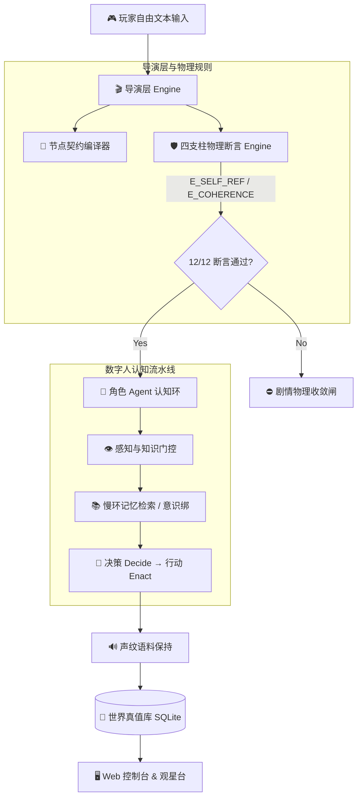

# Causal Anew (不如我们从头来过) — AI-Native Narrative Engine

仓库：[`killbynothing/causal-anew`](https://github.com/killbynothing/causal-anew)

<p align="center">
  
  
  
  
  
</p>

> **打破第四面墙的 AI 原生叙事游戏引擎**  
> 基于长篇小说《存在的意义：因果之外》，将文本叙事重构为由物理断言与数字人认知环驱动的“活世界”。

---

## 💡 核心设计哲学 (Core Philosophy)

* 🌌 **导演 = 剧中反派 (Director as Antagonist)**  
  打破第四面墙的后台控制机制，其本身就是剧情中干涉时空与因果的对立力量。
* ⚛️ **库赢原则 (Truth Source Single Point)**  
  `world_truth.db` 是宇宙唯一的真值源。没有任何 LLM 可以凭空捏造事实，所有意识、记忆与状态转移必须挂钩权威账本。
* 🔒 **确定性硬闸 (Four Pillars Invariants)**  
  核心因果收敛节点（如不可逆事件）拒绝走 LLM 软性提示词调优，由编译级四支柱物理断言强行约束。

---

## 🏗️ 架构流转图 (System Architecture)



---

## 🛡️ 四支柱物理不变量 (The Four Pillars)

为了保证游戏叙事在玩家无限制的自由对话下绝不崩溃，引擎底层构建了四项不可违背的物理断言：

| 断言代号 | 物理隐喻 / 逻辑职责 | 状态 |
|---|---|---|
| **Ⅰ. `E_SELF_REF`** | **不可回滚常量**：历史因果链不可逆，禁止跨周目自我悖论操作。 | 🟢 PASSED |
| **Ⅱ. `E_XLINE_CHANNEL`** | **跨世界线信道锁**：严格控制一秒之差的时空信道传输上界。 | 🟢 PASSED |
| **Ⅲ. `E_FREE_INTERVENTION`** | **自由干涉信噪比**：防止玩家干涉超标导致剧情结构热寂。 | 🟢 PASSED |
| **Ⅳ. `E_COHERENCE_PHASE`** | **双跳者相干相位**：保持多角色意识跳跃时的相干性不发生相位随机化。 | 🟢 PASSED |

---

## 📁 目录结构 (Project Layout)

```text
├── data/               世界真值数据库 (world_truth.db) — 唯一正典真值源
├── source/             原著小说文本语料（只读正典）
├── corpus/             角色声纹与专属台词提取库
├── contracts/          导演层 Storylet 节点契约 (YAML)
├── runtime/            核心运行时（Cognitive Loop、FSM、记忆巩固）
├── c1_web_console/     Web 对话界面与实时认知观测台
├── scripts/            全管线断言与 CI 校验脚本
├── design/             引擎分层设计与架构文档
└── docs/               项目计划与理论参考
```

---

## 🚀 快速开始 (Quick Start)

### 1. 初始化世界真值库
```bash
python scripts/import_db.py
```

### 2. 运行四支柱物理断言测试 (必须 12/12 全绿)
```bash
python scripts/mech_invariant_suite.py --db data/world_truth.db
```

### 3. 跑自动化心跳验证
```bash
python scripts/verify.py --quick
```

### 4. 启动 Web 观测控制台
```bash
cd c1_web_console
python server.py
```
打开浏览器访问 `http://localhost:8000` 即可接入因果观测控制台。

---

## 🛠️ 技术栈 (Tech Stack)

* **Core Engine**: Python 3.10+ · SQLite 3
* **AI & Cognition**: Generative Agents Architecture · Multi-LLM Adaptor · Voiceprint Alignment
* **Frontend Console**: Vanilla Web Console (HTML5/CSS3/JS)
* **Verification**: Custom Invariant CI Suite · Pre-commit Verification

---

<p align="center">
  <i>「不如我们从头来过」—— 每一次周目，都是因果之外的新可能。</i>
</p>
