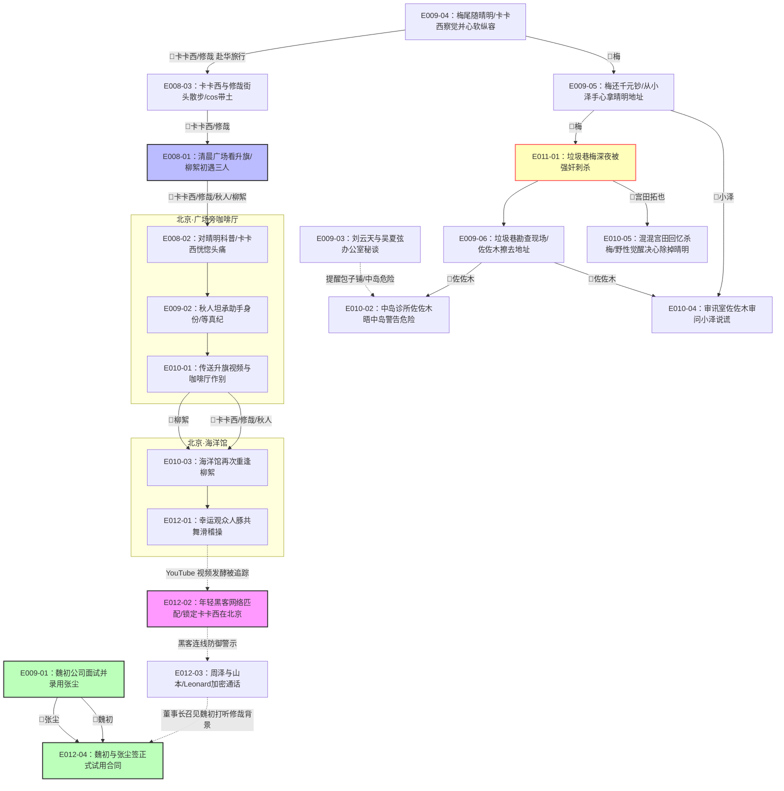
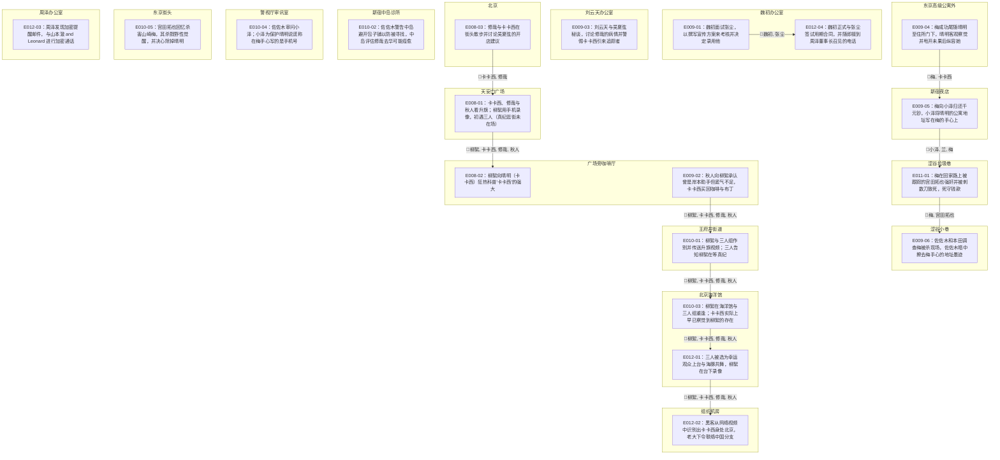

| event_uid | ch  | 场景         | 在场者                                                 | 动作                                 | 动机        | 因果后果          | 知识变动                                                         | 物权/物件          | 干涉点候选                                    | canon_src        |
| --------- | --- | ---------- | --------------------------------------------------- | ---------------------------------- | --------- | ------------- | ------------------------------------------------------------ | -------------- | ---------------------------------------- | ---------------- |
| E008-03   | 8   | 北京·街头·夜晚   | C.kakashi.WMAIN, C.xiuzai.WMAIN                     | 修哉与卡卡西在街头散步并讨论吴夏弦的开店建议             | 调侃与试探     | →E008-01      |                                                              |                |                                          | n1-69:L2570-2594 |
| E008-01   | 8   | 天安门广场·清晨   | ~柳絮, C.kakashi.WMAIN, C.xiuzai.WMAIN, C.akito.WMAIN | 卡卡西、修哉与秋人看升旗；柳絮用手机录像，初遇三人（真纪逛街未在场） | 游客热情/追星   | →E008-02      |                                                              |                |                                          | n1-69:L2558,2600 |
| E008-02   | 8   | 广场旁咖啡厅     | ~柳絮, C.kakashi.WMAIN, C.xiuzai.WMAIN, C.akito.WMAIN | 柳絮向晴明（卡卡西）狂热科普"卡卡西"的强大             | 崇拜        | 待续:柳絮羁绊线起点    |                                                              |                | ◎卡卡西临近广场红旗时短暂恍惚偏头痛（PLOT_NODES 记载，原文行号待核） | n1-69:L2600±     |
| E009-01   | 9   | 魏初办公室·白昼   | C.weichu.WMAIN, C.zhangchen.WMAIN                   | 魏初面试张尘，以撰写宣传方案来考核并决定录用他            | 解决宣传危机    | →E012-04      | C.weichu.WMAIN ← 张尘是懂代码的业余写手                                 |                |                                          | n1-69:L2738-2779 |
| E009-02   | 9   | 广场旁咖啡厅·白昼  | ~柳絮, C.kakashi.WMAIN, C.xiuzai.WMAIN, C.akito.WMAIN | 秋人向柳絮承认曾是岸本助手但底气不足，卡卡西买回咖啡与布丁      | 转移怀疑视线    | →E010-01      | ~柳絮 ← 坂本晴明是个智商200的天才                                         |                |                                          | n1-69:L2780-2886 |
| E009-03   | 9   | 刘云天办公室·白昼  | ~刘云天, ~吴夏弦                                          | 刘云天与吴夏弦秘谈，讨论修哉的病情并警惕卡卡西引来追踪者       | 保护修哉安全    | 待续:修哉病情痊愈评估   | ~吴夏弦 ← 卡卡西出现后修哉开始会发自内心笑                                      |                |                                          | n1-69:L2887-2953 |
| E009-04   | 9   | 东京高级公寓外·白昼 | ~梅, C.kakashi.WMAIN                                 | 梅成功尾随晴明至住所门下，晴明客观察觉并甩开未果后纵容她       | 报恩与求知     | →E009-05      |                                                              |                |                                          | n1-69:L2959-2963 |
| E009-05   | 9   | 新宿夜店·夜晚    | ~小泽, ~兰, ~梅                                         | 梅向小泽归还千元钞，小泽将晴明的公寓地址写在梅的手心上        | 归还钱款      | →E011-01      | ~梅 ← 坂本晴明的公寓住址                                               | 1000日元: 梅归还小泽  |                                          | n1-69:L2963-2985 |
| E009-06   | 9   | 涩谷小巷·清晨    | ~本田, ~佐佐木                                           | 佐佐木和本田调查梅被杀现场，佐佐木暗中擦去梅手心的地址墨迹      | 保护卡卡西与修哉  | 待续:山崎梅遇害案调查   | ~佐佐木 ← 山崎梅遇害且手心写有晴明住址                                        | 手心地址印记: 被佐佐木擦除 |                                          | n1-69:L2986-3024 |
| E010-01   | 10  | 王府井街道·白天   | ~柳絮, C.kakashi.WMAIN, C.xiuzai.WMAIN, C.akito.WMAIN | 柳絮与三人组作别并传送升旗视频；三人告知柳絮在等真纪         | 警惕告别      | →E010-03      |                                                              |                |                                          | n1-69:L3025-3067 |
| E010-02   | 10  | 新宿中岛诊所·白昼  | ~佐佐木, ~中岛                                           | 佐佐木警告中岛避开包子铺以防被寻找，中岛评估修哉去华可能痊愈     | 传递警讯      | 待续:神秘势力追踪动向   | ~中岛 ← 追踪势力再次活动                                               |                |                                          | n1-69:L3068-3146 |
| E010-03   | 10  | 北京海洋馆·白昼   | ~柳絮, C.kakashi.WMAIN, C.xiuzai.WMAIN, C.akito.WMAIN | 柳絮在海洋馆与三人组重逢；卡卡西实际上早已察觉到柳絮的存在      | 尴尬重逢      | →E012-01      |                                                              |                |                                          | n1-69:L3147-3179 |
| E010-04   | 10  | 警视厅审讯室·白天  | ~佐佐木, ~小泽, ~本田                                      | 佐佐木审问小泽；小泽为保护晴明说谎称在梅手心写的是手机号       | 掩护晴明      | 待续:山崎梅案小泽证词核实 | ~佐佐木 ← 小泽为保护晴明而说谎                                            |                |                                          | n1-69:L3180-3309 |
| E010-05   | 10  | 东京街头·白天    | ~宫田拓也                                               | 宫田拓也回忆杀害山崎梅，其杀戮野性觉醒，并决心除掉晴明        | 救回女友/耽溺杀戮 | 待续:等待卡卡西回国    |                                                              | 折叠刀: ~宫田拓也持有   |                                          | n1-69:L3310-3328 |
| E011-01   | 11  | 涩谷垃圾巷·深夜   | ~梅, ~宫田拓也                                           | 梅在回家路上被跟踪的宫田拓也强奸并被刺数刀致死，死守钱款       | 劫掠与强暴     | →E009-06      |                                                              | 几千日元: 梅死守持有    |                                          | n1-69:L3329-3477 |
| E012-01   | 12  | 北京海洋馆·白昼   | ~柳絮, C.kakashi.WMAIN, C.xiuzai.WMAIN, C.akito.WMAIN | 三人被选为幸运观众上台与海豚共舞，柳絮在台下录像           | 配合玩乐      | →E012-02      |                                                              |                |                                          | n1-69:L3480-3580 |
| E012-02   | 12  | 组织机房·白天    | ~黑客, ~组织头领                                          | 黑客从网络视频中识别出卡卡西身处北京，老大下令联络中国分支      | 锁定行踪      | 待续:指使中国本土势力行凶 | ~黑客 ← 卡卡西目前在北京; ~组织头领 ← 卡卡西目前在北京                             |                |                                          | n1-69:L3581-3638 |
| E012-03   | 12  | 周泽办公室·白天   | ~周泽                                                 | 周泽发现加密提醒邮件，与山本澈 and Leonard 进行加密通话 | 应对危机      | →魏初被召见调查修哉    | ~周泽 ← 折原修哉身份神秘; ~山本澈 ← 坂本晴明目前在北京; ~Leonard ← 坂本晴明的室友折原修哉身份神秘 |                |                                          | n1-69:L3639-3700 |
| E012-04   | 12  | 魏初办公室·白昼   | C.weichu.WMAIN, C.zhangchen.WMAIN                   | 魏初正式与张尘签试用期合同，并随即接到周泽董事长召见的电话      | 正式雇佣      | 待续:魏初去董事长办公室  |                                                              | 试用合同: 魏初与张尘签署  |                                          | n1-69:L3701-3757 |

- `~柳絮`
- `~刘云天`
- `~真纪`
- `~吴夏弦`
- `~小泽`
- `~兰`
- `~梅`
- `~本田`
- `~佐佐木`
- `~中岛`
- `~宫田拓也`
- `~黑客`
- `~组织头领`
- `~周泽`
- `~山本澈`
- `~Leonard`

## 时序图

