# Ch100-107细剖事件表

| event_uid | ch | 场景 | 在场者 | 动作 | 动机 | 因果后果 | 知识变动 | 物权/物件 | 干涉点候选 | canon_src |
|---|---|---|---|---|---|---|---|---|---|---|
| E100-01 | 100 | 东京市区/高层建筑 | ~张尘, C.kakashi.WMAIN | 张尘让卡卡西去对战宇智波鼬，卡卡西表示同意 | 击破鼬的防御 | 卡卡西下楼迎战宇智波鼬 | | | | |
| E100-02 | 100 | 东京市区街头 | C.kakashi.WMAIN, ~宇智波鼬, C.xiuzai.WMAIN, C.guojiazheng.WMAIN | 卡卡西与鼬对峙，利用须佐能乎屏蔽攻击的1秒间隙，配合狙击手的攻击打破须佐能乎，抱住鼬 | 击破鼬的防御 | 卡卡西自报真名为坂本晴明，唤醒鼬的自我意识 | ~宇智波鼬 ← 开始产生自我意识 | | | |
| E100-03 | 100 | 东京市区街头 | C.zhangchen.WMAIN, ~萨缪尔·纳 | 张尘与世界政府执行部指挥官萨缪尔·纳对峙，萨缪尔质问张尘为何离开政府，拔枪相向 | 阻止/质问张尘 | 双方僵持(后被直升机坠落打断) | C.zhangchen.WMAIN ← 得知世界政府领导团队(LT)的存在 | | | |
| E101-01 | 101 | 世界政府日本分据点 | ~源晃, ~李思哲 | DS袭击期间，源晃让李思哲带黑客离开前往总部，自己留下待命 | 保护同伴，自己认命 | 源晃可能牺牲，李思哲离开 | | | |
| E102-01 | 102 | 某高层/天台 | C.xiuzai.WMAIN, C.guojiazheng.WMAIN | 修哉和郭家政夺取世界政府直升机的控制权并使其相撞坠毁 | 制造混乱，掩护张尘等人 | 成功使直升机坠毁，打破世界政府围剿 | | 直升机 | | |
| E103-02 | 103 | DS据点 | ~宇智波鼬, C.zhangchen.WMAIN, C.kakashi.WMAIN | 鼬被带到DS据点，张尘让他看漫画打发时间 | 收留鼬 | 鼬暂留在DS据点 | | | | |
| E103-03 | 103 | 魏初公寓 | C.weichu.WMAIN, ~大和天藏, ~佐井, C.banbo.WMAIN, C.yuxuan.WMAIN | 大和与佐井迷晕斑驳雨璇，质问魏初关于张尘送的钢笔的来历 | 调查达斯特线索 | 大和接到费恩电话得知萨缪尔队去往中国 | C.weichu.WMAIN ← 得知达斯特之名，大和得知迪达拉事件 | 带有LT标志的钢笔 | | |
| E103-04 | 103 | 世界政府斯德哥尔摩总部 | C.akito.WMAIN, ~山崎聪 | 秋人被绑架到世界政府总部，山崎聪将其带入并注册为政府成员 | 被强制带入 | 秋人进入世界政府总部 | | | | |
| E103-05 | 103 | 开发区/试验场 | ~迪达拉, ~一身黑 | 迪达拉放置炸弹准备引爆整个区域，被“一身黑”击毙 | 迪达拉为了艺术/疯狂；一身黑为了阻止爆炸 | 迪达拉死亡，一身黑暴露其神经生物学家身份 | | 炸弹/引爆器 | | |
| E104-01 | 104 | 某教堂·日 | ~费恩, ~迪达拉 | 费恩向萨缪尔分队下达逮捕任务后，接迪达拉密报执行官萨缪尔·纳死于艺术爆炸。 | 了解行动局势并寻求佐证 | | ~费恩 ← 获悉执行官萨缪尔·纳已被炸死 | | | n88-107:L540± |
| E105-01 | 105 | DS据点 | C.xiuzai.WMAIN, C.kakashi.WMAIN, C.zhangchen.WMAIN | 修哉发现秋人被抓，卡卡西安慰，修哉计算出试验场城市存在“一秒时间轴偏差” | 寻找异常，救出秋人 | 推测出那座城被空间替换 | | | | |
| E105-02 | 105 | DS据点外围 | C.wuxiaxian.WMAIN, C.maki.WMAIN | 吴夏弦与真纪碰面，两人打赌修哉和云天能否活下来 | 互相慰藉 | | | | | |
| E105-03 | 105 | 魏初公寓附近/街头 | ~大和天藏, ~佐井, ~一身黑 | 大和发现通讯记录存在1秒误差，去现场遇到一身黑，一身黑告知世界政府真相 and 时间轴异常 | 调查迪达拉死因 | 大和三观受到冲击，得知那座城是世界政府的实验品 | ~大和天藏 ← 得知城市时间轴异常与政府真相 | | | |
| E106-01 | 106 | 地下室某处·日 | C.liuyuntian.WMAIN, ~老钱, ~化学老师, ~物理老师 | 刘云天和老师们讨论通过伪装潜入或寻找下水道密道突破世界政府救援队的围堵。 | 谋划突破包围圈 | →E107-01 | | | | n88-107:L578± |
| E107-01 | 107 | 地下室避难所 | C.liuyuntian.WMAIN | 刘云天建议大家寻找信号发射器，带领众人试图冲破救援队封锁 | 获取外界联系 | 刘云天在掩护下跑向信号室 | | | | |
| E107-02 | 107 | 信号室 | C.liuyuntian.WMAIN | 刘云天找到信号室，发送语音后发现时间相差一秒，意识到时空被隔离/替换，绝望下给真纪打电话诀别，准备自尽 | | 刘云天按下原子笔(准备自杀) | C.liuyuntian.WMAIN ← 发现时间相差一秒的绝望真相 | 手机, 原子笔 | | |
| E107-03 | 107 | DS据点洗手间 | C.xiuzai.WMAIN, C.kakashi.WMAIN | 修哉精神崩溃呕吐，卡卡西将其安抚，修哉说出平行宇宙理论与世界政府的最终目的：“为了永恒的世界” | 分析事态 | 揭示世界政府的终极阴谋 | C.xiuzai.WMAIN ← 揭示多重宇宙与城市隔离真相 | | | |

## 时序图

```mermaid
graph TD
    subgraph "东京市区/高层建筑"
        E100-01["E100-01：张尘让卡卡西去对战宇智波鼬，卡卡西表示同意"]
    end
    subgraph "东京市区街头"
        E100-02["E100-02：卡卡西与鼬对峙，利用须佐能乎屏蔽攻击的1秒间隙，配合狙击手的攻击打破须佐能乎，抱住鼬"]
        E100-03["E100-03：张尘与世界政府执行部指挥官萨缪尔·纳对峙，萨缪尔质问张尘为何离开政府，拔枪相向"]
    end
    subgraph "世界政府日本分据点"
        E101-01["E101-01：DS袭击期间，源晃让李思哲带黑客离开前往总部，自己留下待命"]
    end
    subgraph "某高层/天台"
        E102-01["E102-01：修哉和郭家政夺取世界政府直升机的控制权并使其相撞坠毁"]
    end
    subgraph "DS据点"
        E103-02["E103-02：鼬被带到DS据点，张尘让他看漫画打发时间"]
        E105-01["E105-01：修哉发现秋人被抓，卡卡西安慰，修哉计算出试验场城市存在“一秒时间轴偏差”"]
    end
    subgraph "魏初公寓"
        E103-03["E103-03：大和与佐井迷晕斑驳雨璇，质问魏初关于张尘送的钢笔的来历"]
    end
    subgraph "世界政府斯德哥尔摩总部"
        E103-04["E103-04：秋人被绑架到世界政府总部，山崎聪将其带入并注册为政府成员"]
    end
    subgraph "开发区/试验场"
        E103-05["E103-05：迪达拉放置炸弹准备引爆整个区域，被“一身黑”击毙"]
    end
    subgraph "某教堂"
        E104-01["E104-01：费恩向萨缪尔分队下达逮捕任务后，接迪达拉密报执行官萨缪尔·纳死于艺术爆炸"]
    end
    subgraph "DS据点外围"
        E105-02["E105-02：吴夏弦与真纪碰面，两人打赌修哉和云天能否活下来"]
    end
    subgraph "魏初公寓附近/街头"
        E105-03["E105-03：大和发现通讯记录存在1秒误差，去现场遇到一身黑，一身黑告知世界政府真相 and 时间轴异常"]
    end
    subgraph "地下室避难所"
        E106-01["E106-01：刘云天与老师们讨论通过物理和化学突破救援队封锁"]
        E107-01["E107-01：刘云天建议大家寻找信号发射器，带领众人试图冲破救援队封锁"]
    end
    subgraph "信号室"
        E107-02["E107-02：刘云天找到信号室，发送语音后发现时间相差一秒，意识到时空被隔离/替换，绝望下给真纪打电话诀别，准备自尽"]
    end
    subgraph "DS据点洗手间"
        E107-03["E107-03::修哉精神崩溃呕吐，卡卡西将其安抚，修哉说出平行宇宙理论与世界政府的最终目的：“为了永恒的世界”"]
    end
```

