```mermaid
graph TD
    subgraph "街头"
        E108-01["E108-01：卡卡西与修哉在街头走，卡卡西问如果遇到大麻烦修哉会不会站在他这边。"]
        E108-02["E108-02：一名本该死去的人(张尘)突然拍了卡卡西的肩膀出现。"]
        E109-01["E109-01：修哉用枪指着突然出现的张尘，张尘解答卡卡西对修哉第五区的疑问，展示了解情况。"]
    end
    subgraph "世界政府总部"
        E108-03["E108-03：莱纳德等开会讨论日本(DS领地)局势，莱纳德察觉修哉、卡卡西已经离开。"]
    end
    subgraph "过去/教堂附近"
        E109-02["E109-02：回忆刘云天与魏初领证并遭遇政府军追击，最后被逼入死胡同绝境。"]
    end
    subgraph "避难所城市街头"
        E109-03["E109-03：大和天藏带着小女孩张尘，给她买吃食和衣服(备忘录事件)。"]
    end
    subgraph "某公寓"
        E109-04["E109-04：大和天藏把一封信给小张尘，嘱咐她去找信上地址的人，自己独自离开。"]
    end
    subgraph "魏初公寓"
        E109-05["E109-05：小张尘带着信来到魏初公寓，魏初斑驳雨璇正在照顾昏睡的刘云天。"]
        E114-01["E114-01：魏初开车出门。雨璇斑驳在家翻看《百年孤独》，发现内容与记忆不同，确认身处平行宇宙。"]
    end
    subgraph "过去线回忆"
        E110-01["E110-01：回忆中反社会的龙也讲述自己有精神分裂，利用身体杀死了张尘的女友。另一个龙也与张尘结为挚友。"]
    end
    subgraph "废弃城市房顶"
        E110-02["E110-02：转移后三人来到被毁灭的城市，张尘解答DTR武器原理是脑电波共振，并要带卡卡西找人。"]
    end
    subgraph "回忆线"
        E111-01["E111-01：斑驳雨璇回忆过去张尘广播预言城市即将毁灭，未受政府理睬，最终张尘死去。"]
    end
    subgraph "废弃城市街道"
        E111-02["E111-02：张尘坦白自己是来自另一个平行世界的张尘，那个世界里修哉是物理学家，张尘是意识跳转实验志愿者。"]
    end
    subgraph "另一个世界的过去"
        E112-01["E112-01：跳转前，张尘与龙也和修哉告别。修哉发誓会接他回来。张尘进入传送机器。"]
    end
    subgraph "异世界第二跳"
        E112-02["E112-02：张尘在异世界救护站醒来，被维多背着。看到高科技飞船。异世界的龙也出现。"]
    end
    subgraph "异世界世界政府"
        E112-03["E112-03：龙也带张尘去RTW控制室，告知该世界过于完美失去意义即将毁灭，送张尘进入RTW-LT做最后跳转阻止悲剧。"]
    end
    subgraph "某个世界回忆"
        E113-01["E113-01：张尘跳转后遇到秋人、中岛，发现这个世界修哉已死，但被米娅提取大脑，与另一身体缝合为人造人。"]
    end
    subgraph "废弃城市"
        E113-02["E113-02：张尘带修哉等人找到一身黑的米娅。张尘叫出黑发卡卡西(时空机器)，命其带自己离开。"]
        E113-03["E113-03：真正的张尘重现，跪在地上。"]
    end
    subgraph "开发区岔路"
        E114-02["E114-02：魏初开车赶到，斥责变年轻的张尘，将LT钥匙(钢笔)还给他。张尘崩溃痛哭，修哉与卡卡西上前安抚。"]
    end
    subgraph "异世界实验室"
        E115-01["E115-01：张尘与人造人玲于奈交谈，得知该时空人造人剥夺情感技术。玲于奈指出黑发卡卡西能控制时空跃迁，但由修哉大脑主导。"]
        E115-02["E115-02：张尘看完失去意识的龙也，与索恩博士告别，带着那个人造人(黑发卡卡西)启程跳转。"]
    end
    subgraph "时空旅途中"
        E115-03["E115-03：某次张尘喝醉割腕自残，被黑发卡卡西制止并包扎。黑发卡卡西自称要寻找“心”。"]
    end
    subgraph "日本据点"
        E116-01["E116-01：莱纳德和山本分析密码信，破解出BADA暗号，指出三战将波及亚洲。"]
    end
    subgraph "据点酒吧"
        E116-02["E116-02：吴夏弦告知维多张尘等人在中国，邀请他一起前往。维多同意。"]
    end
    subgraph "街道"
        E116-03["E116-03：鼬和佐助散步，带着卡布。两人聊天并决定继续参战，要去中国找张尘等人。"]
    end
    subgraph "日本据点会议室"
        E116-04["E116-04：众人开会决定飞往中国。吴夏弦提供波音747偷渡，中岛提出用佐助和鼬的瞳术护航。"]
    end
    subgraph "阳台"
        E116-05["E116-05：鸣人与樱探讨战后生活，鸣人想送快递，樱想做护士，水门在暗处欣慰观察。"]
    end
    subgraph "某窗台/阳台"
        E116-06["E116-06：真纪留下给云天的告别录音，阻止柳絮跟随，决定独自前往中国战场寻找修哉。"]
    end
    subgraph "过去回忆"
        E117-01["E117-01：秋人回忆被修哉赏识成为挚友，后来修哉失去情感当面割腕，秋人夺刀受伤。吴叔劝其离开。"]
    end
    subgraph "开发区车内"
        E117-02["E117-02：张尘让卡卡西用钢笔在空中写下10位圆周率，钢笔变形为LT会议室的唯一钥匙(图腾容器)。"]
    end
    subgraph "世界政府监控室"
        E117-03["E117-03：几名白大褂进入房间，强行给秋人的脊髓注射不明液体。秋人陷入呆滞，透过监视器向山崎聪求救，山崎聪大为震惊。"]
    end

```

# Ch108-117细剖事件表

| event_uid | ch | 场景 | 在场者 | 动作 | 动机 | 因果后果 | 知识变动 | 物权/物件 | 干涉点候选 | canon_src |
|---|---|---|---|---|---|---|---|---|---|---|
| E108-01 | 108 | 街头 | ~修哉, ~卡卡西 | 卡卡西与修哉在街头走，卡卡西问如果遇到大麻烦修哉会不会站在他这边。 | 日常闲聊/不安 | 修哉肯定回答，加强信任 | 卡卡西得知修哉的态度 | 无 | 修哉表态环节 | Chapter108 |
| E108-02 | 108 | 街头 | ~修哉, ~卡卡西, ~张尘(异世界) | 一名本该死去的人(张尘)突然拍了卡卡西的肩膀出现。 | 异世界张尘降临 | 卡卡西和修哉极度震惊 | 两人得知张尘(异世界版)存在 | 无 | 张尘现身时刻 | Chapter108 |
| E108-03 | 108 | 世界政府总部 | ~莱纳德, ~阿诺德(提到), ~诸位代表 | 莱纳德等开会讨论日本(DS领地)局势，莱纳德察觉修哉、卡卡西已经离开。 | 政治会议/监控 | 政府对DS动向保持警惕 | 莱纳德得知修哉等脱离控制 | 会议资料 | 莱纳德会议分析 | Chapter108 |
| E109-01 | 109 | 街头 | ~修哉, ~卡卡西, ~张尘(异世界) | 修哉用枪指着突然出现的张尘，张尘解答卡卡西对修哉第五区的疑问，展示了解情况。 | 张尘欲证明自己身份 | 修哉虽举枪但未射击，卡卡西使用DTR转移 | 三人即将离开当前位置 | 手枪 | 遭遇异世界张尘 | Chapter109 |
| E109-02 | 109 | 过去/教堂附近 | ~魏初, ~刘云天 | 回忆刘云天与魏初领证并遭遇政府军追击，最后被逼入死胡同绝境。 | 躲避追杀 | 魏初和刘云天的悲剧前因 | 无 | 结婚证 | 逃避追捕时机 | Chapter109 |
| E109-03 | 109 | 避难所城市街头 | ~大和天藏, ~张尘(女) | 大和天藏带着小女孩张尘，给她买吃食和衣服(备忘录事件)。 | 大和照顾小张尘 | 小张尘得到照顾 | 大和记起给女儿买裙子的备忘录 | 裙子, 食物 | 大和的临时父爱 | Chapter109 |
| E109-04 | 109 | 某公寓 | ~大和天藏, ~张尘(女) | 大和天藏把一封信给小张尘，嘱咐她去找信上地址的人，自己独自离开。 | 大和有自己的任务要走 | 小张尘带信去寻找魏初 | 小张尘接到跑腿任务 | 信件 | 大和离别 | Chapter109 |
| E109-05 | 109 | 魏初公寓 | ~魏初, ~斑驳, ~雨璇, ~刘云天, ~张尘(女) | 小张尘带着信来到魏初公寓，魏初斑驳雨璇正在照顾昏睡的刘云天。 | 投递信件 | 魏初等人收留小张尘 | 魏初等人得知大和的信件内容 | 信件 | 魏初接收小张尘 | Chapter109 |
| E110-01 | 110 | 过去线回忆 | ~折原龙也(反社会), ~张尘(被杀女友的) | 回忆中反社会的龙也讲述自己有精神分裂，利用身体杀死了张尘的女友。另一个龙也与张尘结为挚友。 | 反社会龙也出于杀人欲望 | 张尘因此痛恨自己，龙也内部分裂加剧 | 读者了解龙也双重人格真相 | 枪支 | 反社会龙也犯案 | Chapter110 |
| E110-02 | 110 | 废弃城市房顶 | ~修哉, ~卡卡西, ~张尘(异世界) | 转移后三人来到被毁灭的城市，张尘解答DTR武器原理是脑电波共振，并要带卡卡西找人。 | 解释原理并寻找目标 | 三人结伴在废墟中前行 | 修哉卡卡西得知DTR原理 | 无 | DTR原理揭示 | Chapter110 |
| E111-01 | 111 | 回忆线 | ~斑驳, ~雨璇, ~张尘(灭城的) | 斑驳雨璇回忆过去张尘广播预言城市即将毁灭，未受政府理睬，最终张尘死去。 | 回忆张尘的牺牲 | 斑驳雨璇感到无力与遗憾 | 无 | 初音专辑(回忆中) | 张尘灭城警告事件 | Chapter111 |
| E111-02 | 111 | 废弃城市街道 | ~修哉, ~卡卡西, ~张尘(异世界) | 张尘坦白自己是来自另一个平行世界的张尘，那个世界里修哉是物理学家，张尘是意识跳转实验志愿者。 | 张尘讲述来历 | 修哉与卡卡西理解平行世界 | 得知意识跳转计划(RTW) | 无 | 张尘讲述身世 | Chapter111 |
| E112-01 | 112 | 另一个世界的过去 | ~张尘(异世界), ~修哉(另一个), ~折原龙也(另一个) | 跳转前，张尘与龙也和修哉告别。修哉发誓会接他回来。张尘进入传送机器。 | 寻找人类存在的意义 | 张尘意识跳转成功，离开原世界 | 无 | 机器设备 | 意识跳转前夕 | Chapter112 |
| E112-02 | 112 | 异世界第二跳 | ~张尘(异世界), ~维多·邦纳赛拉, ~折原龙也(异世界) | 张尘在异世界救护站醒来，被维多背着。看到高科技飞船。异世界的龙也出现。 | 意识跳转落地 | 发现异世界科技极度发达 | 张尘了解异世界状况 | 担架飞船 | 张尘到达第二世界 | Chapter112 |
| E112-03 | 112 | 异世界世界政府 | ~张尘(异世界), ~折原龙也(异世界) | 龙也带张尘去RTW控制室，告知该世界过于完美失去意义即将毁灭，送张尘进入RTW-LT做最后跳转阻止悲剧。 | 为了挽救人类未来 | 张尘被迫再次跳转 | 得知完美世界的毁灭危机 | 传送装置 | 张尘再次跳转 | Chapter112 |
| E113-01 | 113 | 某个世界回忆 | ~张尘(异世界), ~川口秋人(异世界), ~中岛今朝(异世界) | 张尘跳转后遇到秋人、中岛，发现这个世界修哉已死，但被米娅提取大脑，与另一身体缝合为人造人。 | 得知修哉变身人造人真相 | 发现时空机器的真面目 | 了解修哉的大脑被保存 | 医疗仪器 | 发现修哉的残存体 | Chapter113 |
| E113-02 | 113 | 废弃城市 | ~修哉, ~卡卡西, ~张尘(异世界), ~米娅·海森堡, ~黑发卡卡西 | 张尘带修哉等人找到一身黑的米娅。张尘叫出黑发卡卡西(时空机器)，命其带自己离开。 | 张尘结束本次引导 | 未来张尘消失，真正的当前时空张尘重新出现 | 三人得见时空机器真面目 | 无 | 张尘召唤黑发卡卡西 | Chapter113 |
| E113-03 | 113 | 废弃城市 | ~修哉, ~卡卡西, ~张尘(当前时空) | 真正的张尘重现，跪在地上。 | 张尘恢复原身意识 | 接续当前时空的故事 | 无 | 无 | 真正张尘回归 | Chapter113 |
| E114-01 | 114 | 魏初公寓 | ~斑驳, ~雨璇 | 魏初开车出门。雨璇斑驳在家翻看《百年孤独》，发现内容与记忆不同，确认身处平行宇宙。 | 察觉世界变化 | 接受平行世界现实 | 确认平行宇宙假说 | 书籍《百年孤独》 | 阅读书籍发现异常 | Chapter114 |
| E114-02 | 114 | 开发区岔路 | ~魏初, ~张尘(当前时空), ~修哉, ~卡卡西, ~米娅·海森堡 | 魏初开车赶到，斥责变年轻的张尘，将LT钥匙(钢笔)还给他。张尘崩溃痛哭，修哉与卡卡西上前安抚。 | 魏初交还钥匙，张尘发泄情绪 | 众人决定不再孤军奋战，拟定新计划 | 无 | LT标志的钢笔 | 张尘崩溃与众人和解 | Chapter114 |
| E115-01 | 115 | 异世界实验室 | ~张尘(异世界), ~坂本玲于奈 | 张尘与人造人玲于奈交谈，得知该时空人造人剥夺情感技术。玲于奈指出黑发卡卡西能控制时空跃迁，但由修哉大脑主导。 | 探讨人造人与情感 | 张尘理解时空机器运作 | 得知时空机器控制权 | 试管, 机器 | 张尘与玲于奈对话 | Chapter115 |
| E115-02 | 115 | 异世界实验室 | ~张尘(异世界), ~索恩博士, ~折原龙也(失去意识) | 张尘看完失去意识的龙也，与索恩博士告别，带着那个人造人(黑发卡卡西)启程跳转。 | 踏上新的时空旅途 | 开始漫长的时空穿越 | 无 | 时空机器 | 张尘带机器离开 | Chapter115 |
| E115-03 | 115 | 时空旅途中 | ~张尘(异世界), ~黑发卡卡西(人造人晴明) | 某次张尘喝醉割腕自残，被黑发卡卡西制止并包扎。黑发卡卡西自称要寻找“心”。 | 张尘绝望放纵，机器展现关怀 | 张尘开始教导机器学习格斗和常人喜好 | 机器开始萌生情感概念 | 碎玻璃瓶 | 割腕自残与包扎 | Chapter115 |
| E116-01 | 116 | 日本据点 | ~莱纳德, ~山本澈 | 莱纳德和山本分析密码信，破解出BADA暗号，指出三战将波及亚洲。 | 解析情报 | 为DS下一步行动指明方向 | 得知战争波及亚洲 | 密码信, 白板 | 莱纳德解密信件 | Chapter116 |
| E116-02 | 116 | 据点酒吧 | ~维多·邦纳赛拉, ~吴夏弦 | 吴夏弦告知维多张尘等人在中国，邀请他一起前往。维多同意。 | 汇集同伴 | 决定前往中国汇合 | 得知张尘下落 | 酒杯 | 吴夏弦说服维多 | Chapter116 |
| E116-03 | 116 | 街道 | ~宇智波鼬, ~宇智波佐助, ~卡布(机器人) | 鼬和佐助散步，带着卡布。两人聊天并决定继续参战，要去中国找张尘等人。 | 兄弟交心与决策 | 坚定了参战立场 | 无 | 机器人卡布 | 佐助鼬交谈 | Chapter116 |
| E116-04 | 116 | 日本据点会议室 | ~莱纳德, ~山本澈, ~郭家政, ~吴夏弦, ~中岛今朝 | 众人开会决定飞往中国。吴夏弦提供波音747偷渡，中岛提出用佐助和鼬的瞳术护航。 | 制定前往中国的计划 | 准备出发前往战场 | 无 | 地图, 波音747(提及) | 会议决定偷渡 | Chapter116 |
| E116-05 | 116 | 阳台 | ~鸣人, ~樱, ~波风水门 | 鸣人与樱探讨战后生活，鸣人想送快递，樱想做护士，水门在暗处欣慰观察。 | 对未来的畅想 | 缓和战前紧张气氛 | 无 | 无 | 鸣人樱夜谈 | Chapter116 |
| E116-06 | 116 | 某窗台/阳台 | ~真纪, ~柳絮 | 真纪留下给云天的告别录音，阻止柳絮跟随，决定独自前往中国战场寻找修哉。 | 奔赴战场保护家人 | 柳絮留在日本，真纪奔赴前线 | 无 | 手机 | 真纪告别 | Chapter116 |
| E117-01 | 117 | 过去回忆 | ~川口秋人, ~折原修哉, ~折原龙也 | 秋人回忆被修哉赏识成为挚友，后来修哉失去情感当面割腕，秋人夺刀受伤。吴叔劝其离开。 | 回忆两人羁绊与决裂 | 秋人手部受伤，接受吴叔建议离开 | 无 | 存折, 刀 | 秋人回忆往事 | Chapter117 |
| E117-02 | 117 | 开发区车内 | ~张尘, ~修哉, ~卡卡西, ~魏初, ~米娅·海森堡 | 张尘让卡卡西用钢笔在空中写下10位圆周率，钢笔变形为LT会议室的唯一钥匙(图腾容器)。 | 演示钥匙启动 | 众人得知LT钥匙的真面目 | 得知如何进入LT会议室 | LT钢笔/钥匙 | 钥匙变形启动 | Chapter117 |
| E117-03 | 117 | 世界政府监控室 | ~川口秋人, ~山崎聪, ~白大褂 | 几名白大褂进入房间，强行给秋人的脊髓注射不明液体。秋人陷入呆滞，透过监视器向山崎聪求救，山崎聪大为震惊。 | 强行进行人体实验 | 秋人沦为实验品，山崎聪心理动摇 | 山崎聪目睹残酷实验 | 注射器 | 强行注射实验 | Chapter117 |

## 时序图

## 时序图

