```mermaid
graph TD
    subgraph "飞机客舱"
        E118-01["E118-01：真纪发表演讲，安抚众人，表达对自己信仰正义的坚持。"]
        E119-02["E119-02：修哉启动木马程序恢复飞机GPS，众人寻找迫降地点。"]
    end
    subgraph "飞机驾驶舱"
        E118-02["E118-02：飞机遭导弹锁定，老机长切断自动导航手动驾驶避开一击。"]
    end
    subgraph "高空/飞机残骸中"
        E118-03["E118-03：卡卡西跳出飞机，使用近距离神威转移导弹到敌机群中引爆，力竭坠落。鸣人爆开仙人模式跳出飞机营救。"]
    end
    subgraph "战舰"
        E119-01["E119-01：柳絮换上军装，向吴夏弦表明只想见晴明一面。吴夏弦决定静观其变。"]
    end
    subgraph "过去回忆"
        E120-01["E120-01：张尘与斑驳、雨璇道别，安抚斑驳的情绪，随后带卡卡西离开。"]
    end
    subgraph "异世界记忆"
        E121-01["E121-01：龙也进行意识跳转，到达第30541号世界，试图阻碍张尘成长但失败。回忆正义种西瓜的道理。"]
        E122-01["E122-01：反社会人格龙也夺回身体控制权，在枪战中为保护张尘挡子弹死亡。"]
    end
    subgraph "现实医院"
        E122-02["E122-02：龙也回到现实，面对脑死亡的张尘，宣告张尘于2051年死亡。龙也修哉决定寻找张尘。"]
    end
    subgraph "废弃机场"
        E123-01["E123-01：飞机迫降后，莱纳德用枪指着张尘，质问世界政府、LT和DS的真相。张尘作出回答。"]
    end
    subgraph "海滩机舱"
        E123-02["E123-02：卡卡西向张尘保证自己不会死，张尘用恐龙化石质问人类存在意义，怀疑人类是高等生物玩具。"]
    end
    subgraph "渤海海域战舰"
        E123-03["E123-03：渤海爆发战争，中国自卫军攻击吴夏弦战舰。吴夏弦发国际广播承认战舰身份。"]
    end
    subgraph "过去科技三角洲"
        E124-01["E124-01：米娅和索恩参观活体实验，目睹人造人(131号，即卡卡西)诞生。"]
    end
    subgraph "工作室"
        E124-02["E124-02：修哉干涉北京军区干扰器信号，米娅向魏初传达活着的意义。"]
    end
    subgraph "海面战场"
        E124-03["E124-03：卡卡西利用量子流在深海呼吸，在海面布下巨型电网。张尘向真纪解释修哉与卡卡西的脑电波共振和命运联系。"]
    end
    subgraph "过去看守所"
        E125-01["E125-01：秋人杀害父母后被正义审问，正义与秋人定下不伤害他人的约定，将秋人送往新环境。"]
    end
    subgraph "世界政府看守房间"
        E125-02["E125-02：秋人向山崎聪解释被注射的是微型芯片，世界政府如同电脑主板。"]
    end
    subgraph "秋人内心"
        E125-03["E125-03：秋人回忆其他世界中张尘送信的经历，回忆朋友们的羁绊，决定坚持活下去。"]
    end
    subgraph "北京军区司令室"
        E126-01["E126-01：军长目睹战场局面，内心动摇，承认自己其实已经输了。"]
    end
    subgraph "海面/深海"
        E126-02["E126-02：卡卡西力量透支，意识与修哉链接，感受到修哉的记忆与人类的复杂情感。"]
    end
    subgraph "时空幻境"
        E126-03["E126-03：卡卡西遭到深海能量冲击，意识穿越至恐龙时代，与恐龙接触，恐龙表示相信他来自未来。"]
    end
    subgraph "海面/甲板"
        E126-04["E126-04：卡卡西浑身发光浮出海面，鼬欲用十拳剑阻止但被神威转移。柳絮用声纳向卡卡西呼喊。"]
    end
    subgraph "海域上空"
        E126-05["E126-05：伴随柳絮呼喊，初音未来立体影像出现，跳舞唱歌并向全世界广播世界政府及战争内幕。"]
    end
    subgraph "世界政府走廊"
        E127-01["E127-01：山崎聪趁网络漏洞救出秋人。秋人解释多重世界树状模型理论，决定向东走。"]
    end

```

# Ch118-127细剖事件表

| event_uid | ch | 场景 | 在场者 | 动作 | 动机 | 因果后果 | 知识变动 | 物权/物件 | 干涉点候选 | canon_src |
|---|---|---|---|---|---|---|---|---|---|---|
| E118-01 | 118 | 飞机客舱 | ~真纪, ~张尘, ~卡卡西, ~修哉(提及), ~众人 | 真纪发表演讲，安抚众人，表达对自己信仰正义的坚持。 | 鼓舞士气 | 众人感到被肯定，坚定信念 | 了解真纪的立场 | 无 | 真纪演讲 | Chapter118 |
| E118-02 | 118 | 飞机驾驶舱 | ~老机长, ~副机长 | 飞机遭导弹锁定，老机长切断自动导航手动驾驶避开一击。 | 逃避导弹攻击 | 飞机暂时脱险 | 无 | 飞机 | 飞机遭遇导弹 | Chapter118 |
| E118-03 | 118 | 高空/飞机残骸中 | ~卡卡西, ~鸣人, ~佐助, ~鼬 | 卡卡西跳出飞机，使用近距离神威转移导弹到敌机群中引爆，力竭坠落。鸣人爆开仙人模式跳出飞机营救。 | 消除敌机威胁，保护飞机 | 敌机全灭，卡卡西与鸣人坠海 | 无 | 导弹 | 卡卡西转移导弹 | Chapter118 |
| E119-01 | 119 | 战舰 | ~柳絮, ~吴夏弦 | 柳絮换上军装，向吴夏弦表明只想见晴明一面。吴夏弦决定静观其变。 | 柳絮找寻自我，吴夏弦观察局势 | 柳絮明确心意，战舰等待时机 | 无 | 军装 | 柳絮的心意 | Chapter119 |
| E119-02 | 119 | 飞机客舱 | ~修哉(连线), ~老机长, ~波风水门, ~山本澈 | 修哉启动木马程序恢复飞机GPS，众人寻找迫降地点。 | 寻找迫降方案 | 飞机获得降落希望 | 无 | 木马程序 | 恢复GPS | Chapter119 |
| E120-01 | 120 | 过去回忆 | ~张尘, ~敖斑驳, ~徐雨璇, ~卡卡西 | 张尘与斑驳、雨璇道别，安抚斑驳的情绪，随后带卡卡西离开。 | 告别与宽慰 | 斑驳雨璇解开心结 | 无 | 无 | 斑驳雨璇告别 | Chapter120 |
| E121-01 | 121 | 异世界记忆 | ~折原龙也, ~张尘(年轻), ~折原正义, ~修哉 | 龙也进行意识跳转，到达第30541号世界，试图阻碍张尘成长但失败。回忆正义种西瓜的道理。 | 试图改变张尘命运 | 发现张尘命运难以改变 | 得知张尘在其他世界的成就 | 西瓜 | 龙也干涉异世界 | Chapter121 |
| E122-01 | 122 | 异世界记忆 | ~折原龙也, ~张尘 | 反社会人格龙也夺回身体控制权，在枪战中为保护张尘挡子弹死亡。 | 保护张尘 | 异世界龙也死亡 | 无 | 枪支 | 龙也保护张尘 | Chapter122 |
| E122-02 | 122 | 现实医院 | ~折原龙也, ~折原修哉, ~张尘 | 龙也回到现实，面对脑死亡的张尘，宣告张尘于2051年死亡。龙也修哉决定寻找张尘。 | 面对张尘死亡 | 坚定了寻找张尘的决心 | 确认张尘死亡时间 | 无 | 张尘宣告死亡 | Chapter122 |
| E123-01 | 123 | 废弃机场 | ~张尘, ~莱纳德, ~郭家政, ~维多·邦纳赛拉 | 飞机迫降后，莱纳德用枪指着张尘，质问世界政府、LT和DS的真相。张尘作出回答。 | 质问真相 | 揭开组织真实面目 | 莱纳德得知政府、LT、DS关系 | 枪支 | 莱纳德质问张尘 | Chapter123 |
| E123-02 | 123 | 海滩机舱 | ~卡卡西, ~张尘 | 卡卡西向张尘保证自己不会死，张尘用恐龙化石质问人类存在意义，怀疑人类是高等生物玩具。 | 哲学探讨与悲观猜想 | 卡卡西被张尘言语震慑 | 得知张尘对人类历史的猜想 | 化石(提及) | 张尘的恐龙质问 | Chapter123 |
| E123-03 | 123 | 渤海海域战舰 | ~吴夏弦, ~军长 | 渤海爆发战争，中国自卫军攻击吴夏弦战舰。吴夏弦发国际广播承认战舰身份。 | 公开身份，对抗军方 | 战争全面爆发 | 军长得知吴夏弦意图 | 战舰, 广播设备 | 吴夏弦广播 | Chapter123 |
| E124-01 | 124 | 过去科技三角洲 | ~米娅·海森堡, ~斯蒂芬·索恩, ~实验体131号 | 米娅和索恩参观活体实验，目睹人造人(131号，即卡卡西)诞生。 | 揭露人造人起源 | 索恩和米娅大受震撼 | 得知人造人制造过程 | 实验仪器 | 人造人诞生 | Chapter124 |
| E124-02 | 124 | 工作室 | ~修哉, ~魏初, ~米娅·海森堡 | 修哉干涉北京军区干扰器信号，米娅向魏初传达活着的意义。 | 支援战场，安抚同伴 | 修哉辅助卡卡西 | 魏初得到心灵慰藉 | 电脑 | 修哉干涉信号 | Chapter124 |
| E124-03 | 124 | 海面战场 | ~卡卡西, ~张尘, ~真纪 | 卡卡西利用量子流在深海呼吸，在海面布下巨型电网。张尘向真纪解释修哉与卡卡西的脑电波共振和命运联系。 | 压制战场 | 战场被电网笼罩 | 众人得知修哉和卡卡西的深层联系 | 电网 | 卡卡西布下电网 | Chapter124 |
| E125-01 | 125 | 过去看守所 | ~川口秋人, ~折原正义 | 秋人杀害父母后被正义审问，正义与秋人定下不伤害他人的约定，将秋人送往新环境。 | 引导秋人向善 | 秋人前往德国，命运改变 | 无 | 约定协议 | 正义与秋人约定 | Chapter125 |
| E125-02 | 125 | 世界政府看守房间 | ~川口秋人, ~山崎聪 | 秋人向山崎聪解释被注射的是微型芯片，世界政府如同电脑主板。 | 解释世界政府技术 | 山崎聪了解监控数据来源 | 得知世界政府的微型芯片技术 | 微型芯片 | 秋人解释技术 | Chapter125 |
| E125-03 | 125 | 秋人内心 | ~川口秋人, ~张尘(提及) | 秋人回忆其他世界中张尘送信的经历，回忆朋友们的羁绊，决定坚持活下去。 | 选择活在这个世界 | 秋人不再求死 | 无 | 协议书(回忆) | 秋人的选择 | Chapter125 |
| E126-01 | 126 | 北京军区司令室 | ~军长, ~少校 | 军长目睹战场局面，内心动摇，承认自己其实已经输了。 | 信仰崩溃 | 军长失去战斗意志 | 无 | 无 | 军长认输 | Chapter126 |
| E126-02 | 126 | 海面/深海 | ~卡卡西, ~修哉(意识中) | 卡卡西力量透支，意识与修哉链接，感受到修哉的记忆与人类的复杂情感。 | 意识共鸣 | 卡卡西理解人类情感 | 卡卡西获得修哉的记忆 | 无 | 意识链接 | Chapter126 |
| E126-03 | 126 | 时空幻境 | ~卡卡西, ~恐龙 | 卡卡西遭到深海能量冲击，意识穿越至恐龙时代，与恐龙接触，恐龙表示相信他来自未来。 | 跨越时空的接触 | 体验生命的奇迹 | 确认史前生命智慧(疑似) | 岩画 | 接触史前文明 | Chapter126 |
| E126-04 | 126 | 海面/甲板 | ~卡卡西, ~宇智波鼬, ~柳絮 | 卡卡西浑身发光浮出海面，鼬欲用十拳剑阻止但被神威转移。柳絮用声纳向卡卡西呼喊。 | 阻止暴走/唤回意识 | 卡卡西停止无差别攻击 | 无 | 十拳剑, 声纳通讯器 | 柳絮呼喊卡卡西 | Chapter126 |
| E126-05 | 126 | 海域上空 | ~初音未来(RTW-DS-LT) | 伴随柳絮呼喊，初音未来立体影像出现，跳舞唱歌并向全世界广播世界政府及战争内幕。 | 揭露真相 | 各国决定停战 | 全人类得知世界政府真相 | 广播影像 | 初音未来广播 | Chapter126 |
| E127-01 | 127 | 世界政府走廊 | ~川口秋人, ~山崎聪 | 山崎聪趁网络漏洞救出秋人。秋人解释多重世界树状模型理论，决定向东走。 | 逃亡与揭秘 | 秋人脱离囚禁 | 得知世界树理论 | 无 | 秋人逃亡 | Chapter127 |

## 时序图

## 时序图

