```mermaid
graph TD
    subgraph "废弃机场/海滩"
        E128-01["E128-01：张尘告知晴明老索恩在美国自然死亡。张尘抱怨世界像缝合怪一样混乱。"]
    end
    subgraph "海滩机翼下"
        E128-02["E128-02：张尘病情恶化吐血晕眩，随后强打精神与晴明、修哉拥抱并表达感激。"]
    end
    subgraph "海滩"
        E128-03["E128-03：山本告知各国领导邀请他们出席停战会议。张尘和修哉决定前往联合国面对质询。"]
    end
    subgraph "过去记忆/集中营"
        E128-04["E128-04：费恩回忆恩师带他去集中营教导他什么是群体罪恶与正直。"]
    end
    subgraph "世界政府走廊"
        E128-05["E128-05：费恩等三人准备从内部反击，遇到萨缪尔。萨缪尔放行并告知秋人前往东方本体，并暗中掩护他们。"]
        E129-10["E129-10：晴明和鼬被大量无人机和武警包围，鼬选择留下断后，让晴明去和张尘汇合。"]
        E130-07["E130-07：张尘在极度悲痛下失去痛觉疯狂击杀人造人，最终被赶来的晴明和鼬救下。"]
    end
    subgraph "世界政府正门"
        E128-06["E128-06：晴明利用卡卡西(RTW131)的身份通过人工智能认证，带领众人长驱直入。"]
    end
    subgraph "世界政府下水道"
        E128-07["E128-07：佐助破坏清洁机器人以防上传数据，却引来大量无人机包围。"]
    end
    subgraph "世界政府内部"
        E128-08["E128-08：鸣人击毁无人机引来大量增援。鸣人开启仙人模式保护张尘。萨缪尔出现放走张尘。"]
    end
    subgraph "世界政府大厅"
        E128-09["E128-09：晴明与鼬来到大厅，看见巨大的恐龙化石，确认了曾经人类与恐龙的和平交流而非捕杀。"]
    end
    subgraph "海边街道"
        E129-01["E129-01：吴夏弦给真纪披衣服并暗示心意，真纪看到刘云天后跑向他，吴夏弦彻底释怀。"]
        E129-02["E129-02：真纪与重伤的刘云天重逢相拥，刘云天向真纪求婚，两人重归于好。"]
    end
    subgraph "魏初公寓"
        E129-03["E129-03：魏初消失后，小张尘(子琛)在家喂猫，感到孤独并祈求猫不要离开。"]
    end
    subgraph "异度空间(LT门前)"
        E129-04["E129-04：魏初带着LT钥匙(钢笔)意外穿越到高科技走廊，感到迷茫并等待救援。"]
    end
    subgraph "联合国大厦走廊"
        E129-05["E129-05：山本在开会前传达正义对修哉深沉的爱，修哉彻底解开心结，感到生命完整。"]
    end
    subgraph "联合国大会"
        E129-06["E129-06：山本公布世界政府的反人类活体实验和三战导火索内幕，修哉公开人工智能真相，促成停战。"]
    end
    subgraph "世界政府议会室"
        E129-07["E129-07：议会元老们无视外界动荡，坚信建立无战争、残忍的理想国，不择手段。"]
        E129-09["E129-09：晴明和鼬攻入会议室，宣告议会的失败，议会成员被制裁。"]
    end
    subgraph "世界政府监控室"
        E129-08["E129-08：水门利用修哉提供的光盘下载了人事部档案并传至云端。"]
    end
    subgraph "斯德哥尔摩/联合国"
        E130-01["E130-01：三战停火，国际警察攻入世界政府总部，发现人工智能已被修哉替换。"]
    end
    subgraph "纽约直升机上"
        E130-02["E130-02：修哉和米娅乘坐直升机前往斯德哥尔摩，修哉思考自己与晴明的脑波共鸣现象。"]
    end
    subgraph "世界政府走廊/电梯"
        E130-03["E130-03：秋人和山崎聪被量产人造人追杀。山崎聪牺牲自己让秋人乘超载的电梯逃走。"]
    end
    subgraph "世界政府执行部"
        E130-04["E130-04：萨缪尔被国际警察逮捕后，感觉生无可恋，服下慢性毒药自杀。"]
    end
    subgraph "世界政府某死角/走廊"
        E130-05["E130-05：鸣人为张尘殿后。大和为了引开死角外的人造人主动出击牺牲。"]
    end
    subgraph "世界政府清洁室"
        E130-06["E130-06：张尘被费恩救下，费恩为张尘挡下人造人的乱枪而牺牲，临死前宣告张尘是他的信仰。"]
    end
    subgraph "LT门前"
        E130-08["E130-08：张尘、晴明、鼬到达LT门口发现没带钥匙，魏初适时拿着钢笔出现。"]
    end
    subgraph "中东某战区"
        E130-09["E130-09：修哉驱车赶往斯德哥尔摩途中遭遇车祸，随后被当地耳聋且不懂语言的恐怖分子小孩误杀。"]
    end
    subgraph "LT门前/世界政府"
        E130-10["E130-10：张尘用钢笔打开门，世界政府总部的异度空间开始塌陷消失，晴明冲入门内。魏初失去意识。"]
    end
    subgraph "世界政府废墟"
        E130-11["E130-11：幸存者向消失的世界政府敬礼。晴明、张尘、鼬和昏迷的魏初平安归来。"]
    end
    subgraph "停尸房内外"
        E130-12["E130-12：晴明得知修哉死讯。真纪在帐篷内悲痛欲绝。张尘听闻后癫狂大笑后哭喊崩溃。晴明向修哉遗体告别。"]
    end
    subgraph "公寓"
        E131-01["E131-01：战后，晴明回家，达也给阿琛梳头。两人一边喝啤酒一边感慨平淡但糟糕的生活。"]
        E131-05["E131-05：晴明接到电话得知修哉遗体很久前被盗，怀疑是米娅所为，惊觉一切阴谋才刚刚开始。"]
    end
    subgraph "工作室"
        E131-02["E131-02：达也和晴明修理卡布机器人，晴明回忆修哉，并探讨人类存在的意义(只是存在本身)。"]
    end
    subgraph "异世界记忆"
        E131-03["E131-03：龙也死前，张尘对他说已经可以放弃了，让龙也传达给修哉不要再找他。"]
    end
    subgraph "疗养院"
        E131-04["E131-04：两年后，张尘吃下大量安眠药，向魏初露出笑容，最终在魏初等人带来蛋糕时安静离世。"]
    end
    subgraph "废弃实验室"
        E131-06["E131-06：米娅尝试链接修哉的大脑，修哉大脑通过屏幕打出字幕询问“那个小孩最后说了什么”。"]
    end

```

# Ch128-end细剖事件表

| event_uid | ch | 场景 | 在场者 | 动作 | 动机 | 因果后果 | 知识变动 | 物权/物件 | 干涉点候选 | canon_src |
|---|---|---|---|---|---|---|---|---|---|---|
| E128-01 | 128 | 废弃机场/海滩 | ~张尘, ~卡卡西(坂本晴明), ~郭家政(远景) | 张尘告知晴明老索恩在美国自然死亡。张尘抱怨世界像缝合怪一样混乱。 | 传递死讯 | 晴明对索恩去世默哀 | 晴明得知索恩死讯 | 无 | 告知索恩死讯 | Chapter128 |
| E128-02 | 128 | 海滩机翼下 | ~张尘, ~卡卡西(坂本晴明), ~折原修哉 | 张尘病情恶化吐血晕眩，随后强打精神与晴明、修哉拥抱并表达感激。 | 身体极限与情感流露 | 晴明感到恐慌，三人羁绊加深 | 无 | 无 | 张尘吐血 | Chapter128 |
| E128-03 | 128 | 海滩 | ~张尘, ~折原修哉, ~山本澈 | 山本告知各国领导邀请他们出席停战会议。张尘和修哉决定前往联合国面对质询。 | 决定未来动向 | 修哉和山本前往联合国 | 无 | 无 | 决定前往联合国 | Chapter128 |
| E128-04 | 128 | 过去记忆/集中营 | ~费恩·考夫曼, ~恩师 | 费恩回忆恩师带他去集中营教导他什么是群体罪恶与正直。 | 铺垫反叛动机 | 费恩坚守自己正直的信仰 | 无 | 无 | 费恩回忆恩师 | Chapter128 |
| E128-05 | 128 | 世界政府走廊 | ~费恩·考夫曼, ~大和天藏, ~佐井, ~萨缪尔·纳 | 费恩等三人准备从内部反击，遇到萨缪尔。萨缪尔放行并告知秋人前往东方本体，并暗中掩护他们。 | 内部反叛 | 费恩三人得知秋人去向 | 费恩得知秋人去向 | 无 | 萨缪尔放行 | Chapter128 |
| E128-06 | 128 | 世界政府正门 | ~卡卡西(坂本晴明), ~宇智波鼬, ~张尘, ~卡布 | 晴明利用卡卡西(RTW131)的身份通过人工智能认证，带领众人长驱直入。 | 潜入总部 | 众人顺利进入世界政府内部 | 无 | 无 | 晴明刷脸进入 | Chapter128 |
| E128-07 | 128 | 世界政府下水道 | ~波风水门, ~宇智波佐助, ~清洁机器人, ~无人机 | 佐助破坏清洁机器人以防上传数据，却引来大量无人机包围。 | 潜入遭到阻碍 | 水门与佐助陷入苦战 | 无 | 机器人 | 遭遇无人机包围 | Chapter128 |
| E128-08 | 128 | 世界政府内部 | ~张尘, ~漩涡鸣人, ~萨缪尔·纳, ~无人机 | 鸣人击毁无人机引来大量增援。鸣人开启仙人模式保护张尘。萨缪尔出现放走张尘。 | 保护张尘 | 鸣人与张尘脱险并遇萨缪尔 | 无 | 枪支 | 鸣人开仙人模式 | Chapter128 |
| E128-09 | 128 | 世界政府大厅 | ~卡卡西(坂本晴明), ~宇智波鼬, ~恐龙(化石) | 晴明与鼬来到大厅，看见巨大的恐龙化石，确认了曾经人类与恐龙的和平交流而非捕杀。 | 见证历史遗迹 | 晴明对人类历史有新理解 | 得知恐龙化石真相 | 恐龙化石 | 看到化石 | Chapter128 |
| E129-01 | 129 | 海边街道 | ~吴夏弦, ~折原真纪, ~刘云天 | 吴夏弦给真纪披衣服并暗示心意，真纪看到刘云天后跑向他，吴夏弦彻底释怀。 | 感情告结 | 吴夏弦放弃追求真纪 | 无 | 外套 | 吴夏弦与真纪告别 | Chapter129 |
| E129-02 | 129 | 海边街道 | ~折原真纪, ~刘云天, ~敖斑驳, ~徐雨璇 | 真纪与重伤的刘云天重逢相拥，刘云天向真纪求婚，两人重归于好。 | 破镜重圆 | 两人重新确立关系 | 无 | 无 | 刘云天求婚 | Chapter129 |
| E129-03 | 129 | 魏初公寓 | ~张子琛, ~懒蛋(猫) | 魏初消失后，小张尘(子琛)在家喂猫，感到孤独并祈求猫不要离开。 | 留守家中 | 子琛孤独留守 | 无 | 猫罐头 | 子琛喂猫 | Chapter129 |
| E129-04 | 129 | 异度空间(LT门前) | ~魏初 | 魏初带着LT钥匙(钢笔)意外穿越到高科技走廊，感到迷茫并等待救援。 | 意外穿越 | 魏初到达关键地点 | 得知钢笔的穿越能力 | 钢笔(钥匙) | 魏初穿越LT | Chapter129 |
| E129-05 | 129 | 联合国大厦走廊 | ~折原修哉, ~山本澈 | 山本在开会前传达正义对修哉深沉的爱，修哉彻底解开心结，感到生命完整。 | 解开父子心结 | 修哉精神得到救赎 | 确认父亲的爱 | 无 | 山本传达正义之爱 | Chapter129 |
| E129-06 | 129 | 联合国大会 | ~山本澈, ~折原修哉, ~各国代表 | 山本公布世界政府的反人类活体实验和三战导火索内幕，修哉公开人工智能真相，促成停战。 | 终极反击 | 促成停战与联合围剿世界政府 | 各国得知世界政府反人类罪行 | 实验档案 | 公布内幕与情报 | Chapter129 |
| E129-07 | 129 | 世界政府议会室 | ~议会元老 | 议会元老们无视外界动荡，坚信建立无战争、残忍的理想国，不择手段。 | 固守极端理念 | 议会继续执行既定计划 | 无 | 无 | 议会决议 | Chapter129 |
| E129-08 | 129 | 世界政府监控室 | ~波风水门, ~宇智波佐助 | 水门利用修哉提供的光盘下载了人事部档案并传至云端。 | 获取关键证据 | 为修哉在联合国提供筹码 | 无 | 光盘, 计算机 | 水门下载档案 | Chapter129 |
| E129-09 | 129 | 世界政府议会室 | ~卡卡西(坂本晴明), ~宇智波鼬, ~议会元老 | 晴明和鼬攻入会议室，宣告议会的失败，议会成员被制裁。 | 摧毁议会 | 议会高层覆灭 | 无 | 无 | 制裁议会 | Chapter129 |
| E129-10 | 129 | 世界政府走廊 | ~卡卡西(坂本晴明), ~宇智波鼬, ~无人机, ~武警 | 晴明和鼬被大量无人机和武警包围，鼬选择留下断后，让晴明去和张尘汇合。 | 掩护突围 | 鼬独自迎战敌军 | 无 | 枪支 | 鼬留下断后 | Chapter129 |
| E130-01 | 130 | 斯德哥尔摩/联合国 | ~国际警察, ~各国领导 | 三战停火，国际警察攻入世界政府总部，发现人工智能已被修哉替换。 | 攻占世界政府 | 世界政府总部面临销毁 | 无 | 无 | 停战与攻占总部 | Chapter130 |
| E130-02 | 130 | 纽约直升机上 | ~折原修哉, ~米娅·海森堡 | 修哉和米娅乘坐直升机前往斯德哥尔摩，修哉思考自己与晴明的脑波共鸣现象。 | 探讨共鸣原理 | 为修哉理解晴明经历做铺垫 | 无 | 无 | 探讨脑波共鸣 | Chapter130 |
| E130-03 | 130 | 世界政府走廊/电梯 | ~川口秋人, ~山崎聪, ~量产人造人 | 秋人和山崎聪被量产人造人追杀。山崎聪牺牲自己让秋人乘超载的电梯逃走。 | 掩护逃生 | 山崎聪牺牲，秋人逃亡LT | 无 | 电梯 | 山崎聪牺牲 | Chapter130 |
| E130-04 | 130 | 世界政府执行部 | ~萨缪尔·纳, ~国际警察 | 萨缪尔被国际警察逮捕后，感觉生无可恋，服下慢性毒药自杀。 | 信仰崩塌自杀 | 萨缪尔死亡 | 无 | 手铐, 毒药 | 萨缪尔自杀 | Chapter130 |
| E130-05 | 130 | 世界政府某死角/走廊 | ~漩涡鸣人, ~张尘, ~大和天藏, ~费恩·考夫曼, ~佐井, ~量产人造人 | 鸣人为张尘殿后。大和为了引开死角外的人造人主动出击牺牲。 | 掩护突围 | 大和牺牲 | 无 | 无 | 大和牺牲 | Chapter130 |
| E130-06 | 130 | 世界政府清洁室 | ~张尘, ~费恩·考夫曼, ~量产人造人 | 张尘被费恩救下，费恩为张尘挡下人造人的乱枪而牺牲，临死前宣告张尘是他的信仰。 | 践行信仰 | 费恩牺牲 | 无 | 防弹衣(失效) | 费恩牺牲 | Chapter130 |
| E130-07 | 130 | 世界政府走廊 | ~张尘, ~卡卡西(坂本晴明), ~宇智波鼬, ~量产人造人 | 张尘在极度悲痛下失去痛觉疯狂击杀人造人，最终被赶来的晴明和鼬救下。 | 悲痛爆发 | 张尘清剿沿途人造人 | 无 | 手枪零件 | 张尘暴走 | Chapter130 |
| E130-08 | 130 | LT门前 | ~张尘, ~卡卡西(坂本晴明), ~宇智波鼬, ~魏初 | 张尘、晴明、鼬到达LT门口发现没带钥匙，魏初适时拿着钢笔出现。 | 汇合开启LT | 凑齐开启LT的关键要素 | 无 | 钢笔(LT钥匙) | 魏初送钥匙 | Chapter130 |
| E130-09 | 130 | 中东某战区 | ~折原修哉, ~耳聋小孩 | 修哉驱车赶往斯德哥尔摩途中遭遇车祸，随后被当地耳聋且不懂语言的恐怖分子小孩误杀。 | 意外死亡 | 修哉意外死亡 | 无 | 枪支 | 修哉被杀 | Chapter130 |
| E130-10 | 130 | LT门前/世界政府 | ~张尘, ~卡卡西(坂本晴明), ~魏初 | 张尘用钢笔打开门，世界政府总部的异度空间开始塌陷消失，晴明冲入门内。魏初失去意识。 | 毁灭世界政府空间 | 世界政府彻底消失 | 无 | 钢笔 | 张尘开启LT大门 | Chapter130 |
| E130-11 | 130 | 世界政府废墟 | ~漩涡鸣人, ~波风水门, ~宇智波佐助, ~卡卡西(坂本晴明), ~宇智波鼬, ~张尘, ~魏初 | 幸存者向消失的世界政府敬礼。晴明、张尘、鼬和昏迷的魏初平安归来。 | 劫后余生 | 战斗彻底结束 | 无 | 无 | 众人归来 | Chapter130 |
| E130-12 | 130 | 停尸房内外 | ~卡卡西(坂本晴明), ~折原真纪, ~张尘, ~折原修哉(遗体), ~吴夏弦 | 晴明得知修哉死讯。真纪在帐篷内悲痛欲绝。张尘听闻后癫狂大笑后哭喊崩溃。晴明向修哉遗体告别。 | 获知死讯与告别 | 众人陷入极度悲痛，晴明接受现实 | 得知修哉死讯 | 无 | 确认修哉死讯 | Chapter130 |
| E131-01 | 131 | 公寓 | ~卡卡西(坂本晴明), ~折原达也(新身体), ~张子琛 | 战后，晴明回家，达也给阿琛梳头。两人一边喝啤酒一边感慨平淡但糟糕的生活。 | 回归日常 | 过上平淡生活 | 无 | 啤酒, 梳子 | 战后日常 | Chapter131 |
| E131-02 | 131 | 工作室 | ~折原达也(新身体), ~卡卡西(坂本晴明), ~卡布 | 达也和晴明修理卡布机器人，晴明回忆修哉，并探讨人类存在的意义(只是存在本身)。 | 回顾与释怀 | 晴明领悟存在的意义 | 无 | 卡布机器人 | 修理卡布 | Chapter131 |
| E131-03 | 131 | 异世界记忆 | ~张尘(异世界), ~折原龙也(异世界) | 龙也死前，张尘对他说已经可以放弃了，让龙也传达给修哉不要再找他。 | 跨时空诀别 | 放弃在无尽轮回中的挣扎 | 无 | 无 | 张尘让龙也放弃 | Chapter131 |
| E131-04 | 131 | 疗养院 | ~张尘, ~魏初, ~敖斑驳, ~徐雨璇 | 两年后，张尘吃下大量安眠药，向魏初露出笑容，最终在魏初等人带来蛋糕时安静离世。 | 结束生命 | 张尘自杀离世 | 无 | 安眠药, 蛋糕 | 张尘离世 | Chapter131 |
| E131-05 | 131 | 公寓 | ~卡卡西(坂本晴明), ~折原达也(新身体) | 晴明接到电话得知修哉遗体很久前被盗，怀疑是米娅所为，惊觉一切阴谋才刚刚开始。 | 获知遗体被盗 | 悬念迭起，和平可能被打破 | 得知修哉遗体被盗 | 电话 | 得知遗体被盗 | Chapter131 |
| E131-06 | 131 | 废弃实验室 | ~米娅·海森堡, ~折原修哉(大脑) | 米娅尝试链接修哉的大脑，修哉大脑通过屏幕打出字幕询问“那个小孩最后说了什么”。 | 科技复活 | 修哉的大脑被唤醒 | 确认修哉大脑存活 | 实验仪器, 电脑 | 米娅唤醒修哉大脑 | Chapter131 |

## 时序图

## 时序图

