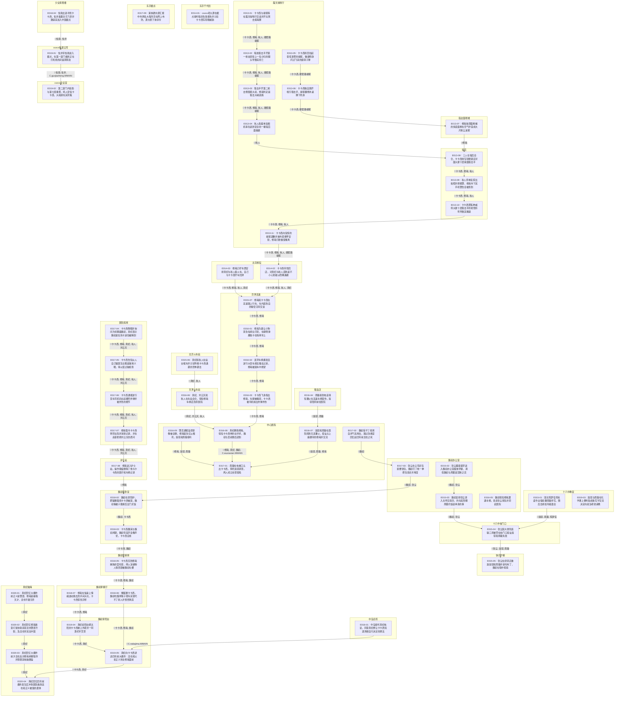

| event_uid | ch  | 场景           | 在场者                                                                     | 动作                             | 动机           | 因果后果      | 知识变动                                                                 | 物权/物件                      | 干涉点候选            | canon_src                  |
| --------- | --- | ------------ | ----------------------------------------------------------------------- | ------------------------------ | ------------ | --------- | -------------------------------------------------------------------- | -------------------------- | ---------------- | -------------------------- |
| E013-01   | 13  | 露天咖啡厅·下午     | C.kakashi.WMAIN, C.xiuzai.WMAIN, C.akito.WMAIN, ~硬套路柳絮                  | 卡卡西与柳絮等在露天咖啡厅交谈并开玩笑去偷海豚        | 饭后闲聊与拉近距离    | →E013-02  |                                                                      |                            |                  | n1-69:L3760-3790           |
| E013-02   | 13  | 露天咖啡厅·下午     | C.kakashi.WMAIN, C.xiuzai.WMAIN, C.akito.WMAIN, ~硬套路柳絮                  | 暗处狙击手开第一枪击碎街上一名少妇的额头导致其死亡      | 刺杀行动开局       | →E013-03  |                                                                      |                            |                  | n1-69:L3819-3825           |
| E013-03   | 13  | 露天咖啡厅·下午     | C.kakashi.WMAIN, C.xiuzai.WMAIN, C.akito.WMAIN, ~硬套路柳絮                  | 狙击手开第二枪击倒围观大叔，修哉判定是狙击大喊逃跑      | 警示同伴避险逃生     | →E013-04  |                                                                      |                            |                  | n1-69:L3838-3857           |
| E013-04   | 13  | 露天咖啡厅·下午     | C.akito.WMAIN                                                           | 秋人抱着单反相机率先逃到安全的一堵墙后面躲避         | 避开狙击火力       | →E013-08  |                                                                      | I.CAMERA:由秋人携带             |                  | n1-69:L3862-3865           |
| E013-05   | 13  | 露天咖啡厅·下午     | C.kakashi.WMAIN, ~硬套路柳絮                                                 | 卡卡西折回拉起受惊发愣的柳絮，敏捷侧身闪过飞来的旋转子弹   | 保护同伴安全       | →E013-06  | C.kakashi.WMAIN ← 被人狙击且自己是目标                                         |                            |                  | n1-69:L3874-3905           |
| E013-06   | 13  | 露天咖啡厅·下午     | C.kakashi.WMAIN, ~硬套路柳絮                                                 | 卡卡西独自跑开吸引狙击手，柳絮翻倒木桌蹲下防身        | 避免连累柳絮并求生    | →E013-07  |                                                                      |                            |                  | n1-69:L3906-3930           |
| E013-07   | 13  | 街边面粉摊·下午     | C.xiuzai.WMAIN                                                          | 修哉抛洒面粉摊的多袋面粉在空气中造成大片粉尘迷雾       | 阻碍狙击手射击视野    | →E013-08  |                                                                      |                            |                  | n1-69:L3936-3940           |
| E013-08   | 13  | 墙后·下午        | C.kakashi.WMAIN, C.xiuzai.WMAIN, C.akito.WMAIN                          | 三人在墙后会合，卡卡西用写轮眼锁定对面大厦十层蒙面狙击手   | 探明狙击手方位      | →E013-09  | C.kakashi.WMAIN, C.xiuzai.WMAIN, C.akito.WMAIN ← 狙击手在大厦十层            |                            |                  | n1-69:L3941-3957           |
| E013-09   | 13  | 墙后·下午        | C.kakashi.WMAIN, C.xiuzai.WMAIN, C.akito.WMAIN                          | 秋人将单反探出拍照并想报警，修哉夺下其手机警告会被查到    | 保全证据且避免暴露    | →E013-10  |                                                                      | I.CAMERA_PHOTO:记录下狙击手轮廓    |                  | n1-69:L3958-3962           |
| E013-10   | 13  | 墙后·下午        | C.kakashi.WMAIN, C.xiuzai.WMAIN, C.akito.WMAIN                          | 卡卡西聚焦神威将大厦十层狙击手的枪管折弯导致其撤退      | 解除狙击火力威胁     | →E013-11  |                                                                      |                            |                  | n1-69:L3963-3972           |
| E013-11   | 13  | 露天咖啡厅·下午     | C.kakashi.WMAIN, C.xiuzai.WMAIN, C.akito.WMAIN, ~硬套路柳絮                  | 卡卡西向受惊的柳絮道歉并披外套搂怀安慰，修哉打断催促撤离   | 抚慰受惊伙伴并逃离    | →E014-02  |                                                                      | I.COAT:披在柳絮身上              |                  | n1-69:L3983-4045           |
| E014-01   | 14  | 东京千代田·白天     | ~源                                                                      | cozco老大源在据点接听暗杀失败报告并讨论卡卡西写轮眼威胁 | 了解刺杀动态与防备    | 待续:据点会议   | ~源 ← 狙击暗杀失败且卡卡西懂神威                                                   |                            |                  | n1-69:L4046-4070           |
| E014-02   | 14  | 北京旅馆·夜晚      | C.kakashi.WMAIN, C.xiuzai.WMAIN, C.akito.WMAIN, ~真纪                     | 卡卡西带伤回店，对真纪与秋人谎称是不小心划破以隐瞒遇袭    | 隐瞒敌情避免恐慌     | →E015-07  | C.kakashi.WMAIN ← 被极像佐助的快递少年追杀且被称“叛徒”                                |                            |                  | n1-69:L4556-4566           |
| E014-03   | 14  | 北京旅馆·夜晚      | C.kakashi.WMAIN, C.xiuzai.WMAIN, C.akito.WMAIN, ~真纪                     | 修哉订好车票安排真纪与秋人乘火车，自己与卡卡西开车回津    | 规避行踪泄露风险     | →E014-04  |                                                                      | I.CAR:吴叔的轿车                |                  | n1-69:L4568-4572           |
| E014-04   | 14  | 北京旅馆·夜晚/翌晨分流 | C.kakashi.WMAIN, C.xiuzai.WMAIN, C.akito.WMAIN, ~真纪                     | 一行按修哉安排执行分流：真纪与秋人持票赴火车站，修哉与卡卡西驾车返津 | 落实双路线撤离帝都   | →E015-06,→E015-07 |                                                                      | I.TICKET:秋人真纪火车票           | 玩家可择跟车或跟火车（δ分岔） | n1-69:L4568-4572,L4910-4911 |
| E015-01   | 15  | 十六中教室·清晨     | ~斑驳, ~雨璇, ~陈梦佳                                                          | 班长陈梦佳将英语作业借给潘雨璇抄写，随后去参加年级晨会    | 互助日常         | →E015-04  |                                                                      | I.ENGLISH_HOMEWORK:借给潘雨璇   |                  | n1-69:L4363-4397           |
| E015-02   | 15  | 魏初办公室·清晨     | C.weichu.WMAIN, C.zhangchen.WMAIN                                       | 张尘撬锁提早进入魏初办公室摆放早餐，调侃魏初与周董是禁断之恋 | 讨好上司以求转正     | →E015-03  |                                                                      | I.COFFEE_AND_BREAD:张尘摆放的早点 |                  | n1-69:L4465-4503           |
| E015-03   | 15  | 魏初办公室·白天     | C.weichu.WMAIN, C.zhangchen.WMAIN                                       | 魏初安排张尘录入文件交简历，并向其隐瞒周董约饭谈单身的事   | 照常公办并规避八卦    | →E015-04  |                                                                      | I.RESUME:张尘简历              |                  | n1-69:L4504-4536           |
| E015-04   | 15  | 十六中校门口·下午    | C.zhangchen.WMAIN, ~斑驳, ~雨璇                                             | 张尘因大冒险连输三局被罚在校门口搭讪斑驳和雨璇失败      | 完成真心话大冒险     | →E015-05  |                                                                      |                            |                  | n1-69:L4599-4654           |
| E015-05   | 15  | 快乐柠檬·下午      | C.zhangchen.WMAIN, ~斑驳, ~雨璇                                             | 张尘在奶茶店重逢斑驳和雨璇并请吃布丁，魏初在暗中观察     | 达成搭讪任务免除工作威胁 | 待续:大事件追查线 | I.BUDDING:请吃布丁                                                       |                            |                  | n1-69:L4656-4673           |
| E015-06   | 15  | 北京火车站·上午     | ~真纪, C.akito.WMAIN                                                      | 真纪和秋人在站台候车并讨论昨晚卡卡西遇袭的恐怖袭击      | 忧虑旅途安全       | →E016-06  |                                                                      |                            |                  | n1-69:L4547-4555           |
| E015-07   | 15  | 京津高速·白天      | C.kakashi.WMAIN, C.xiuzai.WMAIN                                         | 修哉和卡卡西在高速路上行车，车内就各自的秘密沉闷交谈     | 戒备行进与沟通      | →E016-01  |                                                                      | I.CAR:修哉驾驶行驶               |                  | n1-69:L4578-4598           |
| E016-01   | 16  | 京津高速·白天      | C.kakashi.WMAIN, C.xiuzai.WMAIN                                         | 修哉为避让小狗紧急拉闸左打轮，车辆侧滑爆胎卡在隔离带上    | 避免撞击动物       | →E016-02  |                                                                      | I.CAR:损坏爆胎卡住               |                  | n1-69:L4768                |
| E016-02   | 16  | 京津高速·白天      | C.kakashi.WMAIN, C.xiuzai.WMAIN                                         | 连环车祸爆发且逆行大货车疯狂撞击过来，修哉被困车中绝望    | 伏击危险爆发       | →E016-03  |                                                                      |                            |                  | n1-69:L4768                |
| E016-03   | 16  | 京津高速·白天      | C.kakashi.WMAIN, C.xiuzai.WMAIN                                         | 卡卡西飞身抱出修哉，车辆被撞碎，卡卡西被司机抛出炸弹炸伤   | 营救修哉         | →E016-08  | C.kakashi.WMAIN, C.xiuzai.WMAIN ← 被逆行货车和普通炸弹伏击                       | I.CAR:被货车碾碎毁坏              |                  | n1-69:L5315-5343           |
| E016-04   | 16  | 快乐柠檬·下午      | C.zhangchen.WMAIN, ~斑驳, ~雨璇                                             | 雨璇接到电话得知潘父在高速车祸受伤，张尘安抚并协助判断，斑驳陪同前往医院 | 亲属伤情探望       | →E016-07  |                                                                      |                            |                  | n1-69:L4820-4868           |
| E016-05   | 16  | 魏初办公室·下午     | C.weichu.WMAIN, C.zhangchen.WMAIN                                       | 魏初得知修哉遭遇车祸，拿走张尘钱包并奔赴医院         | 急于前往现场       |           | I.WALLET:张尘钱包借给魏初                                                    |                            | n1-69:L4800      |                            |
| E016-06   | 16  | 天津火车站·下午     | ~真纪, C.liuyuntian.WMAIN, C.akito.WMAIN                                  | 真纪、刘云天和秋人在车站会合，得知修哉车祸后急奔医院     | 赶赴现场确认安危     | →E016-08  |                                                                      |                            |                  | n1-69:L4800                |
| E016-07   | 16  | 中心医院·下午      | ~斑驳, ~雨璇, C.xiuzai.WMAIN                                                | 斑驳和雨璇在医院找到无恙潘父，搭讪头上缠绷带的修哉并交流   | 确认亲人安全与好奇搭讪  | →E017-01  |                                                                      |                            |                  | n1-69:L5138-5152           |
| E016-08   | 16  | 中心医院·下午      | C.xiuzai.WMAIN, ~真纪, C.weichu.WMAIN, C.wuxiaxian.WMAIN                  | 真纪拥抱修哉，得知卡卡西骨折动手术，魏初与吴叔随后赶到    | 通报伤情与聚集      | →E017-01  | ~真纪, C.weichu.WMAIN, C.wuxiaxian.WMAIN ← 卡卡西为救修哉受重伤并正在动手术            |                            |                  | n1-69:L5226-5231,5354-5358 |
| E016-09   | 16  | 中心医院·下午      | C.xiuzai.WMAIN, ~斑驳, ~雨璇                                                | 警员通报监控录像被全删，修哉装失忆以推托，斑驳和雨璇偷听   | 警方盘问与密谋防范    | →E017-01  | ~斑驳, ~雨璇 ← 盘问车祸的监控录像全部被人删除                                           |                            |                  | n1-69:L5294-5300           |
| E017-01   | 17  | 中心医院·下午      | ~斑驳, ~雨璇                                                                | 雨璇在电梯口认出卡卡西，拜托斑驳调查，两人成立侦探搭档    | 组队查明超自然现象    | 待续:大事件调查线 | ~斑驳, ~雨璇 ← 卡卡西极度像漫画中的卡卡西且有左眼疤                                        |                            |                  | n1-69:L5140-5208           |
| E017-02   | 17  | 中心医院·下午      | C.weichu.WMAIN                                                          | 魏初受不了病房自闭气氛离去，路过急救室回忆起四年前龙也之死  | 心理避难与触景生情    | →E017-03  |                                                                      |                            |                  | n1-69:L5228-5252           |
| E017-03   | 17  | 魏初办公室·傍晚     | C.weichu.WMAIN, C.zhangchen.WMAIN                                       | 张尘去公司还包索要钱包，魏初打了他一拳把包拿走并离席     | 掩饰伤感         | →E018-02  |                                                                      | I.BAG:归还魏初                 |                  | n1-69:L5253-5271           |
| E017-04   | 17  | 医院病房·傍晚      | C.kakashi.WMAIN, C.xiuzai.WMAIN, ~真纪, C.akito.WMAIN, C.liuyuntian.WMAIN | 卡卡西睁眼并询问为何瞒着魏初，真纪表示魏初是狂热卡迷怕被解剖 | 解答疑问并通报担忧    | →E017-05  | C.kakashi.WMAIN ← 魏初是重度卡卡西角色扮演爱好者                                    |                            |                  | n1-69:L5272-5286           |
| E017-05   | 17  | 医院病房·傍晚      | C.kakashi.WMAIN, C.xiuzai.WMAIN, ~真纪, C.akito.WMAIN, C.liuyuntian.WMAIN | 卡卡西告知众人自己骗医生左眼是玻璃义眼，得以混过脑检查    | 通报隐瞒写轮眼的细节   | →E017-06  |                                                                      |                            |                  | n1-69:L5287-5301           |
| E017-06   | 17  | 医院病房·傍晚      | C.kakashi.WMAIN, C.xiuzai.WMAIN, ~真纪, C.akito.WMAIN, C.liuyuntian.WMAIN | 卡卡西通报逆行货车司机扔出起爆符炸弹并被炸伤的细节      | 共享伏击军工武器情报   | →E017-07  | C.xiuzai.WMAIN, C.akito.WMAIN, C.liuyuntian.WMAIN ← 货车司机扔出炸弹并导致卡卡西炸伤 |                            |                  | n1-69:L5315-5343           |
| E017-07   | 17  | 医院病房·傍晚      | C.kakashi.WMAIN, C.xiuzai.WMAIN, ~真纪, C.akito.WMAIN, C.liuyuntian.WMAIN | 修哉强令卡卡西明早出院并消除记录，并在走廊拒绝刘云天的质问  | 避开警方追查与密谋隐退  | →E017-08  |                                                                      |                            |                  | n1-69:L5347-5396           |
| E017-08   | 17  | 护士站·傍晚       | C.xiuzai.WMAIN                                                          | 修哉进入护士站，操作键盘删除了他与卡卡西的医疗和车祸记录   | 抹除警方和网路记录证据  | →E018-02  |                                                                      |                            |                  | n1-69:L5397-5401           |
| E017-09   | 17  | 东京据点·夜晚      | ~源, ~莱纳德                                                                | 莱纳德向源汇报中外两名大程序员在网上布防，源大怒下抹杀令   | 探明黑客暗中防御网    | 待续:东京暗杀风暴 | ~源 ← 六年前被封杀的革新计划工程师还活着且保护卡卡西                                         |                            |                  | n1-69:L5412-5474           |
| E018-01   | 18  | 中岛诊所·白天      | C.nakajima.WMAIN                                                        | 中岛接听真纪电话，同意真纪想让卡卡西知道真相自行决定的想法  | 达成关于卡卡西的处置共识 | →E019-05  | C.nakajima.WMAIN ← 真纪决定将大爆炸的真相告知卡卡西                                  |                            |                  | n1-69:L5501-5561           |
| E018-02   | 18  | 魏初家卧室·下午     | C.weichu.WMAIN, C.kakashi.WMAIN                                         | 魏初在家陪护，肥猫懒蛋爬卡卡西被窝，魏初掖被子致谢后出门买饭 | 表达谢意并心理松动    | →E018-03  |                                                                      | I.CAT_LANDAN:爬上卡卡西被窝       |                  | n1-69:L5572-5608           |
| E018-03   | 18  | 魏初家卧室·下午     | C.kakashi.WMAIN, C.weichu.WMAIN                                         | 卡卡西醒来与魏初闲聊，魏初夸其声音像声优，卡卡西自省     | 伤情交谈         | →E018-05  | C.kakashi.WMAIN ← 自身存在可能对身边人产生障碍                                     |                            |                  | n1-69:L5609-5642           |
| E018-04   | 18  | 少女家阁楼·下午     | ~佐助, ~佐井                                                                | 佐助出逃寻找卡卡西，佐井乘墨巨鸟飞至并邀请其加入中国据点   | 招募同伴与结盟      | →E019-01  | ~佐助 ← 卡卡西此时并不在这个城市，佐井与他同一立场                                          | I.SUMI_BIRD:乘坐飞鸟离开         |                  | n1-69:L5663-5755           |
| E018-05   | 18  | 魏初家厨房·傍晚     | C.kakashi.WMAIN, C.xiuzai.WMAIN, C.weichu.WMAIN                         | 卡卡西见到修哉娴熟炒菜吃惊，两人演植物人情景剧被魏初吐槽   | 日常调侃         | →E018-06  | C.kakashi.WMAIN ← 修哉竟然擅长极其娴熟的厨艺                                      |                            |                  | n1-69:L5756-5828           |
| E018-06   | 18  | 魏初家餐厅·傍晚     | C.kakashi.WMAIN, C.xiuzai.WMAIN, C.weichu.WMAIN                         | 懒蛋蹭卡卡西，魏初吃醋摔筷子怒斥其替代不了别人并愤然离席   | 睹物思人情绪崩溃     | →E019-05  | C.kakashi.WMAIN ← 以前也有个和懒蛋亲密并住在这的人                                   |                            |                  | n1-69:L5830-5847           |
| E018-07   | 18  | 魏初家餐厅·傍晚     | C.kakashi.WMAIN, C.xiuzai.WMAIN                                         | 修哉在饭桌上情绪波动跑去洗手间大吐，卡卡西惊觉异样      | 身体后遗症反应      | →E019-04  |                                                                      |                            |                  | n1-69:L5847-5852           |
| E019-01   | 19  | cozco快递公司·夜晚 | ~佐助, ~佐井, C.guojiazheng.WMAIN                                           | 佐井带佐助进入据点，在第一道门看到正在打毛线的间谍郭家政   | 参观据点与结识      | →E019-02  | ~佐助 ← 郭家政主业做间谍、副业是家政老师且天天在这打毛线                                       | I.WOOL:郭家政手中的编织毛衣          |                  | n1-69:L5853-5897           |
| E019-02   | 19  | cozco会议室·夜晚  | ~佐助, ~佐井, ~小樱, ~鸣人, ~大和                                                 | 第二道门内佐助与第七班重聚，鸣人坚信卡卡西，大和感叹其背叛  | 第七班会合与分歧     | 待续:第七班追踪线 | ~佐助 ← 卡卡西在这个世界里被判定为了“背叛者”                                            |                            |                  | n1-69:L5898-5928           |
| E019-03   | 19  | 十六中教室·白天     | ~斑驳, ~雨璇                                                                | 斑驳与雨璇在化学课上便利贴纸条写字交流决定向政治老钱请教   | 密谋破案思路       | 待续:侦探线进展  |                                                                      | I.NOTE:写字交流的纸条             |                  | n1-69:L5929-5964           |
| E019-04   | 19  | 魏初家阳台·白天     | C.kakashi.WMAIN, ~真纪                                                    | 真纪给阳台晒太阳的卡卡西披上外套并一同靠栏杆赏景       | 日常搭讪与关怀      | →E019-05  |                                                                      | I.COAT:披在卡卡西背上             |                  | n1-69:L5965-5983           |
| E019-05   | 19  | 魏初家阳台·白天     | C.kakashi.WMAIN, ~真纪                                                    | 真纪向卡卡西讲述四年前大爆炸：龙也和父亲正义死在修哉面前   | 告知悲剧背景以使其做抉择 | →E020-04  | C.kakashi.WMAIN ← 魏初的先夫叫折原龙也，是修哉亲哥哥；四年前龙也和父亲在大爆炸惨死，修哉重创活下            |                            |                  | n1-69:L5984-6071           |
| E020-01   | 20  | 真纪脑海·白天      | ~真纪                                                                     | 真纪回忆大爆炸前正义是警部，修哉是编程天才，龙也平庸无奈   | 叹惋当年兄弟背景     | →E020-02  |                                                                      |                            |                  | n1-69:L6215-6250           |
| E020-02   | 20  | 真纪脑海·白天      | ~真纪                                                                     | 真纪回忆修哉故意打架协助哥哥龙也警部升职，及龙也带其去中国  | 回忆家族间默默支持的过去 | →E020-03  |                                                                      |                            |                  | n1-69:L6215-6250           |
| E020-03   | 20  | 真纪脑海·白天      | ~真纪                                                                     | 真纪回忆大爆炸前夕龙也反对修哉参赛程序并怒砸其电脑硬盘    | 回想兄弟二人决裂起因   | →E020-04  |                                                                      | I.COMPUTER:被龙也砸毁的电脑硬盘      |                  | n1-69:L6215-6250           |
| E020-04   | 20  | 真纪脑海·白天      | ~真纪                                                                     | 真纪回忆四年前爆炸发生后冲到医院看到龙也和正义被毁的遗体   | 惨剧细节回顾       | 待续:卡卡西之抉择 |                                                                      | I.DEAD_BODIES:被炸毁的龙也与正义遗体  |                  | n1-69:L6215-6250           |

## 二、剧情生命线图 (Ch.13-20)

```mermaid
flowchart LR
  subgraph Loc_BJ["北京·案发现场与旅馆"]
    E013-01["E013-01: 咖啡厅偷海豚闲聊"] -->|"👤卡卡西/修哉/秋人/柳絮"| E013-02["E013-02: 狙击枪击毙少妇"]
    E013-02 -->|"👤卡卡西/修哉/秋人/柳絮"| E013-03["E013-03: 狙击第二枪大喊逃跑"]
    E013-03 -->|"👤秋人 携单反逃跑"| E013-04["E013-04: 秋人跑到墙后避难"]
    E013-03 -->|"👤卡卡西/柳絮"| E013-05["E013-05: 卡卡西拉柳絮避开子弹"]
    E013-05 -->|"👤卡卡西/柳絮"| E013-06["E013-06: 卡卡西独自跑开引杀手"]
    E013-03 -->|"👤修哉"| E013-07["E013-07: 修哉抛洒面粉造雾"]
    E013-06 -->|"👤卡卡西"| E013-08["E013-08: 三人在墙后会合"]
    E013-07 -->|"👤修哉"| E013-08
    E013-04 -->|"👤秋人"| E013-08
    E013-08 -->|"👤卡卡西/修哉/秋人"| E013-09["E013-09: 秋人拍照修哉阻拦报警"]
    E013-09 -->|"👤卡卡西/修哉/秋人"| E013-10["E013-10: 卡卡西神威折弯枪管"]
    E013-10 -->|"👤卡卡西/修哉/秋人/柳絮"| E013-11["E013-11: 危机解除搂怀安慰并撤离"]
    E013-11 -->|"👤卡卡西/修哉/秋人 物理转移"| E014-02["E014-02: 旅馆带伤包扎谎称划破"]
    E013-11 -->|"👤修哉 物理转移"| E014-03["E014-03: 订车票分流返程"]
  end

  subgraph Loc_Tokyo["东京·Cozco据点与诊所"]
    E014-01["E014-01: 源在东京据点接暗杀报告"]
    E017-09["E017-09: 莱纳德向源汇报程序员防线"]
    E018-01["E018-01: 中岛诊所接真纪电话商议"]
    E018-04["E018-04: 佐助出逃遇佐井乘巨鸟赴华"]
  end

  subgraph Loc_TJ_School["天津·十六中与奶茶店"]
    E015-01["E015-01: 斑驳雨璇早晨补作业陈梦佳"] -->|"👤斑驳/雨璇 放学"| E015-04["E015-04: 张尘在校门口搭讪失败"]
    E015-04 -->|"👤斑驳/雨璇/张尘 物理移动"| E015-05["E015-05: 奶茶店重逢请吃布丁"]
    E019-03["E019-03: 斑驳雨璇密谋向老钱求助"]
  end

  subgraph Loc_Highway["京津高速车祸区"]
    E014-03 -->|"👤卡卡西/修哉 驾车出发"| E015-07["E015-07: 高速开车沉闷交谈"]
    E015-07 -->|"👤卡卡西/修哉"| E016-01["E016-01: 避让狗侧滑爆胎卡住"]
    E016-01 -->|"👤卡卡西/修哉"| E016-02["E016-02: 货车逆行撞来修哉绝望"]
    E016-02 -->|"👤卡卡西/修哉"| E016-03["E016-03: 卡卡西救修哉被炸弹炸伤"]
  end

  subgraph Loc_TJ_Hospital["天津·中心医院"]
    E016-03 -->|"👤卡卡西/修哉 送医"| E016-07["E016-07: 斑驳雨璇搭讪住院修哉"]
    E016-04 -->|"👤斑驳/雨璇 奔医院"| E016-07
    E016-05 -->|"👤魏初 奔医院"| E016-08["E016-08: 医院会合得知卡卡西手术"]
    E016-06 -->|"👤真纪/刘云天/秋人 奔医院"| E016-08
    E016-07 --> E016-08
    E016-08 -->|"👤修哉"| E016-09["E016-09: 警员盘问监控被删修哉装失忆"]
    E016-09 --> E017-01["E017-01: 雨璇电梯认出卡卡西结侦探搭档"]
    E017-01 -->|"👤卡卡西/修哉/真纪 术后病房"| E017-04["E017-04: 病房谈话真纪防备魏初"]
    E017-04 -->|"👤卡卡西/修哉/真纪"| E017-05["E017-05: 卡卡西称左眼骗过义眼脑CT"]
    E017-05 -->|"👤卡卡西/修哉/真纪"| E017-06["E017-06: 披露逆行车起爆手里剑炸弹"]
    E017-06 -->|"👤卡卡西/修哉/真纪"| E017-07["E017-07: 强令明天出院走廊拒绝刘云天"]
    E017-07 -->|"👤修哉"| E017-08["E017-08: 敲键盘抹除医疗记录档案"]
  end

  subgraph Loc_TJ_WeichuHome["天津·魏初家"]
    E015-02["E015-02: 张尘撬门送早餐被魏初训"] --> E015-03["E015-03: 魏初交代简历瞒周董吃饭"]
    E017-02["E017-02: 魏初离院回司路过急救室痛哭"] --> E017-03["E017-03: 张尘送包挨打魏初拒还钱包"]
    E017-08 -->|"👤卡卡西/修哉 物理回搬"| E018-02["E018-02: 魏初陪护猫钻被窝掖被致谢"]
    E018-02 -->|"👤卡卡西"| E018-03["E018-03: 醒来与魏初闲聊井上和彦自省"]
    E018-03 -->|"👤卡卡西/修哉 物理集结"| E018-05["E018-05: 厨房见修哉炒菜演告白剧"]
    E018-05 -->|"👤卡卡西/修哉/魏初"| E018-06["E018-06: 懒蛋蹭卡卡西魏初吃醋摔筷离席"]
    E018-06 -->|"👤卡卡西/修哉"| E018-07["E018-07: 修哉丢碗筷冲洗手间剧吐"]
    E018-07 -->|"👤卡卡西/真纪"| E019-04["E019-04: 阳台真纪为卡卡西披外套"]
    E019-04 -->|"👤卡卡西/真纪"| E019-05["E019-05: 真纪讲述四年前大爆炸惨案"]
    E019-05 -->|"👤真纪 回忆"| E020-01["E020-01: 正义是刑警修哉天才龙也平庸"]
    E020-01 -->|"👤真纪 回忆"| E020-02["E020-02: 修哉故意打架协助龙也升职"]
    E020-02 -->|"👤真纪 回忆"| E020-03["E020-03: 大爆炸前夕龙也怒砸修哉硬盘"]
    E020-03 -->|"👤真纪 回忆"| E020-04["E020-04: 惨剧发生医院认领被炸毁遗体"]
  end

  subgraph Loc_TJ_Cozco["天津·Cozco快递据点"]
    E018-04 -->|"👤佐助/佐井 物理回津"| E019-01["E019-01: 进据点见郭家政打毛衣"]
    E019-01 -->|"👤佐助/佐井"| E019-02["E019-02: 第七班重聚鸣人小樱大和坚信"]
  end

  %% 跨章节伏笔及信息流转线
  E013-10 -.->|"折弯狙击枪引警惕"| E014-01
  E014-01 -.->|"跨国通缉卡卡西"| E016-02
  E017-08 -.->|"清除警方线索"| E018-01
  E018-01 -.->|"真纪给中岛打电话商议"| E019-05
  E017-09 -.->|"源大人收到莱纳德报告"| E018-01
```

## 三、未建档角色增量清单

以下为 Ch.13-20 细剖中提取的增量关键角色（剔除了首批 16 个已建档角色）：

1. **`~柳絮`**：来自北京的卡迷女大学生，在咖啡厅、海洋馆与卡卡西、修哉、秋人结识。在 13 章现场目睹了少妇被爆头狙击的惨案并受惊，由卡卡西救下并安抚。
2. **`~莱纳德` (Leonard Cook)**：前谷歌首席软件工程师，网络代码个性签名是 `blood plus`，在 17 章末尾作为 cozco 脱线黑客技术员向源大人报告网络攻防情况。
3. **`~鸣人` (漩涡鸣人)**：火影世界穿越者，在 Cozco 22 层快递公司中国据点内与第七班重聚，坚信卡卡西有难言苦衷。
4. **`~小樱` (春野樱)**：火影世界穿越者，在 Cozco 中国据点内与第七班重聚。
5. **`~佐助` (宇智波佐助)**：火影世界穿越者，此前偶遇卡卡西将其手臂砍伤并称其为叛徒，在 18 章脱离快递少女家，被佐井接引至 Cozco 据点归队。
6. **`~陈梦佳` (佳佳)**：天津十六中高一七班的班长，也是斑驳和雨璇的同桌，成绩优异。对二次元一无所知，在 15 章清晨将英语作业借给潘雨璇。
7. **`~源` (源晃)**：日本千代田区 Cozco 跨国快递据点的主管/老大，下达了清除卡卡西并防止其与“革新派”合流的密令。
8. **`~货车司机`**：逆行货车的驾驶员，在京津高速上伏击并试图撞击卡卡西与修哉，后扔出炸弹将卡卡西炸成重伤。
9. **`~警员`**：在中心医院对出车祸的修哉和真纪进行盘问并通报监控已被删除的警员。

## 时序图

