# Ch.21-30 细剖事件表

| event_uid | ch  | 场景       | 在场者                                                                 | 动作                                 | 动机       | 因果后果         | 知识变动                                       | 物权/物件           | 干涉点候选     | canon_src        |
| --------- | --- | -------- | ------------------------------------------------------------------- | ---------------------------------- | -------- | ------------ | ------------------------------------------ | --------------- | --------- | ---------------- |
| E021-01   | 21  | 魏初家某处·白昼 | ~真纪, C.kakashi.WMAIN                                                | 真纪因修哉受惊而向卡卡西痛哭倾诉                   | 宣泄压抑悲伤   | →E021-02     |                                            |                 |           | n1-69:L6446-6467 |
| E021-02   | 21  | 魏初家某处·白昼 | ~真纪, C.kakashi.WMAIN                                                | 真纪向卡卡西讲述魏初当年因龙也死而责怪修哉活着的旧事         | 解释家人隔阂   | →E021-03     | C.kakashi.WMAIN ← 魏初曾因龙也之死责怪修哉             |                 |           | n1-69:L6503-6512 |
| E021-03   | 21  | 魏初家某处·白昼 | ~真纪, C.kakashi.WMAIN                                                | 真纪向卡卡西说明带修哉回国是为了让他正视过去治愈抑郁症        | 治愈修哉期望   | →E021-04     | C.kakashi.WMAIN ← 真纪带修哉回国的目的是让他正视过去        |                 |           | n1-69:L6531-6534 |
| E021-04   | 21  | 魏初家某处·白昼 | ~真纪, C.kakashi.WMAIN                                                | 真纪请求卡卡西帮忙让修哉回忆过去                   | 依赖卡卡西影响  | 待续:修哉回忆      |                                            |                 |           | n1-69:L6566-6569 |
| E021-05   | 21  | 天津地铁·白昼  | ~柳絮, ~柳絮同学                                                          | 柳絮同学询问柳絮从北京回来后性情变化的原因              | 关心朋友变化   | →E021-06     |                                            |                 |           | n1-69:L6618-6620 |
| E021-06   | 21  | 天津地铁·白昼  | ~柳絮, ~柳絮同学, C.xiuzai.WMAIN                                          | 柳絮在地铁上偶然遇见修哉并因惯性扑倒在他身上             | 重逢打招呼    | →E021-07     |                                            |                 |           | n1-69:L6621-6625 |
| E021-07   | 21  | 天津地铁·白昼  | ~柳絮, C.xiuzai.WMAIN                                                 | 修哉邀请柳絮陪同他去游玩并得到同意                  | 寻找陪伴排解   | 待续:修哉柳絮游玩    |                                            |                 |           | n1-69:L6667-6673 |
| E021-08   | 21  | 刘公寓客房·白昼 | C.akito.WMAIN                                                       | 秋人把自己反锁在客房用Photoshop试图还原狙击手长相      | 试图查明凶手   | 待续:秋人还原照片    |                                            |                 |           | n1-69:L6675-6679 |
| E021-09   | 21  | 学校过道·白昼  | ~雨璇, ~斑驳, ~老钱                                                       | 政治老师老钱向雨璇和斑驳透露城基大厦发生未破凶杀案          | 卖弄时事信息   | →E021-10     | ~雨璇, ~斑驳 ← 城基大厦发生未破凶杀案                     |                 |           | n1-69:L6754-6770 |
| E021-10   | 21  | 学校过道·白昼  | ~雨璇, ~斑驳                                                            | 雨璇提议去城基大厦探险调查命案，斑驳同意               | 寻求刺激探险   | 待续:斑驳雨璇探险    |                                            |                 |           | n1-69:L6783-6798 |
| E021-11   | 21  | 魏初办公室·早晨 | C.weichu.WMAIN, C.zhangchen.WMAIN                                   | 魏初发现张尘在办公室熬夜工作后睡觉，捏他脖子叫醒他          | 叫醒员工打趣   | →E021-12     |                                            |                 |           | n1-69:L6803-6831 |
| E021-12   | 21  | 魏初办公室·早晨 | C.weichu.WMAIN, C.zhangchen.WMAIN                                   | 张尘回忆高中上课睡觉并自嘲活该                    | 感叹过去     | 待续:张尘往事      |                                            |                 |           | n1-69:L6857-6863 |
| E021-13   | 21  | 组织据点·白昼  | ~郭家政, ~大和, ~佐井, ~鸣人, ~小樱, ~佐助                                       | 鸣人小樱请求外出，郭家政扣留佐井作为人质后同意大和带人逛街      | 限制行动防逃跑  | →E021-14     |                                            |                 |           | n1-69:L6864-6893 |
| E021-14   | 21  | 咖啡屋·白昼   | ~大和, ~鸣人, ~小樱, ~佐助                                                  | 大和向佐助说明组织利用他们寻找卡卡西，且据点有查克拉干扰       | 交换情报现状   | 待续:寻找卡卡西     | ~佐助 ← 组织用查克拉干扰仪软禁他们寻找卡卡西                   |                 |           | n1-69:L6909-6993 |
| E021-15   | 21  | 吴夏弦办公室·昼 | ~吴夏弦, C.kakashi.WMAIN                                               | 卡卡西推断并找到吴夏弦办公室，询问当年折原家惨案细节         | 探查真相     | →E021-16     |                                            |                 |           | n1-69:L6994-7032 |
| E021-16   | 21  | 吴夏弦办公室·昼 | ~吴夏弦, C.kakashi.WMAIN                                               | 吴夏弦推测龙也是因秘密任务失败而举家逃亡并隐瞒修哉          | 提供当年案情推测 | →E021-17     | C.kakashi.WMAIN ← 龙也可能因任务失败逃亡并隐瞒修哉（吴夏弦推测版） |                 |           | n1-69:L7069-7081 |
| E021-17   | 21  | 吴夏弦办公室·昼 | ~吴夏弦, C.kakashi.WMAIN                                               | 吴夏弦给卡卡西看折原家旧照并拜托他拯救修哉              | 托付拯救修哉   | 待续:卡卡西救修哉    |                                            | 照片相册: 吴夏弦展示     |           | n1-69:L7100-7126 |
| E021-18   | 21  | 餐厅·白昼    | ~柳絮, C.xiuzai.WMAIN                                                 | 柳絮在餐厅询问修哉关于天才的烦恼并感叹不公平             | 试探排解烦闷   | 待续:修哉的回复     |                                            |                 |           | n1-69:L7129-7243 |
| E023-01   | 23  | 大厦三层过道·昼 | ~斑驳, ~雨璇                                                            | 斑驳与雨璇在凶宅探险时被意外停滞的电梯困在三层黑灯过道        | 寻求刺激探险   | →E023-02     |                                            |                 |           | n1-69:L7353-7423 |
| E023-02   | 23  | 大厦三层过道·昼 | ~斑驳, ~雨璇, C.zhangchen.WMAIN                                         | 张尘用手机照明出现在两个女生身后并解释说自己是来凑热闹的       | 取材偶遇     | →E024-03     |                                            |                 |           | n1-69:L7424-7456 |
| E023-03   | 23  | 大悦城入口·白昼 | C.kakashi.WMAIN, ~柳絮                                                | 卡卡西蒙面站在大悦城被路人拍照围观，柳絮迟到并与他汇合        | 赴修哉安排的局  | →E023-05     |                                            |                 |           | n1-69:L7460-7496 |
| E023-04   | 23  | 魏初家浴室·白昼 | C.xiuzai.WMAIN                                                      | 修哉被反锁在浴室内，向猫求食物未果                  | 饥饿索食     | →E023-06     |                                            |                 |           | n1-69:L7501-7514 |
| E023-05   | 23  | 汉堡店·白昼   | C.kakashi.WMAIN, ~柳絮                                                | 卡卡西询问柳絮是否有男友导致她喷了可乐                | 闲聊与试探    | 待续:卡卡西柳絮     |                                            |                 |           | n1-69:L7516-7604 |
| E023-06   | 23  | 魏初家客厅·白昼 | C.xiuzai.WMAIN, C.weichu.WMAIN                                      | 魏初将修哉从浴室放出，两人笑闹倒地，修哉要求吃蛋炒饭         | 饿极求食和解   | 待续:修哉吃蛋炒饭    |                                            |                 |           | n1-69:L7606-7660 |
| E024-01   | 24  | 游戏厅·白昼   | C.kakashi.WMAIN, ~柳絮                                                | 卡卡西和柳絮在游戏厅玩乐，柳絮抓娃娃失败很失落            | 减压娱乐     | →E024-02     |                                            |                 |           | n1-69:L7672-7707 |
| E024-02   | 24  | 游戏厅外·白昼  | C.kakashi.WMAIN, ~柳絮                                                | 卡卡西用神威作弊抓到玩偶送给柳絮，柳絮告知遇到蒙面怪人        | 讨好女伴     | 待续:卡卡西追查杀手   | ~柳絮 ← 卡卡西抓到了她想要的娃娃                         | 玩偶: 卡卡西送给柳絮     |           | n1-69:L7711-7736 |
| E024-03   | 24  | 大厦三层过道·昼 | ~斑驳, ~雨璇, C.zhangchen.WMAIN                                         | 三人在三层过道看到虚掩门后的血迹，张尘阻止两人出声          | 躲避潜在杀手   | →E024-04     |                                            |                 |           | n1-69:L7738-7821 |
| E024-04   | 24  | 大厦三层过道·昼 | ~斑驳, ~雨璇, C.zhangchen.WMAIN                                         | 听到脚步声后，张尘假装慌乱地报警发现尸体               | 报警求助伪装   | →E024-05     |                                            |                 |           | n1-69:L7822-7839 |
| E024-05   | 24  | 诚基大厦外·白昼 | ~斑驳, ~雨璇, C.zhangchen.WMAIN                                         | 张尘向斑驳和雨璇解释连环杀手出没的真相并警告她们别玩命        | 警告保护女生   | →E024-06     | ~斑驳, ~雨璇 ← 诚基大厦连续两周发生凶案且张尘知情               |                 |           | n1-69:L7841-7890 |
| E024-06   | 24  | 休息店·白昼   | ~斑驳, ~雨璇, C.zhangchen.WMAIN                                         | 张尘请两个女生喝饮料压惊，并拜托她们一些事情             | 压惊与请求协助  | 待续:张尘的委托     |                                            |                 |           | n1-69:L7892-7924 |
| E024-07   | 24  | 魏初家玄关·傍晚 | C.kakashi.WMAIN, C.xiuzai.WMAIN                                     | 卡卡西回家与修哉闲聊，怀疑修哉被固定一上午并抱怨无聊         | 日常交流     | →E024-08     |                                            |                 |           | n1-69:L7926-7945 |
| E024-08   | 24  | 魏初家餐厅·傍晚 | C.kakashi.WMAIN, C.xiuzai.WMAIN, C.weichu.WMAIN                     | 修哉和卡卡西抢吃懒蛋的炸虾，魏初端出晚饭嘲笑他们吃猫粮        | 饥饿抢食惹笑话  | →E025-01     |                                            | 炸虾: 被修哉和卡卡西吃掉   |           | n1-69:L7947-7957 |
| E025-01   | 25  | 魏初家餐厅·傍晚 | C.weichu.WMAIN, C.kakashi.WMAIN, C.xiuzai.WMAIN                     | 魏初因抢食事件消气并向卡卡西为当晚失态道歉              | 缓和关系并道歉  | →E025-02     |                                            |                 |           | n1-69:L7963-7981 |
| E025-02   | 25  | 魏初家餐厅·傍晚 | C.weichu.WMAIN, C.kakashi.WMAIN, C.xiuzai.WMAIN                     | 魏初借老熟人名义调侃卡卡西无女友，进而讲起她和龙也的恋爱往事     | 分享恋爱回忆   | →E025-03     |                                            |                 |           | n1-69:L8025-8125 |
| E025-03   | 25  | 魏初家餐厅·傍晚 | C.weichu.WMAIN, C.kakashi.WMAIN                                     | 魏初回忆龙也惨死时痛哭，卡卡西握手安慰并劝她不要将错归咎于己     | 自责与安慰    | 待续:卡卡西宽慰魏初   |                                            |                 |           | n1-69:L8175-8197 |
| E025-04   | 25  | 魏初家餐厅·傍晚 | C.weichu.WMAIN, C.kakashi.WMAIN                                     | 魏初怀疑是龙也暗中安排卡卡西来保护修哉，但随后自己否定        | 寻求情感寄托   | 待续:魏初的幻想     |                                            |                 |           | n1-69:L8207-8214 |
| E026-01   | 26  | 日本组织据点·夜 | ~黑客                                                                 | 黑客调查Leonard动向时发现两个不同风格的编程者在隐藏卡卡西信息 | 追踪网络痕迹   | 待续:黑客追查      | ~黑客 ← 有人暗中隐藏卡卡西                            |                 |           | n1-69:L8240-8274 |
| E026-02   | 26  | 魏初家客房·深夜 | C.xiuzai.WMAIN                                                      | 修哉带病熬夜反击黑客的网络追踪并意识到对方试图查自己身份       | 防御网络追踪   | →E026-03     | C.xiuzai.WMAIN ← 有黑客试图查身份                  |                 |           | n1-69:L8276-8289 |
| E026-03   | 26  | 魏初家客房·深夜 | C.xiuzai.WMAIN, C.kakashi.WMAIN                                     | 卡卡西进入修哉房间送冰袋并调侃，修哉透露车祸疑点           | 日常交谈与情报  | →E026-04     |                                            | 冰袋: 卡卡西交修哉      |           | n1-69:L8293-8344 |
| E026-04   | 26  | 魏初家客房·深夜 | C.xiuzai.WMAIN, C.kakashi.WMAIN                                     | 修哉告知卡卡西狙击手是军人且受命于政府，推测政府要杀卡卡西      | 分析追杀者背景  | →E026-05     | C.kakashi.WMAIN ← 狙击手是军人受命政府（修哉推测版）        |                 |           | n1-69:L8345-8371 |
| E026-05   | 26  | 魏初家客房·深夜 | C.xiuzai.WMAIN, C.kakashi.WMAIN                                     | 两人开玩笑后意外滚倒在床并接吻，随后触电般分开互损          | 玩笑擦枪走火   | 待续:修哉卡卡西     |                                            |                 | ◎接吻可能产生干涉 | n1-69:L8397-8439 |
| E026-06   | 26  | 魏初家客房·深夜 | C.xiuzai.WMAIN, C.kakashi.WMAIN                                     | 卡卡西折返给饿肚子的修哉送剩饭，然后外出夜探             | 照顾室友与夜探  | 待续:卡卡西夜探     |                                            | 剩饭: 卡卡西送修哉      |           | n1-69:L8449-8476 |
| E027-01   | 27  | 组织据点·昼   | ~佐助, ~大和, ~佐井, ~小樱                                                  | 大和称组织查不到卡卡西行踪，佐助不满欲离开被佐井拦下         | 质疑组织与反叛  | →E027-02     |                                            |                 |           | n1-69:L8476-8495 |
| E027-02   | 27  | 组织据点·昼   | ~佐助, ~大和, ~佐井, ~小樱, ~郭家政                                            | 佐井和大和说明被据点摄像头全方位监视现状，郭家政进门威胁       | 说明软禁真相   | 待续:佐助了解处境    | ~佐助 ← 组织通过摄像头监视他们                          |                 |           | n1-69:L8516-8553 |
| E027-03   | 27  | 学校办公室·昼  | ~雨璇, ~斑驳, ~老罗                                                       | 雨璇和斑驳将张尘的信交给语文老师老罗，老罗看信后激动         | 替张尘传信    | →E027-04     | ~老罗 ← 学生张尘在附近工作想见她                         | 信封: 斑驳交老罗       |           | n1-69:L8588-8628 |
| E027-04   | 27  | 学校办公室·昼  | ~雨璇, ~斑驳, ~老罗                                                       | 老罗向两人回忆张尘高中才华并感叹曾经发生过不愉快的事         | 讲述张尘往事   | 待续:张尘高中往事    | ~雨璇, ~斑驳 ← 张尘高中经历不快                        |                 |           | n1-69:L8646-8656 |
| E027-05   | 27  | 董事长办公室·昼 | C.zhangchen.WMAIN, ~周泽                                              | 张尘向周泽展示前三起凶杀案死者皆投资过公司，警告周泽小心       | 推理案件与警告  | →E027-06     | ~周泽 ← 三名死者投资其公司                            | 档案3份: 张尘展示      |           | n1-69:L8682-8705 |
| E027-06   | 27  | 董事长办公室·昼 | ~周泽                                                                 | 周泽等张尘离开后立刻打电话给Leonard要求调查张尘背景      | 应对张尘试探   | 待续:周泽查张尘     |                                            |                 |           | n1-69:L8708-8710 |
| E027-07   | 27  | 魏初公司大厅·昼 | C.weichu.WMAIN, ~黄毛混子                                               | 几名混混因地皮纠纷来公司闹事，魏初挺身而出欲报警交涉         | 应对地痞闹事   | 待续:魏初处理危机    |                                            |                 |           | n1-69:L8712-8740 |
| E028-01   | 28  | 荒地公路·昼   | C.xiuzai.WMAIN, C.kakashi.WMAIN                                     | 修哉带卡卡西来到被炸毁的折原家旧址并讲述四年前的事发经过       | 重返家园遗址   | →E028-02     |                                            |                 |           | n1-69:L8844-8893 |
| E028-02   | 28  | 荒地公路·昼   | C.xiuzai.WMAIN, C.kakashi.WMAIN                                     | 修哉回忆爆炸逃亡并跪在地上痛哭自责，卡卡西跪地抱住他安慰       | 宣泄内疚与拥抱  | 待续:卡卡西救赎修哉   |                                            |                 |           | n1-69:L8924-8998 |
| E028-03   | 28  | 俄勒冈州民宅·夜 | ~Leonard, ~Sara                                                     | Leonard深夜接听周泽电话调查张尘，女友Sara抱怨生活提心吊胆 | 接到调查指令   | →E028-05     | ~Leonard ← 周泽要求调查张尘                        |                 |           | n1-69:L9008-9042 |
| E028-04   | 28  | 街边花坛·昼   | C.xiuzai.WMAIN, C.kakashi.WMAIN                                     | 两人在路边吃小吃，卡卡西向修哉坦白自己刚来到这个世界时的记忆     | 坦白降临经历   | 待续:修哉推断卡卡西来历 | C.xiuzai.WMAIN ← 卡卡西来到世界时身处监控仪房间           |                 |           | n1-69:L9044-9100 |
| E028-05   | 28  | 董事长办公室·昼 | ~Leonard, ~周泽                                                       | Leonard在电话中向周泽说明张尘简历造假且高中失踪至今      | 揭露张尘背景   | 待续:周泽的对策     | ~周泽 ← 张尘简历造假且高中失踪                          |                 |           | n1-69:L9102-9134 |
| E029-01   | 29  | 宿舍·昼     | ~柳絮, ~柳絮舍友                                                          | 柳絮的舍友讲起高中时仰慕的学长张尘，透露他在女友跳楼后失踪      | 舍友的张尘八卦  | 待续:柳絮与张尘关联   | ~柳絮 ← 张尘高中女友跳楼后失踪                          |                 |           | n1-69:L9249-9321 |
| E029-02   | 29  | 伊势丹餐厅·傍晚 | C.zhangchen.WMAIN                                                   | 张尘带伤赴约在餐厅等待老罗时趴在桌上睡着               | 等待恩师赴约   | →E029-03     |                                            |                 |           | n1-69:L9323-9361 |
| E029-03   | 29  | 伊势丹餐厅·傍晚 | C.zhangchen.WMAIN, ~老罗                                              | 老罗叫醒张尘，两人久别重逢激动落泪，张尘边吃边哭诉找不到家人     | 师生重逢与痛哭  | →E029-04     | ~老罗 ← 张尘找不到搬家的父母                           |                 |           | n1-69:L9363-9425 |
| E029-04   | 29  | 伊势丹餐厅·傍晚 | C.zhangchen.WMAIN, ~老罗                                              | 老罗感叹当年寻找张尘的绝望，张尘隐晦透露自己曾被绑架并被迫工作    | 倾诉失踪真相   | →E029-05     | ~老罗 ← 张尘曾被绑架逼迫写东西逃亡四年                      |                 |           | n1-69:L9435-9482 |
| E029-05   | 29  | 伊势丹餐厅·傍晚 | C.zhangchen.WMAIN, ~老罗                                              | 张尘提醒老罗注意跟踪而来的雨璇和斑驳，告诫她有想法并非好事      | 察觉跟踪与告诫  | 待续:老罗的关照     |                                            |                 |           | n1-69:L9484-9519 |
| E030-01   | 30  | 魏初家客厅·夜  | C.weichu.WMAIN, C.kakashi.WMAIN, C.xiuzai.WMAIN, C.akito.WMAIN, ~真纪 | 修哉和卡卡西合伙将秋人绑在椅子上堵住嘴，真纪微笑离开         | 恶搞秋人日常   | →E030-02     |                                            |                 |           | n1-69:L9520-9552 |
| E030-02   | 30  | 魏初家客厅·夜  | C.weichu.WMAIN, C.kakashi.WMAIN, C.xiuzai.WMAIN, C.akito.WMAIN      | 修哉将绑在椅子上的秋人拖进卧室，卡卡西在客厅试探魏初关于龙也的记忆  | 转移注意力试探  | →E030-03     |                                            |                 |           | n1-69:L9554-9575 |
| E030-03   | 30  | 魏初家客厅·夜  | C.weichu.WMAIN, C.kakashi.WMAIN                                     | 卡卡西套出龙也曾在外勤处理跨国案时被派往佐佐木不让管的地方      | 刺探龙也工作秘密 | 待续:卡卡西追查龙也路线 | C.kakashi.WMAIN ← 龙也曾参与高层越权指派的跨国案件         |                 |           | n1-69:L9576-9635 |
| E030-04   | 30  | 餐厅外街头·夜  | ~雨璇, ~斑驳                                                            | 斑驳抱怨老罗和张尘聊太久，两人打算去KTV通宵但没钱         | 跟踪偷窥的烦恼  | →E030-05     |                                            |                 |           | n1-69:L9645-9685 |
| E030-05   | 30  | 商业街·夜    | C.zhangchen.WMAIN, ~老罗                                              | 张尘送老罗去停车场，打算先自己用吓唬的方式劝退两个学生        | 商议保护学生   | →E030-06     |                                            |                 |           | n1-69:L9687-9750 |
| E030-06   | 30  | 商业街·夜    | C.zhangchen.WMAIN, ~雨璇, ~斑驳                                         | 张尘买热饮送给饥寒交迫的雨璇和斑驳，邀请她们去自己家借宿       | 照顾跟踪的学生  | 待续:两个女生借宿张尘家 |                                            | 热饮2杯: 张尘送给雨璇和斑驳 |           | n1-69:L9752-9793 |
| E030-07   | 30  | 魏初家客房·夜  | C.xiuzai.WMAIN, C.kakashi.WMAIN, C.akito.WMAIN                      | 修哉向秋人解释车祸疑点，推断政府要杀卡卡西，秋人震惊         | 拉秋人入伙情报  | →E030-08     | C.akito.WMAIN ← 狙击事件与爆炸是政府针对卡卡西            |                 |           | n1-69:L9795-9878 |
| E030-08   | 30  | 魏初家客房·夜  | C.xiuzai.WMAIN, C.kakashi.WMAIN, C.akito.WMAIN                      | 卡卡西透露自己夜探机关发现有人巨额买通当地官员，推断该城暂时安全   | 分析城市安全   | 待续:卡卡西分析     | C.akito.WMAIN ← 有人巨额买通官员且城市暂安全             |                 |           | n1-69:L9880-9885 |

## 剧情时序图 (Ch.21-30)

```mermaid
graph TD

    subgraph "魏初家某处"
        E021-01["E021-01：真纪因修哉受惊而向卡卡西痛哭倾诉"]
        E021-02["E021-02：真纪向卡卡西讲述魏初当年因龙也死而责怪修哉活着的旧事"]
        E021-03["E021-03：真纪向卡卡西说明带修哉回国是为了让他正视过去治愈抑郁症"]
        E021-04["E021-04：真纪请求卡卡西帮忙让修哉回忆过去"]
    end
    subgraph "天津地铁"
        E021-05["E021-05：柳絮同学询问柳絮从北京回来后性情变化的原因"]
        E021-06["E021-06：柳絮在地铁上偶然遇见修哉并因惯性扑倒在他身上"]
        E021-07["E021-07：修哉邀请柳絮陪同他去游玩并得到同意"]
    end
    E021-08["E021-08：秋人把自己反锁在客房用Photoshop试图还原狙击手长相"]
    subgraph "学校过道"
        E021-09["E021-09：政治老师老钱向雨璇和斑驳透露城基大厦发生未破凶杀案"]
        E021-10["E021-10：雨璇提议去城基大厦探险调查命案，斑驳同意"]
    end
    subgraph "魏初办公室"
        E021-11["E021-11：魏初发现张尘在办公室熬夜工作后睡觉，捏他脖子叫醒他"]
        E021-12["E021-12：张尘回忆高中上课睡觉并自嘲活该"]
    end
    subgraph "组织据点"
        E021-13["E021-13：鸣人小樱请求外出，郭家政扣留佐井作为人质后同意大和带人逛街"]
        E027-01["E027-01：大和称组织查不到卡卡西行踪，佐助不满欲离开被佐井拦下"]
        E027-02["E027-02：佐井和大和说明被据点摄像头全方位监视现状，郭家政进门威胁"]
    end
    E021-14["E021-14：大和向佐助说明组织利用他们寻找卡卡西，且据点有查克拉干扰"]
    subgraph "吴夏弦办公室"
        E021-15["E021-15：卡卡西推断并找到吴夏弦办公室，询问当年折原家惨案细节"]
        E021-16["E021-16：吴夏弦推测龙也是因秘密任务失败而举家逃亡并隐瞒修哉"]
        E021-17["E021-17：吴夏弦给卡卡西看折原家旧照并拜托他拯救修哉"]
    end
    E021-18["E021-18：柳絮在餐厅询问修哉关于天才的烦恼并感叹不公平"]
    subgraph "大厦三层过道"
        E023-01["E023-01：斑驳与雨璇在凶宅探险时被意外停滞的电梯困在三层黑灯过道"]
        E023-02["E023-02：张尘用手机照明出现在两个女生身后并解释说自己是来凑热闹的"]
        E024-03["E024-03：三人在三层过道看到虚掩门后的血迹，张尘阻止两人出声"]
        E024-04["E024-04：听到脚步声后，张尘假装慌乱地报警发现尸体"]
    end
    E023-03["E023-03：卡卡西蒙面站在大悦城被路人拍照围观，柳絮迟到并与他汇合"]
    E023-04["E023-04：修哉被反锁在浴室内，向猫求食物未果"]
    E023-05["E023-05：卡卡西询问柳絮是否有男友导致她喷了可乐"]
    subgraph "魏初家客厅"
        E023-06["E023-06：魏初将修哉从浴室放出，两人笑闹倒地，修哉要求吃蛋炒饭"]
        E030-01["E030-01：修哉和卡卡西合伙将秋人绑在椅子上堵住嘴，真纪微笑离开"]
        E030-02["E030-02：修哉将绑在椅子上的秋人拖进卧室，卡卡西在客厅试探魏初关于龙也的记忆"]
        E030-03["E030-03：卡卡西套出龙也曾在外勤处理跨国案时被派往佐佐木不让管的地方"]
    end
    E024-01["E024-01：卡卡西和柳絮在游戏厅玩乐，柳絮抓娃娃失败很失落"]
    E024-02["E024-02：卡卡西用神威作弊抓到玩偶送给柳絮，柳絮告知遇到蒙面怪人"]
    E024-05["E024-05：张尘向斑驳和雨璇解释连环杀手出没的真相并警告她们别玩命"]
    E024-06["E024-06：张尘请两个女生喝饮料压惊，并拜托她们一些事情"]
    E024-07["E024-07：卡卡西回家与修哉闲聊，怀疑修哉被固定一上午并抱怨无聊"]
    subgraph "魏初家餐厅"
        E024-08["E024-08：修哉和卡卡西抢吃懒蛋的炸虾，魏初端出晚饭嘲笑他们吃猫粮"]
        E025-01["E025-01：魏初因抢食事件消气并向卡卡西为当晚失态道歉"]
        E025-02["E025-02：魏初借老熟人名义调侃卡卡西无女友，进而讲起她和龙也的恋爱往事"]
        E025-03["E025-03：魏初回忆龙也惨死时痛哭，卡卡西握手安慰并劝她不要将错归咎于己"]
        E025-04["E025-04：魏初怀疑是龙也暗中安排卡卡西来保护修哉，但随后自己否定"]
    end
    E026-01["E026-01：黑客调查Leonard动向时发现两个不同风格的编程者在隐藏卡卡西信息"]
    subgraph "魏初家客房"
        E026-02["E026-02：修哉带病熬夜反击黑客的网络追踪并意识到对方试图查自己身份"]
        E026-03["E026-03：卡卡西进入修哉房间送冰袋并调侃，修哉透露车祸疑点"]
        E026-04["E026-04：修哉告知卡卡西狙击手是军人且受命于政府，推测政府要杀卡卡西"]
        E026-05["E026-05：两人开玩笑后意外滚倒在床并接吻，随后触电般分开互损"]
        E026-06["E026-06：卡卡西折返给饿肚子的修哉送剩饭，然后外出夜探"]
        E030-07["E030-07：修哉向秋人解释车祸疑点，推断政府要杀卡卡西，秋人震惊"]
        E030-08["E030-08：卡卡西透露自己夜探机关发现有人巨额买通当地官员，推断该城暂时安全"]
    end
    subgraph "学校办公室"
        E027-03["E027-03：雨璇和斑驳将张尘的信交给语文老师老罗，老罗看信后激动"]
        E027-04["E027-04：老罗向两人回忆张尘高中才华并感叹曾经发生过不愉快的事"]
    end
    subgraph "董事长办公室"
        E027-05["E027-05：张尘向周泽展示前三起凶杀案死者皆投资过公司，警告周泽小心"]
        E027-06["E027-06：周泽等张尘离开后立刻打电话给Leonard要求调查张尘背景"]
        E028-05["E028-05：Leonard在电话中向周泽说明张尘简历造假且高中失踪至今"]
    end
    E027-07["E027-07：几名混混因地皮纠纷来公司闹事，魏初挺身而出欲报警交涉"]
    subgraph "荒地公路"
        E028-01["E028-01：修哉带卡卡西来到被炸毁的折原家旧址并讲述四年前的事发经过"]
        E028-02["E028-02：修哉回忆爆炸逃亡并跪在地上痛哭自责，卡卡西跪地抱住他安慰"]
    end
    E028-03["E028-03：Leonard深夜接听周泽电话调查张尘，女友Sara抱怨生活提心吊胆"]
    E028-04["E028-04：两人在路边吃小吃，卡卡西向修哉坦白自己刚来到这个世界时的记忆"]
    E029-01["E029-01：柳絮的舍友讲起高中时仰慕的学长张尘，透露他在女友跳楼后失踪"]
    subgraph "伊势丹餐厅"
        E029-02["E029-02：张尘带伤赴约在餐厅等待老罗时趴在桌上睡着"]
        E029-03["E029-03：老罗叫醒张尘，两人久别重逢激动落泪，张尘边吃边哭诉找不到家人"]
        E029-04["E029-04：老罗感叹当年寻找张尘的绝望，张尘隐晦透露自己曾被绑架并被迫工作"]
        E029-05["E029-05：张尘提醒老罗注意跟踪而来的雨璇和斑驳，告诫她有想法并非好事"]
    end
    E030-04["E030-04：斑驳抱怨老罗和张尘聊太久，两人打算去KTV通宵但没钱"]
    subgraph "商业街"
        E030-05["E030-05：张尘送老罗去停车场，打算先自己用吓唬的方式劝退两个学生"]
        E030-06["E030-06：张尘买热饮送给饥寒交迫的雨璇和斑驳，邀请她们去自己家借宿"]
    end

    E021-01 -->|"👤真纪, 卡卡西"| E021-02
    E021-02 -->|"👤真纪, 卡卡西"| E021-03
    E021-03 -->|"👤真纪, 卡卡西"| E021-04
    E021-05 -->|"👤柳絮, 柳絮同学"| E021-06
    E021-06 -->|"👤柳絮, 柳絮同学, 修哉"| E021-07
    E021-09 -->|"👤雨璇, 斑驳, 老钱"| E021-10
    E021-11 -->|"👤魏初, 张尘"| E021-12
    E021-13 -->|"👤郭家政, 大和, 佐井, 鸣人, 小樱, 佐助"| E021-14
    E021-15 -->|"👤吴夏弦, 卡卡西"| E021-16
    E021-16 -->|"👤吴夏弦, 卡卡西"| E021-17
    E023-01 -->|"👤斑驳, 雨璇"| E023-02
    E023-02 -->|"👤斑驳, 雨璇, 张尘"| E024-03
    E023-03 -->|"👤卡卡西, 柳絮"| E023-05
    E023-04 -->|"👤修哉"| E023-06
    E024-01 -->|"👤卡卡西, 柳絮"| E024-02
    E024-03 -->|"👤斑驳, 雨璇, 张尘"| E024-04
    E024-04 -->|"👤斑驳, 雨璇, 张尘"| E024-05
    E024-05 -->|"👤斑驳, 雨璇, 张尘"| E024-06
    E024-07 -->|"👤卡卡西, 修哉"| E024-08
    E024-08 -->|"👤卡卡西, 修哉, 魏初"| E025-01
    E025-01 -->|"👤魏初, 卡卡西, 修哉"| E025-02
    E025-02 -->|"👤魏初, 卡卡西, 修哉"| E025-03
    E026-02 -->|"👤修哉"| E026-03
    E026-03 -->|"👤修哉, 卡卡西"| E026-04
    E026-04 -->|"👤修哉, 卡卡西"| E026-05
    E027-01 -->|"👤佐助, 大和, 佐井, 小樱"| E027-02
    E027-03 -->|"👤雨璇, 斑驳, 老罗"| E027-04
    E027-05 -->|"👤张尘, 周泽"| E027-06
    E028-01 -->|"👤修哉, 卡卡西"| E028-02
    E028-03 -->|"👤Leonard, Sara"| E028-05
    E029-02 -->|"👤张尘"| E029-03
    E029-03 -->|"👤张尘, 老罗"| E029-04
    E029-04 -->|"👤张尘, 老罗"| E029-05
    E030-01 -->|"👤魏初, 卡卡西, 修哉, 秋人, 真纪"| E030-02
    E030-02 -->|"👤魏初, 卡卡西, 修哉, 秋人"| E030-03
    E030-04 -->|"👤雨璇, 斑驳"| E030-05
    E030-05 -->|"👤张尘, 老罗"| E030-06
    E030-07 -->|"👤修哉, 卡卡西, 秋人"| E030-08
    style E026-05 fill:#f9f,stroke:#333,stroke-width:2px
```

