```mermaid
graph TD
    subgraph "破旧居民区一楼"
        E031-01["E031-01：张尘带两个学生回家在楼下遇到守夜的陈奶奶并寒暄"]
    end
    subgraph "张尘家客厅"
        E031-02["E031-02：雨璇调侃张尘没有女朋友激怒张尘，斑驳抱腰阻拦他发火"]
        E031-03["E031-03：斑驳和雨璇在客厅讨论张尘身份，张尘从厨房出来打断"]
    end
    subgraph "魏初家客房"
        E031-04["E031-04：修哉和卡卡西向秋人透露高层被买通并在隐瞒卡卡西行踪"]
        E031-05["E031-05：秋人抱怨不想卷入危险，修哉提起秋人的漫画家梦想"]
        E031-06["E031-06：修哉和卡卡西故意用暧昧言语和结界把秋人堵在房间内恶搞"]
        E033-01["E033-01：修哉利用黑客据点电压不稳成功反击并获取对方位于千代田的地址"]
        E035-01["E035-01：卡卡西从昏迷中醒来，向修哉和秋人坦白自己被指控杀害纲手"]
        E035-02["E035-02：秋人激动地表示绝对不相信卡卡西会杀人，卡卡西大受感动"]
        E040-04["E040-04：修哉向卡卡西展示连夜调查结果：张尘受国际刑警保护且Leonard曾查过他"]
        E040-05["E040-05：卡卡西推测这些人的时间线都与四五年前重叠，两人决定主动接触张尘"]
    end
    subgraph "魏初家客厅"
        E032-01["E032-01：魏初清早出门看到秋人眼圈通红，秋人抱住魏初痛哭宣泄"]
        E032-02["E032-02：修哉和卡卡西面对魏初质问用轻浮言辞掩盖恶搞事实"]
        E032-03["E032-03：卡卡西在秋人身旁结印色诱之术，秋人再次惨叫崩溃"]
        E034-01["E034-01：魏初下班回家心情沉闷和修哉抱怨，突然听到浴室传出沉闷响声"]
        E034-09["E034-09：魏初向真纪透露自己白天看到张尘满身惊悚伤疤感到异常"]
        E037-01["E037-01：秋人醒来得知修哉和真纪要去酒吧，记录下两人屋中追猫的闹剧"]
    end
    subgraph "魏初办公室"
        E032-04["E032-04：发烧的张尘迟到进门，魏初扶住他并关切地替他热早饭"]
        E032-05["E032-05：张尘在电脑上看到Leonard发来的要求终止黑客入侵的警告邮件"]
        E033-08["E033-08：魏初发现昏倒的张尘并扒开上衣看到满身惊悚伤疤"]
        E033-09["E033-09：张尘在噩梦中哭泣呓语写不出来求放过，醒后向魏初道谢"]
    end
    subgraph "学校"
        E032-06["E032-06：雨璇和斑驳向同桌佳佳抱怨通宵写作业后的困倦"]
    end
    subgraph "张尘家书房"
        E032-07["E032-07：（回忆）张尘端咖啡严肃警告两个女生不要继续侦探游戏否则没命"]
        E032-08["E032-08：（回忆）张尘见两人不妥协，故意用激将法并提供WiFi密码"]
    end
    subgraph "日本某处"
        E032-09["E032-09：山本在电话中警告周泽不得伤害卡卡西，周泽表示已让Leonard发邮件"]
    end
    subgraph "俄勒冈州某处"
        E032-10["E032-10：Leonard思考张尘零背景的疑点，怀疑其是政府的人或龙也弟弟"]
    end
    subgraph "日本千代田据点"
        E033-02["E033-02：黑客抱怨停电导致失败，并回忆当年被源从监狱招募的过往"]
    end
    subgraph "大街地摊"
        E033-03["E033-03：卡卡西在地摊买防身弹簧刀，付钱后摊主瞬移消失"]
    end
    subgraph "街区花园"
        E033-04["E033-04：卡卡西偶遇送快递的鸣人，鸣人看到他没有面罩的脸神情复杂"]
    end
    subgraph "僻静花园"
        E033-05["E033-05：鸣人追随卡卡西到僻静处，哭着质问他为何要背叛村子杀了纲手"]
        E033-06["E033-06：卡卡西表示不记得，鸣人不信并嘱咐他小心后瞬身离开"]
    end
    subgraph "魏初公司男厕"
        E033-07["E033-07：魏初担心张尘而闯进男厕找人，反被吃止疼片的张尘借机调戏跑出"]
    end
    subgraph "魏初家浴室"
        E033-10["E033-10：卡卡西因鸣人的指控陷入恍惚，在浴室对镜子使用写轮眼催眠自己"]
        E033-11["E033-11：卡卡西在幻术回忆中遭受撕裂般头痛并在浴室痛晕倒下"]
        E034-02["E034-02：修哉打开浴室发现卡卡西全裸痛苦昏迷，让看呆的魏初拿浴巾"]
    end
    subgraph "魏初家卧室"
        E034-03["E034-03：修哉将卡卡西带回卧室，打电话向中岛医生求助"]
        E034-07["E034-07：修哉用电池和导线制作简易电击器准备刺激卡卡西大脑穴位"]
        E034-08["E034-08：修哉向秋人推测卡卡西是对自己使用了幻术试图自我催眠"]
        E040-01["E040-01：魏初宿醉醒来惊恐发现卡卡西睡在旁边，卡卡西淡定解释自己被枕了一宿"]
        E040-03["E040-03：昨夜卡卡西抱醉酒魏初上床，魏初将他当成阿龙死拽不放，卡卡西心软留下陪伴"]
    end
    subgraph "刘公寓"
        E034-04["E034-04：真纪接电话得知卡卡西昏迷带秋人出门帮忙，刘云天冷漠看报"]
        E034-05["E034-05：刘云天在家人离开后回忆起与真纪相识以及折原家惨案的往事"]
        E040-02["E040-02：刘云天背烂醉的真纪回家，严厉警告修哉不要再惹事牵连家人"]
    end
    subgraph "日本千代田某处"
        E034-06["E034-06：中岛看着保险箱里卡卡西曾经的全身检查档案感慨他还能活着"]
    end
    subgraph "张尘家卧室"
        E035-03["E035-03：张尘躺在床上自责害了无辜的人，收到神秘人短信提醒鸣人出现"]
    end
    subgraph "公司停车场"
        E035-04["E035-04：周泽下班发现被跟踪恐慌，回忆当年被山本和Leonard持枪胁迫"]
        E035-05["E035-05：周泽在车内惊恐万分打电话向张尘求救，张尘让其开向市中心"]
    end
    subgraph "诚基大厦外马路"
        E036-01["E036-01：周泽被寻仇保安拍车窗，张尘赶来上车解围并让周泽开往快速路"]
    end
    subgraph "快速路车内"
        E036-02["E036-02：张尘向周泽点明保安的杀人动机，并表露自己旨在寻找当年律师"]
        E036-03["E036-03：周泽拔枪威胁张尘，张尘说出革新计划和RTW令周泽震惊僵住"]
    end
    subgraph "cozco总部"
        E036-04["E036-04：鸣人向郭家政打听鹿丸下落却发现其完全不知，怀疑卡卡西被洗脑"]
    end
    subgraph "咖啡厅"
        E036-05["E036-05：柳絮主动约卡卡西喝咖啡，闲聊中提起初中政治老师因谈论革新失踪"]
    end
    subgraph "学校老钱办公室"
        E036-06["E036-06：雨璇斑驳向老钱打听张尘，老钱震惊并透露张尘曾卷入革新运动"]
        E036-07["E036-07：老钱警告两人好奇心会害死人，并做出噤声手势劝其保持沉默"]
    end
    subgraph "街道"
        E037-02["E037-02：柳絮和卡卡西散步时试探其穿越身份，卡卡西搂住柳絮表示放下过去"]
        E037-03["E037-03：两人浪漫拥抱时被流浪狗打断围观，相视大笑"]
        E039-04["E039-04：六人在午夜街头狂奔躲避警察，大笑散步并相互自我介绍"]
        E039-05["E039-05：张尘用漫迷口吻调侃卡卡西身份，卡卡西察觉张尘眼神有异决定调查他"]
    end
    subgraph "商务中心某酒吧"
        E037-04["E037-04：雨璇和斑驳换便装到偏僻小酒吧消愁，被秋人搭讪邀请同坐安全区"]
        E037-05["E037-05：两个女生与修哉秋人闲聊，得知秋人是岸本助手后异常激动"]
        E037-06["E037-06：混子路过辱骂秋人画作，修哉主动挑衅要求道歉并摔碎酒杯引发斗殴"]
        E038-03["E038-03：修哉和秋人遭混子围殴，斑驳用书包抡砸混子保护秋人"]
        E038-04["E038-04：修哉体力不支被制服，大笑嘲讽店主，店主暴怒下令往死里打"]
        E038-05["E038-05：店主正要拿酒瓶砸修哉，卡卡西在门口远距离扔杯子将其击倒"]
        E038-06["E038-06：卡卡西亮折叠刀镇住混子，将受惊的柳絮推入吧台后轻松摆平战局"]
        E039-01["E039-01：卡卡西帮修哉接脱臼的手臂，众人得知秋人发求救短信摇来卡卡西"]
        E039-02["E039-02：张尘本想来救人却发现危机解除，假装发火后融入众人点昂贵名酒庆祝"]
        E039-03["E039-03：斑驳发现混子报了警，警笛逼近，张尘果断提议跑路躲避警察"]
    end
    subgraph "诚基大厦外"
        E038-01["E038-01：魏初下班吓唬盯梢的张尘，张尘确认仇家保安已被周泽替换"]
        E038-02["E038-02：真纪赶来抱怨修哉去酒吧并拉魏初同去，张尘接到斑驳的酒吧求救"]
    end

    E031-01 -->|"👤张尘, 雨璇, 斑驳, 陈奶奶"| E031-02
    E031-02 -->|"👤张尘, 雨璇, 斑驳"| E031-03
    E031-04 -->|"👤修哉, 卡卡西, 秋人"| E031-05
    E031-05 -->|"👤修哉, 卡卡西, 秋人"| E031-06
    E032-01 -->|"👤魏初, 秋人"| E032-02
    E032-02 -->|"👤魏初, 秋人, 修哉, 卡卡西"| E032-03
    E032-04 -->|"👤魏初, 张尘"| E032-05
    E032-06 -->|"👤雨璇, 斑驳, 佳佳"| E032-07
    E032-07 -->|"👤张尘, 雨璇, 斑驳"| E032-08
    E032-09 -->|"👤山本, 周泽, Leonard"| E032-10
    E033-01 -->|"👤修哉"| E033-02
    E033-03 -->|"👤卡卡西, 小贩"| E033-04
    E033-04 -->|"👤卡卡西, 鸣人"| E033-05
    E033-05 -->|"👤卡卡西, 鸣人"| E033-06
    E033-07 -->|"👤魏初, 张尘"| E033-08
    E033-08 -->|"👤魏初, 张尘"| E033-09
    E033-10 -->|"👤卡卡西"| E033-11
    E034-01 -->|"👤魏初, 修哉"| E034-02
    E034-02 -->|"👤魏初, 修哉, 卡卡西"| E034-03
    E034-03 -->|"👤修哉, 卡卡西"| E034-04
    E034-04 -->|"👤真纪, 刘云天, 秋人"| E034-05
    E034-07 -->|"👤修哉, 秋人, 卡卡西"| E034-08
    E035-01 -->|"👤卡卡西, 修哉, 秋人"| E035-02
    E035-02 -->|"👤秋人, 卡卡西, 修哉"| E035-03
    E035-04 -->|"👤周泽, 山本, Leonard"| E035-05
    E035-05 -->|"👤周泽, 张尘"| E036-01
    E036-01 -->|"👤周泽, 张尘, 保安"| E036-02
    E036-02 -->|"👤张尘, 周泽"| E036-03
    E036-05 -->|"👤卡卡西, 柳絮"| E036-06
    E036-06 -->|"👤雨璇, 斑驳, 老钱"| E036-07
    E037-01 -->|"👤秋人, 修哉, 真纪"| E037-02
    E037-02 -->|"👤卡卡西, 柳絮"| E037-03
    E037-03 -->|"👤卡卡西, 柳絮"| E038-03
    E037-04 -->|"👤雨璇, 斑驳, 秋人"| E037-05
    E037-05 -->|"👤雨璇, 斑驳, 秋人, 修哉"| E037-06
    E037-06 -->|"👤修哉, 秋人, 雨璇, 斑驳, 混子"| E038-04
    E038-01 -->|"👤魏初, 张尘"| E038-02
    E038-02 -->|"👤魏初, 张尘, 真纪"| E039-01
    E038-03 -->|"👤修哉, 秋人, 雨璇, 斑驳, 混子"| E038-04
    E038-04 -->|"👤修哉, 酒吧店主"| E038-05
    E038-05 -->|"👤卡卡西, 修哉, 酒吧店主"| E038-06
    E038-06 -->|"👤卡卡西, 修哉, 柳絮, 雨璇, 斑驳"| E039-01
    E039-01 -->|"👤卡卡西, 修哉, 秋人, 雨璇, 斑驳, 柳絮"| E039-02
    E039-02 -->|"👤张尘, 卡卡西, 修哉, 秋人, 雨璇, 斑驳, 柳絮"| E039-03
    E039-03 -->|"👤斑驳, 张尘"| E039-04
    E039-04 -->|"👤张尘, 卡卡西, 修哉, 秋人, 雨璇, 斑驳, 柳絮"| E039-05
    E040-01 -->|"👤魏初, 卡卡西"| E040-02
    E040-03 -->|"👤魏初, 卡卡西"| E040-01
    E040-04 -->|"👤修哉, 卡卡西"| E040-05
```

# Ch.31-40 细剖事件表

| event_uid | ch | 场景 | 在场者 | 动作 | 动机 | 因果后果 | 知识变动 | 物权/物件 | 干涉点候选 | canon_src |
|---|---|---|---|---|---|---|---|---|---|---|
| E031-01 | 31 | 破旧居民区一楼·夜 | C.zhangchen.WMAIN, ~雨璇, ~斑驳, ~陈奶奶 | 张尘带两个学生回家在楼下遇到守夜的陈奶奶并寒暄 | 邻里寒暄打招呼 | →E031-02 | | | | n1-69:L62-81 |
| E031-02 | 31 | 张尘家客厅·夜 | C.zhangchen.WMAIN, ~雨璇, ~斑驳 | 雨璇调侃张尘没有女朋友激怒张尘，斑驳抱腰阻拦他发火 | 玩笑触碰痛点 | →E031-03 | | | | n1-69:L91-135 |
| E031-03 | 31 | 张尘家客厅·夜 | C.zhangchen.WMAIN, ~雨璇, ~斑驳 | 斑驳和雨璇在客厅讨论张尘身份，张尘从厨房出来打断 | 猜测身份被抓包 | 待续:雨璇斑驳的好奇 | ~雨璇, ~斑驳 ← 猜测张尘是卧底警察或富二代 | | | n1-69:L136-177 |
| E031-04 | 31 | 魏初家客房·夜 | C.xiuzai.WMAIN, C.kakashi.WMAIN, C.akito.WMAIN | 修哉和卡卡西向秋人透露高层被买通并在隐瞒卡卡西行踪 | 共享情报局势 | →E031-05 | C.akito.WMAIN ← 有人买通高层隐瞒卡卡西行踪 | | | n1-69:L182-225 |
| E031-05 | 31 | 魏初家客房·夜 | C.xiuzai.WMAIN, C.kakashi.WMAIN, C.akito.WMAIN | 秋人抱怨不想卷入危险，修哉提起秋人的漫画家梦想 | 安抚与激励 | →E031-06 | | | | n1-69:L227-253 |
| E031-06 | 31 | 魏初家客房·夜 | C.xiuzai.WMAIN, C.kakashi.WMAIN, C.akito.WMAIN | 修哉和卡卡西故意用暧昧言语和结界把秋人堵在房间内恶搞 | 恶搞同伴减压 | 待续:秋人受惊吓 | | | | n1-69:L274-303 |
| E032-01 | 32 | 魏初家客厅·早晨 | C.weichu.WMAIN, C.akito.WMAIN | 魏初清早出门看到秋人眼圈通红，秋人抱住魏初痛哭宣泄 | 寻求安慰保护 | →E032-02 | | | | n1-69:L307-331 |
| E032-02 | 32 | 魏初家客厅·早晨 | C.weichu.WMAIN, C.akito.WMAIN, C.xiuzai.WMAIN, C.kakashi.WMAIN | 修哉和卡卡西面对魏初质问用轻浮言辞掩盖恶搞事实 | 掩饰恶作剧 | →E032-03 | | | | n1-69:L333-363 |
| E032-03 | 32 | 魏初家客厅·早晨 | C.akito.WMAIN, C.kakashi.WMAIN, C.xiuzai.WMAIN | 卡卡西在秋人身旁结印色诱之术，秋人再次惨叫崩溃 | 继续恶搞受害者 | 待续:秋人精神受创 | | | | n1-69:L370-380 |
| E032-04 | 32 | 魏初办公室·早晨 | C.weichu.WMAIN, C.zhangchen.WMAIN | 发烧的张尘迟到进门，魏初扶住他并关切地替他热早饭 | 关心带病下属 | →E032-05 | | 早饭: 魏初送给张尘 | | n1-69:L382-459 |
| E032-05 | 32 | 魏初办公室·早晨 | C.zhangchen.WMAIN | 张尘在电脑上看到Leonard发来的要求终止黑客入侵的警告邮件 | 收到黑客警告 | 待续:张尘的对策 | C.zhangchen.WMAIN ← Leonard发邮件警告其停止入侵 | 邮件: Leonard发送给张尘 | | n1-69:L461-467 |
| E032-06 | 32 | 学校·白昼 | ~雨璇, ~斑驳, ~佳佳 | 雨璇和斑驳向同桌佳佳抱怨通宵写作业后的困倦 | 日常交流疲倦 | →E032-07 | | | | n1-69:L469-485 |
| E032-07 | 32 | 张尘家书房·半夜 | C.zhangchen.WMAIN, ~雨璇, ~斑驳 | （回忆）张尘端咖啡严肃警告两个女生不要继续侦探游戏否则没命 | 保护性警告 | →E032-08 | ~雨璇, ~斑驳 ← 张尘警告继续查会有生命危险 | | | n1-69:L487-546 |
| E032-08 | 32 | 张尘家书房·半夜 | C.zhangchen.WMAIN, ~雨璇, ~斑驳 | （回忆）张尘见两人不妥协，故意用激将法并提供WiFi密码 | 纵容与引导探索 | 待续:两个女生的调查 | ~雨璇, ~斑驳 ← 张尘家WiFi密码 | | | n1-69:L505-546 |
| E032-09 | 32 | 日本某处·昼 | ~山本, ~周泽, ~Leonard | 山本在电话中警告周泽不得伤害卡卡西，周泽表示已让Leonard发邮件 | 部署下一步对策 | →E032-10 | ~周泽, ~Leonard ← 山本底线是不让卡卡西出事 | | | n1-69:L548-571 |
| E032-10 | 32 | 俄勒冈州某处·昼 | ~Leonard | Leonard思考张尘零背景的疑点，怀疑其是政府的人或龙也弟弟 | 推理张尘身份 | 待续:Leonard追查 | ~Leonard ← 张尘背景资料被完全抹除 | | | n1-69:L573-597 |
| E033-01 | 33 | 魏初家客房·夜 | C.xiuzai.WMAIN | 修哉利用黑客据点电压不稳成功反击并获取对方位于千代田的地址 | 追踪黑客位置 | →E033-02 | C.xiuzai.WMAIN ← 黑客位置在日本千代田 | | | n1-69:L599-607 |
| E033-02 | 33 | 日本千代田据点·昼 | ~黑客 | 黑客抱怨停电导致失败，并回忆当年被源从监狱招募的过往 | 抱怨与追忆 | 待续:黑客的对策 | ~黑客 ← 据点位置已暴露给对手 | | | n1-69:L609-655 |
| E033-03 | 33 | 大街地摊·昼 | C.kakashi.WMAIN, ~小贩 | 卡卡西在地摊买防身弹簧刀，付钱后摊主瞬移消失 | 购买防身武器 | →E033-04 | | 弹簧刀: 卡卡西买下 | | n1-69:L657-678 |
| E033-04 | 33 | 街区花园·昼 | C.kakashi.WMAIN, ~鸣人 | 卡卡西偶遇送快递的鸣人，鸣人看到他没有面罩的脸神情复杂 | 师徒异界重逢 | →E033-05 | | | | n1-69:L687-705 |
| E033-05 | 33 | 僻静花园·昼 | C.kakashi.WMAIN, ~鸣人 | 鸣人追随卡卡西到僻静处，哭着质问他为何要背叛村子杀了纲手 | 质问杀戮真相 | →E033-06 | C.kakashi.WMAIN ← 鸣人指控他杀了纲手婆婆 | | | n1-69:L707-742 |
| E033-06 | 33 | 僻静花园·昼 | C.kakashi.WMAIN, ~鸣人 | 卡卡西表示不记得，鸣人不信并嘱咐他小心后瞬身离开 | 逃避与嘱咐 | 待续:卡卡西找寻记忆 | ~鸣人 ← 决定不向组织汇报卡卡西行踪 | | | n1-69:L744-762 |
| E033-07 | 33 | 魏初公司男厕·昼 | C.weichu.WMAIN, C.zhangchen.WMAIN | 魏初担心张尘而闯进男厕找人，反被吃止疼片的张尘借机调戏跑出 | 关心下属闹尴尬 | →E033-08 | | | | n1-69:L764-790 |
| E033-08 | 33 | 魏初办公室·昼 | C.weichu.WMAIN, C.zhangchen.WMAIN | 魏初发现昏倒的张尘并扒开上衣看到满身惊悚伤疤 | 发现悲惨伤疤 | →E033-09 | C.weichu.WMAIN ← 张尘满身伤疤 | | | n1-69:L822-834 |
| E033-09 | 33 | 魏初办公室·昼 | C.weichu.WMAIN, C.zhangchen.WMAIN | 张尘在噩梦中哭泣呓语写不出来求放过，醒后向魏初道谢 | 噩梦发作与感谢 | 待续:魏初的疑虑 | C.weichu.WMAIN ← 张尘曾在逼迫下写东西 | | | n1-69:L840-869 |
| E033-10 | 33 | 魏初家浴室·夜 | C.kakashi.WMAIN | 卡卡西因鸣人的指控陷入恍惚，在浴室对镜子使用写轮眼催眠自己 | 试图找回杀人记忆 | →E033-11 | | | | n1-69:L885-943 |
| E033-11 | 33 | 魏初家浴室·夜 | C.kakashi.WMAIN | 卡卡西在幻术回忆中遭受撕裂般头痛并在浴室痛晕倒下 | 幻术反噬昏迷 | 待续:卡卡西昏迷 | | | | n1-69:L947-991 |
| E034-01 | 34 | 魏初家客厅·夜 | C.weichu.WMAIN, C.xiuzai.WMAIN | 魏初下班回家心情沉闷和修哉抱怨，突然听到浴室传出沉闷响声 | 听见异响 | →E034-02 | | | | n1-69:L999-1020 |
| E034-02 | 34 | 魏初家浴室·夜 | C.weichu.WMAIN, C.xiuzai.WMAIN, C.kakashi.WMAIN | 修哉打开浴室发现卡卡西全裸痛苦昏迷，让看呆的魏初拿浴巾 | 发现同伴昏迷 | →E034-03 | | | | n1-69:L1024-1046 |
| E034-03 | 34 | 魏初家卧室·夜 | C.xiuzai.WMAIN, C.kakashi.WMAIN | 修哉将卡卡西带回卧室，打电话向中岛医生求助 | 紧急求救 | →E034-04 | | | | n1-69:L1048-1053 |
| E034-04 | 34 | 刘公寓·夜 | ~真纪, ~刘云天, C.akito.WMAIN | 真纪接电话得知卡卡西昏迷带秋人出门帮忙，刘云天冷漠看报 | 告知突发状况 | →E034-05 | | | | n1-69:L1055-1081 |
| E034-05 | 34 | 刘公寓·夜 | ~刘云天 | 刘云天在家人离开后回忆起与真纪相识以及折原家惨案的往事 | 回忆家庭惨案 | 待续:刘云天的感慨 | | | | n1-69:L1085-1168 |
| E034-06 | 34 | 日本千代田某处·夜 | ~中岛 | 中岛看着保险箱里卡卡西曾经的全身检查档案感慨他还能活着 | 感慨奇迹 | 待续:中岛医生 | | 档案: 中岛查看 | | n1-69:L1170-1184 |
| E034-07 | 34 | 魏初家卧室·夜 | C.xiuzai.WMAIN, C.akito.WMAIN, C.kakashi.WMAIN | 修哉用电池和导线制作简易电击器准备刺激卡卡西大脑穴位 | 准备微电流治疗 | →E034-08 | | | | n1-69:L1186-1223 |
| E034-08 | 34 | 魏初家卧室·夜 | C.xiuzai.WMAIN, C.akito.WMAIN | 修哉向秋人推测卡卡西是对自己使用了幻术试图自我催眠 | 推测昏倒原因 | 待续:治疗卡卡西 | | | | n1-69:L1224-1233 |
| E034-09 | 34 | 魏初家客厅·夜 | C.weichu.WMAIN, ~真纪 | 魏初向真纪透露自己白天看到张尘满身惊悚伤疤感到异常 | 倾诉下属反常 | 待续:真纪的建议 | ~真纪 ← 张尘满身伤疤很不寻常 | | | n1-69:L1235-1268 |
| E035-01 | 35 | 魏初家客房·夜 | C.kakashi.WMAIN, C.xiuzai.WMAIN, C.akito.WMAIN | 卡卡西从昏迷中醒来，向修哉和秋人坦白自己被指控杀害纲手 | 坦白被控杀人 | →E035-02 | | | | n1-69:L1272-1341 |
| E035-02 | 35 | 魏初家客房·夜 | C.akito.WMAIN, C.kakashi.WMAIN, C.xiuzai.WMAIN | 秋人激动地表示绝对不相信卡卡西会杀人，卡卡西大受感动 | 漫画家的信任 | →E035-03 | | | | n1-69:L1343-1382 |
| E035-03 | 35 | 张尘家卧室·夜 | C.zhangchen.WMAIN | 张尘躺在床上自责害了无辜的人，收到神秘人短信提醒鸣人出现 | 收到鸣人情报 | 待续:张尘的行动 | C.zhangchen.WMAIN ← 得知鸣人出现在这座城市 | | | n1-69:L1388-1445 |
| E035-04 | 35 | 公司停车场·夜 | ~周泽, ~山本, ~Leonard | 周泽下班发现被跟踪恐慌，回忆当年被山本和Leonard持枪胁迫 | 回忆被逼上贼船 | →E035-05 | ~周泽 ← 被山本和Leonard用贩毒证据要挟为其赚钱 | | | n1-69:L1447-1524 |
| E035-05 | 35 | 公司停车场·夜 | ~周泽, C.zhangchen.WMAIN | 周泽在车内惊恐万分打电话向张尘求救，张尘让其开向市中心 | 惊恐求救 | →E036-01 | | | | n1-69:L1526-1550 |
| E036-01 | 36 | 诚基大厦外马路·夜 | ~周泽, C.zhangchen.WMAIN, ~保安 | 周泽被寻仇保安拍车窗，张尘赶来上车解围并让周泽开往快速路 | 紧急上车逃生 | →E036-02 | | | | n1-69:L1554-1567 |
| E036-02 | 36 | 快速路车内·夜 | C.zhangchen.WMAIN, ~周泽 | 张尘向周泽点明保安的杀人动机，并表露自己旨在寻找当年律师 | 揭示寻仇真相 | →E036-03 | | | | n1-69:L1569-1618 |
| E036-03 | 36 | 快速路车内·夜 | ~周泽, C.zhangchen.WMAIN | 周泽拔枪威胁张尘，张尘说出革新计划和RTW令周泽震惊僵住 | 拔枪对峙与震撼 | 待续:周泽的反应 | ~周泽 ← 张尘知道革新计划和RTW | 手枪: 周泽指向张尘 | | n1-69:L1619-1644 |
| E036-04 | 36 | cozco总部·夜 | ~鸣人, ~郭家政 | 鸣人向郭家政打听鹿丸下落却发现其完全不知，怀疑卡卡西被洗脑 | 试探与起疑 | 待续:鸣人的调查 | ~鸣人 ← 郭家政不知道鹿丸是谁 | | | n1-69:L1646-1698 |
| E036-05 | 36 | 咖啡厅·昼 | C.kakashi.WMAIN, ~柳絮 | 柳絮主动约卡卡西喝咖啡，闲聊中提起初中政治老师因谈论革新失踪 | 闲聊引出革新 | →E036-06 | | | | n1-69:L1700-1768 |
| E036-06 | 36 | 学校老钱办公室·昼 | ~雨璇, ~斑驳, ~老钱 | 雨璇斑驳向老钱打听张尘，老钱震惊并透露张尘曾卷入革新运动 | 追查张尘过往 | →E036-07 | ~雨璇, ~斑驳 ← 张尘曾被卷入革新运动 | | | n1-69:L1774-1821 |
| E036-07 | 36 | 学校老钱办公室·昼 | ~老钱, ~雨璇, ~斑驳 | 老钱警告两人好奇心会害死人，并做出噤声手势劝其保持沉默 | 警告禁止调查 | 待续:两个女生的抉择 | | | | n1-69:L1834-1852 |
| E037-01 | 37 | 魏初家客厅·夜 | C.akito.WMAIN, C.xiuzai.WMAIN, ~真纪 | 秋人醒来得知修哉和真纪要去酒吧，记录下两人屋中追猫的闹剧 | 准备去酒吧疯狂 | →E037-02 | | | | n1-69:L1856-1896 |
| E037-02 | 37 | 街道·夜 | C.kakashi.WMAIN, ~柳絮 | 柳絮和卡卡西散步时试探其穿越身份，卡卡西搂住柳絮表示放下过去 | 寻找现实归宿 | →E037-03 | | | | n1-69:L1897-1985 |
| E037-03 | 37 | 街道·夜 | C.kakashi.WMAIN, ~柳絮 | 两人浪漫拥抱时被流浪狗打断围观，相视大笑 | 浪漫被打断 | →E038-03 | | | | n1-69:L1994-2006 |
| E037-04 | 37 | 商务中心某酒吧·夜 | ~雨璇, ~斑驳, C.akito.WMAIN | 雨璇和斑驳换便装到偏僻小酒吧消愁，被秋人搭讪邀请同坐安全区 | 步入鱼龙混杂地 | →E037-05 | | | | n1-69:L2007-2070 |
| E037-05 | 37 | 商务中心某酒吧·夜 | ~雨璇, ~斑驳, C.akito.WMAIN, C.xiuzai.WMAIN | 两个女生与修哉秋人闲聊，得知秋人是岸本助手后异常激动 | 漫画读者见助手 | →E037-06 | | | | n1-69:L2071-2174 |
| E037-06 | 37 | 商务中心某酒吧·夜 | C.xiuzai.WMAIN, C.akito.WMAIN, ~雨璇, ~斑驳, ~混子 | 混子路过辱骂秋人画作，修哉主动挑衅要求道歉并摔碎酒杯引发斗殴 | 挑衅黑道引发群殴 | →E038-04 | | | | n1-69:L2183-2212 |
| E038-01 | 38 | 诚基大厦外·夜 | C.weichu.WMAIN, C.zhangchen.WMAIN | 魏初下班吓唬盯梢的张尘，张尘确认仇家保安已被周泽替换 | 确认仇家消失 | →E038-02 | C.zhangchen.WMAIN ← 仇家保安消失，周泽已下黑手 | | | n1-69:L2215-2251 |
| E038-02 | 38 | 诚基大厦外·夜 | C.weichu.WMAIN, C.zhangchen.WMAIN, ~真纪 | 真纪赶来抱怨修哉去酒吧并拉魏初同去，张尘接到斑驳的酒吧求救 | 接到求救电话 | →E039-01 | C.zhangchen.WMAIN ← 斑驳和雨璇在酒吧卷入斗殴 | | | n1-69:L2253-2300 |
| E038-03 | 38 | 商务中心某酒吧·夜 | C.xiuzai.WMAIN, C.akito.WMAIN, ~雨璇, ~斑驳, ~混子 | 修哉和秋人遭混子围殴，斑驳用书包抡砸混子保护秋人 | 陷入混战挨打 | →E038-04 | | | | n1-69:L2302-2372 |
| E038-04 | 38 | 商务中心某酒吧·夜 | C.xiuzai.WMAIN, ~酒吧店主 | 修哉体力不支被制服，大笑嘲讽店主，店主暴怒下令往死里打 | 嘲讽惹怒黑道 | →E038-05 | | | | n1-69:L2374-2404 |
| E038-05 | 38 | 商务中心某酒吧·夜 | C.kakashi.WMAIN, C.xiuzai.WMAIN, ~酒吧店主 | 店主正要拿酒瓶砸修哉，卡卡西在门口远距离扔杯子将其击倒 | 及时救场秒杀头目 | →E038-06 | | | | n1-69:L2406-2426 |
| E038-06 | 38 | 商务中心某酒吧·夜 | C.kakashi.WMAIN, C.xiuzai.WMAIN, ~柳絮, ~雨璇, ~斑驳 | 卡卡西亮折叠刀镇住混子，将受惊的柳絮推入吧台后轻松摆平战局 | 轻松清场 | →E039-01 | | | | n1-69:L2427-2468 |
| E039-01 | 39 | 商务中心某酒吧·夜 | C.kakashi.WMAIN, C.xiuzai.WMAIN, C.akito.WMAIN, ~雨璇, ~斑驳, ~柳絮 | 卡卡西帮修哉接脱臼的手臂，众人得知秋人发求救短信摇来卡卡西 | 战后治疗与闲谈 | →E039-02 | | | | n1-69:L2472-2495 |
| E039-02 | 39 | 商务中心某酒吧·夜 | C.zhangchen.WMAIN, C.kakashi.WMAIN, C.xiuzai.WMAIN, C.akito.WMAIN, ~雨璇, ~斑驳, ~柳絮 | 张尘本想来救人却发现危机解除，假装发火后融入众人点昂贵名酒庆祝 | 意外会合共饮 | →E039-03 | | 威力肯塔基: 张尘点酒 | | n1-69:L2509-2580 |
| E039-03 | 39 | 商务中心某酒吧·夜 | ~斑驳, C.zhangchen.WMAIN | 斑驳发现混子报了警，警笛逼近，张尘果断提议跑路躲避警察 | 警笛逼近逃跑 | →E039-04 | | | | n1-69:L2582-2630 |
| E039-04 | 39 | 街道·夜 | C.zhangchen.WMAIN, C.kakashi.WMAIN, C.xiuzai.WMAIN, C.akito.WMAIN, ~雨璇, ~斑驳, ~柳絮 | 六人在午夜街头狂奔躲避警察，大笑散步并相互自我介绍 | 狂奔脱险结交 | →E039-05 | | | | n1-69:L2632-2673 |
| E039-05 | 39 | 街道·夜 | C.zhangchen.WMAIN, C.kakashi.WMAIN, C.xiuzai.WMAIN, C.akito.WMAIN | 张尘用漫迷口吻调侃卡卡西身份，卡卡西察觉张尘眼神有异决定调查他 | 彼此试探与玩笑 | 待续:卡卡西的疑心 | C.kakashi.WMAIN ← 察觉张尘眼神带着愧疚且非同寻常 | | | n1-69:L2675-2710 |
| E040-01 | 40 | 魏初家卧室·晨 | C.weichu.WMAIN, C.kakashi.WMAIN | 魏初宿醉醒来惊恐发现卡卡西睡在旁边，卡卡西淡定解释自己被枕了一宿 | 宿醉清晨的尴尬 | →E040-02 | | | | n1-69:L2715-2753 |
| E040-02 | 40 | 刘公寓·夜（插叙） | ~刘云天, ~真纪, C.xiuzai.WMAIN | 刘云天背烂醉的真纪回家，严厉警告修哉不要再惹事牵连家人 | 姐夫的警告 | 待续:修哉的心理阴影 | | | | n1-69:L2755-2771 |
| E040-03 | 40 | 魏初家卧室·夜（插叙） | C.weichu.WMAIN, C.kakashi.WMAIN | 昨夜卡卡西抱醉酒魏初上床，魏初将他当成阿龙死拽不放，卡卡西心软留下陪伴 | 醉酒错认与陪伴 | →E040-01 | | | | n1-69:L2782-2868 |
| E040-04 | 40 | 魏初家客房·晨 | C.xiuzai.WMAIN, C.kakashi.WMAIN | 修哉向卡卡西展示连夜调查结果：张尘受国际刑警保护且Leonard曾查过他 | 交流调查情报 | →E040-05 | C.kakashi.WMAIN ← 张尘受国际刑警保护，Leonard曾调查张尘 | | | n1-69:L2875-2964 |
| E040-05 | 40 | 魏初家客房·晨 | C.xiuzai.WMAIN, C.kakashi.WMAIN | 卡卡西推测这些人的时间线都与四五年前重叠，两人决定主动接触张尘 | 敲定试探计划 | 待续:接触张尘 | | | | n1-69:L2970-2977 |

## 时序图

## 时序图

