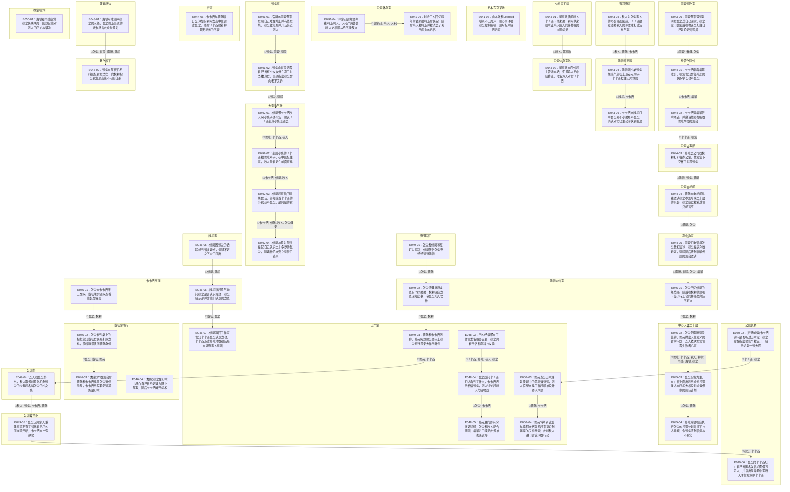

# Ch.41-50 细剖事件表

| event_uid | ch  | 场景        | 在场者                                                                              | 动作                                       | 动机       | 因果后果      | 知识变动                                 | 物权/物件         | 干涉点候选 | canon_src                      |
| --------- | --- | --------- | -------------------------------------------------------------------------------- | ---------------------------------------- | -------- | --------- | ------------------------------------ | ------------- | ----- | ------------------------------ |
| E041-01   | 41  | 张尘家·早     | C.zhangchen.WMAIN, ~雨璇, ~斑驳                                                      | 宿醉的雨璇醒来发现自己睡在地上并有些发烧，张尘做煎蛋并开玩笑逗两人        | 照顾留宿的高中生 | →E041-02  |                                      |               |       | n1-69:L1-L91                   |
| E041-02   | 41  | 张尘家·早     | C.zhangchen.WMAIN, ~斑驳                                                           | 张尘向斑驳透露自己曾有个女友但在高三时坠楼身亡，斑驳指出张尘曾向老罗哭诉     | 透露初恋往事   | →E042-01  | C.zhangchen.WMAIN ← 初恋女友高三时坠楼身亡      |               |       | n1-69:L92-L151                 |
| E041-03   | 41  | 日本东京某地·日  | ~山本澈, ~Leonard                                                                   | 山本澈和Leonard联系不上周泽，担心周泽被张尘控制把柄，期盼坂本晴明归来   | 担忧同伙失联   | 待续:周泽的下落  |                                      |               |       | n1-69:L152-L182                |
| E041-04   | 41  | 公司休息室·日   | ~郭家政, ~鸣人, ~大和                                                                   | 郭家政突然要单独叫走鸣人，大和严厉警告鸣人必须顺从绝不能反抗           | 叫走鸣人问话   | →E041-05  |                                      |               |       | n1-69:L183-L217                |
| E041-05   | 41  | 公司休息室·日   | ~佐助, ~佐井, ~小樱                                                                    | 剩余三人回忆两年前鹿丸被叫走后失踪，随后鸣人被叫走并被洗去了关于鹿丸的记忆    | 交流恐怖回忆   | 待续:鸣人的遭遇  |                                      |               |       | n1-69:L218-L241                |
| E042-01   | 42  | 大型淘气堡·日   | C.xiuzai.WMAIN, C.kakashi.WMAIN, C.akito.WMAIN                                   | 修哉带卡卡西秋人来小孩子游乐场，提议卡卡西变身小孩混进去             | 找乐子混入游乐场 | →E042-02  |                                      |               |       | n1-69:L242-L300                |
| E042-02   | 42  | 大型淘气堡·日   | C.kakashi.WMAIN, C.xiuzai.WMAIN, C.akito.WMAIN                                   | 变成小孩的卡卡西被修哉牵手，心中回忆往事，秋人独自走在前面搭戏          | 角色扮演游玩   | →E042-03  |                                      |               |       | n1-69:L327-L368                |
| E042-03   | 42  | 大型淘气堡·日   | C.kakashi.WMAIN, C.xiuzai.WMAIN, C.akito.WMAIN, ~张尘母亲                            | 修哉和搭讪的阿姨套话，得知缠着卡卡西的小女孩叫张尘，是阿姨的女儿         | 试探张尘家人   | →E042-04  |                                      |               |       | n1-69:L371-L428                |
| E042-04   | 42  | 大型淘气堡·日   | C.xiuzai.WMAIN, ~张尘母亲                                                            | 修哉故意对阿姨提起自己认识二十多岁的张尘，阿姨神色大变立刻借口逃离        | 打草惊蛇验证猜想 | 待续:张尘的家庭  | C.xiuzai.WMAIN ← 确认张尘家庭通过生二胎掩盖身世并受保护 |               |       | n1-69:L429-L449                |
| E043-01   | 43  | 休息室幻境·夜   | ~鸣人, ~郭家政                                                                        | 郭家政质问鸣人卡卡西下落未果，利用纳米技术让鸣人陷入同伴惨死的血腥幻觉      | 逼问卡卡西下落  | →E043-02  |                                      |               |       | n1-69:L451-L503                |
| E043-02   | 43  | 公司休息室外·夜  | ~郭家政                                                                             | 郭家政在门外和主管通电话，汇报鸣人已中招昏迷，准备派人对付卡卡西         | 汇报逼供进展   | 待续:抓捕卡卡西  |                                      |               |       | n1-69:L504-L525                |
| E043-03   | 43  | 返程街道·日    | C.akito.WMAIN, C.xiuzai.WMAIN, C.kakashi.WMAIN                                   | 秋人对张尘家人的巧合感到困惑，卡卡西故意碰掉秋人的冰激凌打破沉重气氛       | 打破沉闷气氛   | →E043-04  |                                      |               |       | n1-69:L527-L558                |
| E043-04   | 43  | 魏初家厨房·日   | C.weichu.WMAIN, C.kakashi.WMAIN                                                  | 魏初因小弟张尘翘班气得切土豆差点切手，卡卡西捏住刀片救险             | 防止魏初自残   | →E043-05  |                                      |               |       | n1-69:L560-L606                |
| E043-05   | 43  | 魏初家厨房·日   | C.kakashi.WMAIN, C.weichu.WMAIN                                                  | 卡卡西从魏初口中套出那个小弟名叫张尘，确认对方已主动潜伏到身边          | 确认潜伏事实   | 待续:张尘的潜伏  | C.kakashi.WMAIN ← 确认张尘在魏初公司工作        |               |       | n1-69:L607-L612                |
| E043-06   | 43  | 雨璇家卧室·日   | ~雨璇, ~潘母, C.zhangchen.WMAIN                                                      | 雨璇醒来得知是网友张尘送自己回家，张尘敲门告别后在电话里坦白自己是论坛管理员   | 展现人脉与底牌  | →E044-01  | ~雨璇 ← 张尘坦白自己是论坛管理员                   |               |       | n1-69:L614-L683                |
| E044-01   | 44  | 经管学院外·日   | C.kakashi.WMAIN, ~柳絮                                                             | 卡卡西牵着柳絮散步，柳絮告知曾经暗恋的失踪学长也叫张尘              | 散步告知张尘情报 | →E044-02  | C.kakashi.WMAIN ← 柳絮暗恋的学长也叫张尘且已失踪    |               |       | n1-69:L731-L772                |
| E044-02   | 44  | 经管学院外·日   | C.kakashi.WMAIN, ~柳絮                                                             | 卡卡西送柳絮银哨项链，并邀请她参加明晚修哉举办的聚会               | 赠送礼物发出邀请 | →E044-03  |                                      | 银哨项链: 卡卡西送给柳絮 |       | n1-69:L773-L806                |
| E044-03   | 44  | 公司人事部·日   | C.weichu.WMAIN, C.zhangchen.WMAIN, C.xiuzai.WMAIN                                | 修哉去公司找魏初打听租办公室，故意留下空杯子试探张尘               | 赴公司试探对手  | →E044-04  |                                      |               |       | n1-69:L808-L841                |
| E044-04   | 44  | 公司电梯间·日   | C.xiuzai.WMAIN, C.zhangchen.WMAIN                                                | 修哉在电梯间单独邀请张尘参加今晚二十层的聚会，张尘察觉被看透但只能答应      | 正面发出聚会邀请 | →E044-05  |                                      |               |       | n1-69:L842-L860                |
| E044-05   | 44  | 高中教室·日    | ~雨璇, ~斑驳, C.zhangchen.WMAIN, ~柳絮                                                 | 雨璇打电话求张尘教打篮球，张尘提议今晚玩耍，斑驳随后接到柳絮传达的聚会邀请    | 聚会邀请双重传递 | →E045-01  |                                      |               |       | n1-69:L862-L922                |
| E044-06   | 44  | 街道·日      | C.kakashi.WMAIN, C.xiuzai.WMAIN, ~柳絮                                             | 卡卡西与修哉暗自盘算如何利用女高中生突破张尘，随后卡卡西搂着柳絮安抚她的不安   | 盘算突破口    | 待续:利用女生   |                                      |               |       | n1-69:L923-L971                |
| E045-01   | 45  | 魏初办公室·日   | C.zhangchen.WMAIN, C.weichu.WMAIN                                                | 张尘回忆修哉的熟悉感，随后在魏初的注视下签了转正合同并感慨命运不可抗       | 签署转正合同   | →E045-02  |                                      |               |       | n1-69:L975-L1039               |
| E045-02   | 45  | 中心大厦二十层·夜 | C.xiuzai.WMAIN, C.kakashi.WMAIN, C.akito.WMAIN, ~柳絮, ~雨璇, ~斑驳, C.zhangchen.WMAIN | 张尘带雨璇斑驳赴约，修哉抛出人生意义的哲学问题，众人依次发言坦露失败者心声    | 聚会坦露心声   | →E045-03  |                                      |               |       | n1-69:L1041-L1148              |
| E045-03   | 45  | 中心大厦二十层·夜 | C.zhangchen.WMAIN, C.xiuzai.WMAIN                                                | 张尘反客为主，在白板上画出利用全息投影技术在四栋大楼投影虚拟偶像的疯狂计划    | 抛出全息投影计划 | →E045-04  |                                      |               |       | n1-69:L1149-L1220              |
| E045-04   | 45  | 中心大厦二十层·夜 | C.xiuzai.WMAIN, C.zhangchen.WMAIN, C.kakashi.WMAIN                               | 修哉痛快答应执行张尘的投影计划并揽下技术难题，令张尘感到震惊与不真实       | 修哉答应计划   | 待续:投影计划   |                                      |               |       | n1-69:L1221-L1246              |
| E046-01   | 46  | 卡卡西房间·日   | C.zhangchen.WMAIN, C.weichu.WMAIN                                                | 张尘在卡卡西床上醒来，魏初端粥进来查看他恢复情况                 | 幻术后苏醒    | →E046-02  |                                      |               |       | n1-69:L1247-L1301              |
| E046-02   | 46  | 魏初家客厅·日   | C.zhangchen.WMAIN, C.weichu.WMAIN, C.xiuzai.WMAIN                                | 张尘看到桌上的相框得知魏初亡夫是折原龙也，情绪崩溃质问修哉身份          | 发现龙也相框   | →E046-03  |                                      |               |       | n1-69:L1302-L1345              |
| E046-03   | 46  | 魏初家客厅·昨夜  | C.xiuzai.WMAIN, C.kakashi.WMAIN, C.zhangchen.WMAIN                               | (插叙)昨晚聚会后修哉和卡卡西擒住张尘逼供无果，卡卡西用写轮眼对其施展幻术    | 擒拿逼供张尘   | 待续:逼供结果   |                                      |               |       | n1-69:L1346-L1376              |
| E046-04   | 46  | 魏初家客厅·昨夜  | C.zhangchen.WMAIN, C.kakashi.WMAIN, C.xiuzai.WMAIN                               | (插叙)张尘在幻术中坦白自己曾约定努力阻止某事，随后卡卡西解开幻术        | 幻术吐露约定   | 待续:约定的真相  |                                      |               |       | n1-69:L1377-L1407              |
| E046-05   | 46  | 魏初家·日     | C.xiuzai.WMAIN, C.weichu.WMAIN                                                   | 修哉因张尘的话联想到诸多疑点，惊疑不定之下夺门而出                | 修哉疑窦丛生   | →E046-06  |                                      |               |       | n1-69:L1408-L1449              |
| E046-06   | 46  | 卡卡西房间·日   | C.weichu.WMAIN, C.zhangchen.WMAIN                                                | 魏初鼓起勇气询问张尘是否认识龙也，张尘暗示那并非他们认识的龙也          | 暗示龙也另有隐情 | →E046-07  |                                      |               |       | n1-69:L1451-L1500              |
| E046-07   | 46  | 工作室·日     | C.xiuzai.WMAIN, C.kakashi.WMAIN, C.akito.WMAIN                                   | 修哉跑回工作室告知卡卡西张尘认识龙也，卡卡西点破修哉昨晚砸店是在调查家人死因   | 讨论张尘底细   | 待续:调查真相   |                                      |               |       | n1-69:L1501-L1563              |
| E048-01   | 48  | 篮球场边·日    | C.zhangchen.WMAIN, ~斑驳, ~雨璇, C.weichu.WMAIN                                      | 斑驳用球砸掉张尘的汉堡，张尘抢走斑驳的饭卡扬言去食堂报复             | 抢饭卡打闹    | →E048-02  |                                      |               |       | n1-69:L1842-L1868              |
| E048-02   | 48  | 教学楼下·日    | C.zhangchen.WMAIN, C.weichu.WMAIN                                                | 张尘在某楼下发抖回忆女友坠亡，向魏初指出女友恐高绝不可能自杀           | 揭露女友死因疑点 | 待续:张尘的过去  | C.weichu.WMAIN ← 得知张尘女友坠楼            |               |       | n1-69:L1870-L1946              |
| E048-03   | 48  | 工作室·多日    | C.kakashi.WMAIN, C.xiuzai.WMAIN, C.akito.WMAIN, C.zhangchen.WMAIN                | 四人经常聚在工作室准备投影设备，张尘兴奋于各种高科技仪器             | 准备投影设备   | →E048-04  |                                      |               |       | n1-69:L1951-L1990              |
| E048-04   | 48  | 工作室·日     | C.zhangchen.WMAIN, C.kakashi.WMAIN                                               | 张尘质问卡卡西幻术看到了什么，卡卡西表示相信张尘，两人讨论起鸣人与暗物质     | 质问幻术内容   | →E048-05  |                                      |               |       | n1-69:L1991-L2104              |
| E048-05   | 48  | 工作室·日     | C.xiuzai.WMAIN, C.zhangchen.WMAIN, C.kakashi.WMAIN, C.akito.WMAIN, ~柳絮           | 修哉进门即兴演捉奸戏码，张尘和秋人配合胡闹，柳絮进门撞见此景被彻底误导      | 戏耍柳絮     | 待续:柳絮误会   |                                      |               |       | n1-69:L2105-L2176              |
| E049-01   | 49  | 街道路口·早    | C.zhangchen.WMAIN, C.xiuzai.WMAIN                                                | 张尘和修哉等红灯过马路，修哉警告张尘要好好对待魏初                | 街头叮嘱     | →E049-02  |                                      |               |       | n1-69:L2181-L2289              |
| E049-02   | 49  | 魏初办公室·早   | C.zhangchen.WMAIN, C.weichu.WMAIN                                                | 张尘感慨折原龙也有个好弟弟，魏初回应龙也深知此事，令张尘陷入愣神         | 感慨修哉为人   | →E049-03  |                                      |               |       | n1-69:L2290-L2310              |
| E049-03   | 49  | 工作室·日     | C.xiuzai.WMAIN, C.kakashi.WMAIN                                                  | 修哉和卡卡西闲聊，修哉突然提出要带上张尘执行探亲大作战计划            | 提出探亲计划   | →E049-04  |                                      |               |       | n1-69:L2312-L2371              |
| E049-04   | 49  | 公园外·日     | C.akito.WMAIN, C.zhangchen.WMAIN, C.kakashi.WMAIN, C.xiuzai.WMAIN                | 众人拉张尘外出，秋人取景时意外拍到张尘的父母和名叫张尘的小女孩          | 撞见张尘家人   | →E049-05  |                                      |               |       | n1-69:L2374-L2400              |
| E049-05   | 49  | 公园树荫下·日   | C.zhangchen.WMAIN, C.kakashi.WMAIN                                               | 张尘因见家人重建家庭且有了替代自己的人而崩溃干呕，卡卡西在一旁静候        | 见家人崩溃干呕  | →E049-06  |                                      |               |       | n1-69:L2401-L2446              |
| E049-06   | 49  | 公园长椅·日    | C.zhangchen.WMAIN, C.kakashi.WMAIN                                               | 张尘向卡卡西坦白自己曾匿名发帖企图借刀杀人，并指出周泽暗中垄断天津信息保护卡卡西 | 坦白借刀杀人   | 待续:周泽的保护  |                                      |               |       | n1-69:L2448-L2555              |
| E050-01   | 50  | 教室/室内·阴天  | ~斑驳, ~雨璇                                                                         | 斑驳和雨璇察觉张尘失联两周，回想起他对两人的庇护与帮助              | 察觉张尘失联   | 待续:女生们的行动 |                                      |               |       | n1-69:L2568-L2648              |
| E050-02   | 50  | 公园长椅·日    | C.kakashi.WMAIN, C.zhangchen.WMAIN                                               | (衔接前情)卡卡西询问是否听过山本澈，张尘震惊指出他们早被设计，暗示这是一张大网 | 张尘指破阴谋   | →E050-03  |                                      |               |       | n1-69:L2672-L2710              |
| E050-03   | 50  | 工作室·日     | C.xiuzai.WMAIN, C.kakashi.WMAIN                                                  | 修哉查出山本澈是传说中的零败诉律师，两人惊觉从找工作起就被设计卷入阴谋      | 查出山本澈身份  | →E050-04  |                                      |               |       | n1-69:L2651-L2670, L2712-L2751 |
| E050-04   | 50  | 工作室·日     | C.xiuzai.WMAIN, C.kakashi.WMAIN, C.akito.WMAIN                                   | 修哉将革新计划与编程大赛联系起来意识到漏掉的关键线索，此时秋人进门讨论明晚行动  | 拼凑出关键线索  | 待续:明晚投影行动 |                                      |               |       | n1-69:L2752-L2835              |

## 时序图

## 时序图

