```mermaid
graph TD
    subgraph "张尘住处(六楼)"
        E051-01["E051-01：郭家政在张尘处监视卡卡西等人被捕，张尘发现并询问其身份"]
        E054-05["E054-05：铁门自动开启后三人跑上六楼发现张尘家大门敞开墙有血手印"]
    end
    subgraph "张尘住处(室内)"
        E051-02["E051-02：郭家政向张尘透露他受雇于大组织并成为张尘卧底"]
        E051-03["E051-03：郭家政透露暴乱劫人计划，张尘推断幕后大组织目标是卡卡西"]
        E051-04["E051-04：张尘决意卷入并请求郭家政继续监视以拉其入局"]
        E054-06["E054-06：三人发现张尘家被彻底洗劫满屋血迹弹痕陷入绝望"]
    end
    subgraph "地下车库/黑车上"
        E051-05["E051-05：卡卡西在车上向头目试探是否认错人并故意激怒头目"]
    end
    subgraph "某大厦天台"
        E051-06["E051-06：众人到达天台下车后持枪手下警告卡卡西，卡卡西从容应对"]
        E052-03["E052-03：头目向卡卡西展示底牌威慑未果"]
        E052-04["E052-04：头目得知鸣人被控制，随后佐助等四人乘直升机降落汇合"]
        E052-05["E052-05：头目要挟卡卡西合作，卡卡西唤醒佐助等人未果"]
        E052-06["E052-06：谈判破裂佐助对卡卡西使用千鸟击中头部，郭家政狙杀头目"]
    end
    subgraph "修哉的房间"
        E052-01["E052-01：修哉收到张尘的阴谋邮件而极度担忧卡卡西安危"]
    end
    subgraph "北京街头酒吧外"
        E052-02["E052-02：大和四人因缺乏经费未能进入酒吧而发生争执"]
    end
    subgraph "对面楼顶"
        E052-07["E052-07：卡卡西受伤未死，张尘挥动衣服制止郭家政继续狙击并现身"]
        E053-02["E053-02：大和接到假撤退命令，佐井查清狙击手是郭家政"]
        E053-04["E053-04：修哉赶到质问张尘底细，张尘坦言已卷入局中建议先撤离"]
    end
    subgraph "某栋楼顶"
        E053-01["E053-01：郭家政从狙击镜中看到张尘在对面楼上挥舞手臂阻止自己并收枪"]
    end
    subgraph "楼顶(通讯)"
        E053-03["E053-03：张尘与郭家政通话调侃，郭透露高层计划将转移鸣人等"]
    end
    subgraph "北京某处"
        E053-05["E053-05：郭家政得知高层怀疑张尘后急忙打电话通知其逃跑"]
    end
    subgraph "张尘住处(电话)"
        E053-06["E053-06：张尘告知郭家政周泽死讯并濒临崩溃，郭家政劝解"]
        E054-07["E054-07：魏初致电修哉求助，修哉命令不准报警格式化手机并立刻回家"]
    end
    subgraph "修哉工作室"
        E053-07["E053-07：修哉接到张尘电话得知周泽死讯，张尘急迫要求他们回日本"]
    end
    subgraph "张尘家楼下"
        E053-08["E053-08：几名线人在楼下确认张尘位置并按响门铃"]
    end
    subgraph "魏初公司外"
        E054-01["E054-01：魏初因张尘失联而生气并偶遇雨璇和斑驳得知均已失联"]
    end
    subgraph "商场内"
        E054-02["E054-02：三人在商场吃冰沙聊天饭后决定一起去张尘家找他"]
    end
    subgraph "张尘家一楼"
        E054-03["E054-03：三人到达楼下时一楼老婆婆透过窗缝冷冷注视她们"]
    end
    subgraph "山本办公室"
        E054-04["E054-04：Leonard汇报周泽死讯，山本澈冷漠分析死因表示毫不在意"]
    end
    subgraph "魏初家客厅"
        E055-01["E055-01：修哉阻止卡卡西去现场并道出张尘可能已死，卡卡西痛斥其软弱"]
        E055-02["E055-02：斑驳推断老婆婆故意指引，修哉决定回日本，两女孩怒斥后跑出"]
    end
    subgraph "张尘住处楼下"
        E055-03["E055-03：老婆婆告诉两人张尘昨夜重伤逃跑并警告勿再卷入"]
    end
    subgraph "北京街头"
        E056-01["E056-01：柳絮内心崩溃嫉妒天才逃离家后吹响银哨，卡卡西暗中未露面"]
    end
    subgraph "街头/张尘楼外"
        E056-02["E056-02：卡卡西现身致歉斑驳雨璇，随后找到柳絮并答应带她逃离"]
    end
    subgraph "老婆婆家"
        E056-03["E056-03：半夜一名自称警察的人敲开老婆婆的门谎称邻居报案"]
    end
    subgraph "Cozco大楼内"
        E056-04["E056-04：郭家政刺杀主管并找到大和等人递地图警告鸣人无药可救"]
        E058-04["E058-04：大和四人易容混入工作人员并开后门潜逃离开大楼"]
    end
    subgraph "雨璇家"
        E056-05["E056-05：雨璇清晨决意追查张尘真相并与母亲发生激烈争吵后跑出"]
    end
    subgraph "街头/张尘楼下"
        E057-01["E057-01：斑驳和雨璇来到张尘家楼下发现警车且得知老婆婆遇害失踪"]
    end
    subgraph "老罗办公室"
        E057-02["E057-02：斑驳和雨璇来到办公室，老罗坦言受张尘之托传达不要做傻事"]
        E057-04["E057-04：斑驳得知张尘养伤欲联系晴明，老罗明白张尘之意"]
    end
    subgraph "老罗家"
        E057-03["E057-03：老罗在暴雨中遭遇张尘并将其救回家连夜手术保住性命"]
        E059-01["E059-01：卡卡西和郭家政上门，张尘强撑出卧室倒在郭家政怀里"]
    end
    subgraph "东京羽田机场"
        E057-05["E057-05：修哉等人连夜逃回东京，吴夏弦离开真纪与众人告别"]
    end
    subgraph "机场至涩谷"
        E058-01["E058-01：众人在机场交流，吴夏弦暗示真纪和刘云天婚姻状况后离开"]
    end
    subgraph "涩谷公寓内"
        E058-02["E058-02：卡卡西接听雨璇安全电话，柳絮因同住分歧跑去买冷饮"]
    end
    subgraph "源的办公室"
        E058-03["E058-03：部下汇报宫田女友被害且宫田被击毙，源传唤佐佐木宪二"]
    end
    subgraph "十六中外/街头"
        E058-05["E058-05：佐井倒戈自称奉命监视引来狙击手捕获三人，郭家政借电话"]
    end
    subgraph "老罗家张尘卧室"
        E059-02["E059-02：张尘向卡卡西透露各国政府及RTW计划秘密并要求斟酌告知修哉"]
    end
    subgraph "警车外"
        E059-03["E059-03：张尘回忆折原龙也邀请其加入世界政府被拒后逼死其女友"]
    end
    subgraph "审讯室"
        E060-01["E060-01：鹿丸折磨张尘后对其进行洗脑灌输革新计划是将人作为武器"]
    end
    subgraph "瑞典办公"
        E060-02["E060-02：折原龙也向张尘坦白弑父骗局表达不认同理念并招募其拟定RTW计划"]
    end

    E051-01 -->|"👤张尘, C.guojiazheng.WMAIN, 大和, 佐助, 小樱, 佐井"| E051-02
    E051-02 -->|"👤张尘, C.guojiazheng.WMAIN"| E051-03
    E051-03 -->|"👤张尘, C.guojiazheng.WMAIN"| E051-04
    E051-05 -->|"👤卡卡西, 头目, 持枪手下"| E051-06
    E051-06 -->|"👤卡卡西, 头目, 持枪手下"| E052-01
    E052-01 -->|"👤修哉"| E052-06
    E052-02 -->|"👤小樱, 大和, 佐助, 佐井"| E052-04
    E052-03 -->|"👤卡卡西, 头目"| E052-04
    E052-04 -->|"👤卡卡西, 头目, 佐助, 小樱, 大和, 佐井"| E052-05
    E052-05 -->|"👤卡卡西, 头目, 佐助, 小樱, 大和, 佐井"| E052-06
    E052-06 -->|"👤卡卡西, 佐助, 头目, C.guojiazheng.WMAIN"| E052-07
    E052-07 -->|"👤卡卡西, 佐助, 张尘, C.guojiazheng.WMAIN"| E053-01
    E053-01 -->|"👤C.guojiazheng.WMAIN"| E053-02
    E053-02 -->|"👤卡卡西, 大和, 小樱, 佐助, 佐井"| E053-03
    E053-03 -->|"👤张尘, C.guojiazheng.WMAIN, 大和"| E053-04
    E053-05 -->|"👤C.guojiazheng.WMAIN, 主管"| E053-06
    E053-06 -->|"👤张尘, C.guojiazheng.WMAIN"| E053-07
    E053-07 -->|"👤修哉, 卡卡西, 秋人, 张尘"| E053-08
    E054-01 -->|"👤魏初, 雨璇, 斑驳"| E054-02
    E054-02 -->|"👤魏初, 雨璇, 斑驳"| E054-03
    E054-05 -->|"👤魏初, 雨璇, 斑驳"| E054-06
    E054-06 -->|"👤魏初, 斑驳, 雨璇"| E054-07
    E055-01 -->|"👤修哉, 卡卡西, 秋人, 魏初, 斑驳, 雨璇"| E055-02
    E055-02 -->|"👤斑驳, 雨璇, 魏初, 修哉, 卡卡西"| E055-03
    E055-03 -->|"👤卡卡西, 斑驳, 雨璇, 老婆婆"| E056-02
    E056-01 -->|"👤柳絮, 卡卡西"| E056-02
    E056-03 -->|"👤老婆婆, 警察"| E057-01
    E056-04 -->|"👤主管, C.guojiazheng.WMAIN, 大和, 佐助, 小樱, 佐井"| E058-04
    E056-05 -->|"👤雨璇, 潘母, 潘父"| E057-01
    E057-01 -->|"👤斑驳, 雨璇"| E057-02
    E057-02 -->|"👤老罗, 斑驳, 雨璇"| E057-03
    E057-03 -->|"👤老罗, 张尘, 老罗丈夫, 医生"| E057-04
    E057-04 -->|"👤老罗, 斑驳, 雨璇"| E058-02
    E057-05 -->|"👤修哉, 卡卡西, 秋人, 柳絮, 真纪, C.wuxiaxian.WMAIN"| E058-01
    E058-01 -->|"👤修哉, 卡卡西, 秋人, 柳絮, 真纪, C.wuxiaxian.WMAIN"| E058-02
    E058-02 -->|"👤修哉, 卡卡西, 秋人, 柳絮"| E059-01
    E058-04 -->|"👤大和, 小樱, 佐助, 佐井, 工作人员"| E058-05
    E058-05 -->|"👤佐助, 大和, 小樱, 佐井, C.guojiazheng.WMAIN, 保安"| E059-01
    E059-01 -->|"👤老罗, 张尘, 老罗丈夫, C.guojiazheng.WMAIN, 卡卡西"| E059-02
    E059-02 -->|"👤卡卡西, 张尘"| E059-03
    E059-03 -->|"👤张尘, C.ryuya.WMAIN"| E060-01
    E060-01 -->|"👤张尘, 鹿丸"| E060-02
```

| event_uid | ch  | 场景         | 在场者                                                                         | 动作                              | 动机        | 因果后果                        | 知识变动                                    | 物权/物件       | 干涉点候选                   | canon_src    |
| --------- | --- | ---------- | --------------------------------------------------------------------------- | ------------------------------- | --------- | --------------------------- | --------------------------------------- | ----------- | ----------------------- | ------------ |
| E051-01   | 51  | 张尘住处(六楼)·晚 | C.zhangchen.WMAIN, C.guojiazheng.WMAIN, ~大和, ~佐助, ~小樱, ~佐井                  | 郭家政在张尘处监视卡卡西等人被捕，张尘发现并询问其身份     | 发现异常身份    | →E051-02                    | C.zhangchen.WMAIN ← 郭家政受过专业训练且监视卡卡西等人   |             |                         | n1-69:L15676 |
| E051-02   | 51  | 张尘住处(室内)·晚 | C.zhangchen.WMAIN, C.guojiazheng.WMAIN                                      | 郭家政向张尘透露他受雇于大组织并成为张尘卧底          | 坦白底细      | →E051-03                    |                                         |             |                         | n1-69:L15701 |
| E051-03   | 51  | 张尘住处(室内)·晚 | C.zhangchen.WMAIN, C.guojiazheng.WMAIN                                      | 郭家政透露暴乱劫人计划，张尘推断幕后大组织目标是卡卡西     | 推理分析局势    | →E051-04                    | C.zhangchen.WMAIN ← 背后大组织目标是旗木卡卡西       |             |                         | n1-69:L15764 |
| E051-04   | 51  | 张尘住处(室内)·晚 | C.zhangchen.WMAIN, C.guojiazheng.WMAIN                                      | 张尘决意卷入并请求郭家政继续监视以拉其入局           | 避免后悔而卷入   | 待续:张尘介入革新计划                 |                                         |             | ◎张尘决定强行介入危险局势           | n1-69:L15830 |
| E051-05   | 51  | 地下车库/黑车上·夜 | C.kakashi.WMAIN, ~头目, ~持枪手下                                                 | 卡卡西在车上向头目试探是否认错人并故意激怒头目         | 试探底线和情报   | →E051-06                    |                                         |             |                         | n1-69:L15862 |
| E051-06   | 51  | 某大厦天台·夜    | C.kakashi.WMAIN, ~头目, ~持枪手下                                                 | 众人到达天台下车后持枪手下警告卡卡西，卡卡西从容应对      | 保持冷静拖延    | →E052-01                    |                                         |             |                         | n1-69:L15938 |
| E052-01   | 52  | 修哉的房间·夜    | C.xiuzai.WMAIN                                                              | 修哉收到张尘的阴谋邮件而极度担忧卡卡西安危           | 担忧同伴安危    | →E052-06                    |                                         |             |                         | n1-69:L15984 |
| E052-02   | 52  | 北京街头酒吧外·夜  | ~小樱, ~大和, ~佐助, ~佐井                                                          | 大和四人因缺乏经费未能进入酒吧而发生争执            | 任务间隙放松    | →E052-04                    |                                         |             |                         | n1-69:L16001 |
| E052-03   | 52  | 某大厦天台·夜    | C.kakashi.WMAIN, ~头目                                                        | 头目向卡卡西展示底牌威慑未果                  | 威慑卡卡西     | →E052-04                    |                                         |             |                         | n1-69:L16016 |
| E052-04   | 52  | 某大厦天台·夜    | C.kakashi.WMAIN, ~头目, ~佐助, ~小樱, ~大和, ~佐井                                    | 头目得知鸣人被控制，随后佐助等四人乘直升机降落汇合       | 汇合并通报战果   | →E052-05                    | C.kakashi.WMAIN ← 鸣人已被控制且佐助等人为头目办事      |             | ◎佐助等人被控制参与袭击卡卡西         | n1-69:L16035 |
| E052-05   | 52  | 某大厦天台·夜    | C.kakashi.WMAIN, ~头目, ~佐助, ~小樱, ~大和, ~佐井                                    | 头目要挟卡卡西合作，卡卡西唤醒佐助等人未果           | 利用人质要挟    | →E052-06                    | C.kakashi.WMAIN ← 佐助等人记忆已被修改            |             |                         | n1-69:L16086 |
| E052-06   | 52  | 某大厦天台·夜    | C.kakashi.WMAIN, ~佐助, ~头目, C.guojiazheng.WMAIN                              | 谈判破裂佐助对卡卡西使用千鸟击中头部，郭家政狙杀头目      | 谈判破裂引发战斗  | →E052-07                    |                                         |             |                         | n1-69:L16135 |
| E052-07   | 52  | 对面楼顶·夜     | C.kakashi.WMAIN, ~佐助, C.zhangchen.WMAIN, C.guojiazheng.WMAIN                | 卡卡西受伤未死，张尘挥动衣服制止郭家政继续狙击并现身      | 阻止事态恶化    | →E053-01                    |                                         |             |                         | n1-69:L16164 |
| E053-01   | 53  | 某栋楼顶·夜     | C.guojiazheng.WMAIN                                                         | 郭家政从狙击镜中看到张尘在对面楼上挥舞手臂阻止自己并收枪    | 配合张尘停止狙击  | →E053-02                    |                                         |             |                         | n1-69:L16198 |
| E053-02   | 53  | 对面楼顶·夜     | C.kakashi.WMAIN, ~大和, ~小樱, ~佐助, ~佐井                                         | 大和接到假撤退命令，佐井查清狙击手是郭家政           | 收到假命令撤退   | →E053-03                    |                                         |             |                         | n1-69:L16215 |
| E053-03   | 53  | 楼顶(通讯)·夜   | C.zhangchen.WMAIN, C.guojiazheng.WMAIN, ~大和                                 | 张尘与郭家政通话调侃，郭透露高层计划将转移鸣人等        | 交流情报应对变局  | →E053-04                    | C.zhangchen.WMAIN ← 鸣人等将被转移             |             |                         | n1-69:L16246 |
| E053-04   | 53  | 对面楼顶·夜     | C.xiuzai.WMAIN, C.kakashi.WMAIN, C.akito.WMAIN, C.zhangchen.WMAIN           | 修哉赶到质问张尘底细，张尘坦言已卷入局中建议先撤离       | 处理伤员并解释   | 待续:张尘与修哉的信任博弈               |                                         |             |                         | n1-69:L16290 |
| E053-05   | 53  | 北京某处·日     | C.guojiazheng.WMAIN, ~主管                                                    | 郭家政得知高层怀疑张尘后急忙打电话通知其逃跑          | 获悉情报通知逃亡  | →E053-06                    | C.guojiazheng.WMAIN ← 高层已锁定张尘           |             |                         | n1-69:L16348 |
| E053-06   | 53  | 张尘住处(电话)·日 | C.zhangchen.WMAIN, C.guojiazheng.WMAIN                                      | 张尘告知郭家政周泽死讯并濒临崩溃，郭家政劝解          | 传达死讯并劝解   | →E053-07                    | C.zhangchen.WMAIN ← 周泽确认死亡              |             |                         | n1-69:L16382 |
| E053-07   | 53  | 修哉工作室·日    | C.xiuzai.WMAIN, C.kakashi.WMAIN, C.akito.WMAIN, C.zhangchen.WMAIN           | 修哉接到张尘电话得知周泽死讯，张尘急迫要求他们回日本      | 通知撤离与警告   | →E053-08                    |                                         |             |                         | n1-69:L16417 |
| E053-08   | 53  | 张尘家楼下·日    | C.zhangchen.WMAIN, ~线人                                                      | 几名线人在楼下确认张尘位置并按响门铃              | 执行抓捕暗杀    | 待续:张尘遇袭事件                   |                                         |             | ◎张尘遭多方势力锁定并追杀           | n1-69:L16499 |
| E054-01   | 54  | 魏初公司外·日    | C.weichu.WMAIN, ~雨璇, ~斑驳                                                    | 魏初因张尘失联而生气并偶遇雨璇和斑驳得知均已失联        | 担忧寻找张尘    | →E054-02                    |                                         |             |                         | n1-69:L16524 |
| E054-02   | 54  | 商场内·日      | C.weichu.WMAIN, ~雨璇, ~斑驳                                                    | 三人在商场吃冰沙聊天饭后决定一起去张尘家找他          | 结伴寻人      | →E054-03                    |                                         |             |                         | n1-69:L16565 |
| E054-03   | 54  | 张尘家一楼·日    | C.weichu.WMAIN, ~雨璇, ~斑驳, ~老婆婆                                              | 三人到达楼下时一楼老婆婆透过窗缝冷冷注视她们          | 异常注视      | 待续:老婆婆的隐秘身份                 |                                         |             |                         | n1-69:L16629 |
| E054-04   | 54  | 山本办公室·日    | ~山本澈, ~Leonard                                                              | Leonard汇报周泽死讯，山本澈冷漠分析死因表示毫不在意   | 汇报高层死讯    |                             |                                         |             |                         | n1-69:L16632 |
| E054-05   | 54  | 张尘住处(六楼)·晚 | C.weichu.WMAIN, ~雨璇, ~斑驳                                                    | 铁门自动开启后三人跑上六楼发现张尘家大门敞开墙有血手印     | 惊恐探查张尘安危  | →E054-06                    |                                         |             |                         | n1-69:L16669 |
| E054-06   | 54  | 张尘住处(室内)·晚 | C.weichu.WMAIN, ~斑驳, ~雨璇                                                    | 三人发现张尘家被彻底洗劫满屋血迹弹痕陷入绝望          | 发现凶案现场    | →E054-07                    |                                         | 弹头: 斑驳从墙上抠出 | ◎魏初等人发现张尘遇袭血案现场         | n1-69:L16710 |
| E054-07   | 54  | 张尘住处(电话)·晚 | C.weichu.WMAIN, C.xiuzai.WMAIN, C.kakashi.WMAIN, ~雨璇, ~斑驳                   | 魏初致电修哉求助，修哉命令不准报警格式化手机并立刻回家     | 紧急应对与撤离   | C.xiuzai.WMAIN ← 张尘住处发生惨烈枪击 |                                         |             | n1-69:L16738            |              |
| E055-01   | 55  | 魏初家客厅·晚    | C.xiuzai.WMAIN, C.kakashi.WMAIN, C.akito.WMAIN, C.weichu.WMAIN, ~斑驳, ~雨璇    | 修哉阻止卡卡西去现场并道出张尘可能已死，卡卡西痛斥其软弱    | 争论是否救援    | →E055-02                    |                                         |             |                         | n1-69:L16801 |
| E055-02   | 55  | 魏初家客厅·晚    | ~斑驳, ~雨璇, C.weichu.WMAIN, C.xiuzai.WMAIN, C.kakashi.WMAIN                   | 斑驳推断老婆婆故意指引，修哉决定回日本，两女孩怒斥后跑出    | 意见分歧与失望   | →E055-03                    | ~斑驳 ← 推断老婆婆有意指引                         |             |                         | n1-69:L16914 |
| E055-03   | 55  | 张尘住处楼下·晚   | C.kakashi.WMAIN, ~斑驳, ~雨璇, ~老婆婆                                             | 老婆婆告诉两人张尘昨夜重伤逃跑并警告勿再卷入          | 提供线索并警告   | →E056-02                    | ~斑驳, ~雨璇 ← 张尘在暴雨中重伤逃跑                   |             |                         | n1-69:L17042 |
| E056-01   | 56  | 北京街头·傍晚    | ~柳絮, C.kakashi.WMAIN                                                        | 柳絮内心崩溃嫉妒天才逃离家后吹响银哨，卡卡西暗中未露面     | 极度绝望寻求逃离  | →E056-02                    |                                         | 银哨: 柳絮吹响    |                         | n1-69:L17101 |
| E056-02   | 56  | 街头/张尘楼外·傍晚 | C.kakashi.WMAIN, ~斑驳, ~雨璇, ~柳絮                                              | 卡卡西现身致歉斑驳雨璇，随后找到柳絮并答应带她逃离       | 安抚并带走柳絮   | 待续:柳絮随卡卡西离开                 |                                         |             |                         | n1-69:L17180 |
| E056-03   | 56  | 老婆婆家·半夜    | ~老婆婆, ~警察                                                                   | 半夜一名自称警察的人敲开老婆婆的门谎称邻居报案         | 警方/线人上门灭口 | →E057-01                    |                                         |             |                         | n1-69:L17267 |
| E056-04   | 56  | Cozco大楼内·日 | ~主管, C.guojiazheng.WMAIN, ~大和, ~佐助, ~小樱, ~佐井                                | 郭家政刺杀主管并找到大和等人递地图警告鸣人无药可救       | 刺杀主管与协助逃亡 | →E058-04                    | ~大和 ← 鸣人被纳米机器控制且郭家政提供地图                 | 地图: 郭家政交给大和 |                         | n1-69:L17280 |
| E056-05   | 56  | 雨璇家·早      | ~雨璇, ~潘母, ~潘父                                                               | 雨璇清晨决意追查张尘真相并与母亲发生激烈争吵后跑出       | 追查真相的决心   | →E057-01                    |                                         |             |                         | n1-69:L17359 |
| E057-01   | 57  | 街头/张尘楼下·早  | ~斑驳, ~雨璇                                                                    | 斑驳和雨璇来到张尘家楼下发现警车且得知老婆婆遇害失踪      | 发现命案受惊吓   | →E057-02                    |                                         |             | ◎老婆婆因向斑驳等提供线索遇害         | n1-69:L17403 |
| E057-02   | 57  | 老罗办公室·上午   | ~老罗, ~斑驳, ~雨璇                                                               | 斑驳和雨璇来到办公室，老罗坦言受张尘之托传达不要做傻事     | 传达张尘的通知   | →E057-03                    | ~斑驳, ~雨璇 ← 张尘委托老罗传话                     |             |                         | n1-69:L17458 |
| E057-03   | 57  | 老罗家·昨夜     | ~老罗, C.zhangchen.WMAIN, ~老罗丈夫, ~医生                                          | 老罗在暴雨中遭遇张尘并将其救回家连夜手术保住性命        | 冒死救助学生    | →E057-04                    | ~老罗 ← 获悉张尘重伤被追杀                         |             | ◎老罗夫妇冒险藏匿并救治重伤的张尘       | n1-69:L17492 |
| E057-04   | 57  | 老罗办公室·上午   | ~老罗, ~斑驳, ~雨璇                                                               | 斑驳得知张尘养伤欲联系晴明，老罗明白张尘之意          | 尝试安全联系晴明  | →E058-02                    |                                         |             |                         | n1-69:L17608 |
| E057-05   | 57  | 东京羽田机场·日   | C.xiuzai.WMAIN, C.kakashi.WMAIN, C.akito.WMAIN, ~柳絮, ~真纪, C.wuxiaxian.WMAIN | 修哉等人连夜逃回东京，吴夏弦离开真纪与众人告别         | 逃离北京返回日本  | →E058-01                    |                                         |             |                         | n1-69:L17650 |
| E058-01   | 58  | 机场至涩谷·日    | C.xiuzai.WMAIN, C.kakashi.WMAIN, C.akito.WMAIN, ~柳絮, ~真纪, C.wuxiaxian.WMAIN | 众人在机场交流，吴夏弦暗示真纪和刘云天婚姻状况后离开      | 暂别与暗示     | →E058-02                    |                                         |             |                         | n1-69:L17680 |
| E058-02   | 58  | 涩谷公寓内·日    | C.xiuzai.WMAIN, C.kakashi.WMAIN, C.akito.WMAIN, ~柳絮                         | 卡卡西接听雨璇安全电话，柳絮因同住分歧跑去买冷饮        | 安顿柳絮与接听电话 | →E059-01                    |                                         |             |                         | n1-69:L17730 |
| E058-03   | 58  | 源的办公室·日    | ~源, ~部下                                                                     | 部下汇报宫田女友被害且宫田被击毙，源传唤佐佐木宪二       | 处理棋子失效危机  | 待续:佐佐木宪二被传唤                 |                                         |             |                         | n1-69:L17787 |
| E058-04   | 58  | Cozco大楼内·日 | ~大和, ~小樱, ~佐助, ~佐井, ~工作人员                                                   | 大和四人易容混入工作人员并开后门潜逃离开大楼          | 易容潜逃      | →E058-05                    |                                         |             |                         | n1-69:L17822 |
| E058-05   | 58  | 十六中外/街头·日  | ~佐助, ~大和, ~小樱, ~佐井, C.guojiazheng.WMAIN, ~保安                                | 佐井倒戈自称奉命监视引来狙击手捕获三人，郭家政借电话      | 佐井倒戈捕获三人  | →E059-01                    | ~大和 ← 佐井系奉政府之命监视他们                      |             | ◎佐井彻底倒戈揭露卧底身份           | n1-69:L17862 |
| E059-01   | 59  | 老罗家·日      | ~老罗, C.zhangchen.WMAIN, ~老罗丈夫, C.guojiazheng.WMAIN, C.kakashi.WMAIN         | 卡卡西和郭家政上门，张尘强撑出卧室倒在郭家政怀里        | 郭卡汇合探望张尘  | →E059-02                    |                                         |             |                         | n1-69:L17937 |
| E059-02   | 59  | 老罗家张尘卧室·日  | C.kakashi.WMAIN, C.zhangchen.WMAIN                                          | 张尘向卡卡西透露各国政府及RTW计划秘密并要求斟酌告知修哉   | 托付核心机密情报  | →E059-03                    | C.kakashi.WMAIN ← 获悉世界政府与RTW计划真相        |             | ◎张尘将世界政府与RTW计划核心机密告知卡卡西 | n1-69:L18005 |
| E059-03   | 59  | 警车外·多年前    | C.zhangchen.WMAIN, C.ryuya.WMAIN                                            | 张尘回忆折原龙也邀请其加入世界政府被拒后逼死其女友       | 威逼利诱张尘入伙  | →E060-01                    | C.zhangchen.WMAIN ← 得知折原龙也是世界政府成员       |             |                         | n1-69:L18100 |
| E060-01   | 60  | 审讯室·多年前    | C.zhangchen.WMAIN, ~鹿丸                                                      | 鹿丸折磨张尘后对其进行洗脑灌输革新计划是将人作为武器      | 酷刑洗脑与顺从   | →E060-02                    | C.zhangchen.WMAIN ← 获悉革新计划将所有人当作武器      |             | ◎鹿丸在世界政府内以行刑者身份对张尘洗脑    | n1-69:L18228 |
| E060-02   | 60  | 瑞典办公·多年前   | C.zhangchen.WMAIN, C.ryuya.WMAIN                                            | 折原龙也向张尘坦白弑父骗局表达不认同理念并招募其拟定RTW计划 | 招募张尘结成暗盟  |                             | C.zhangchen.WMAIN ← 得知折原龙也弑父真相及其不认同组织理念 |             | ◎折原龙也与张尘结成针对世界政府内部的暗盟   | n1-69:L18408 |

## 时序图

## 时序图

