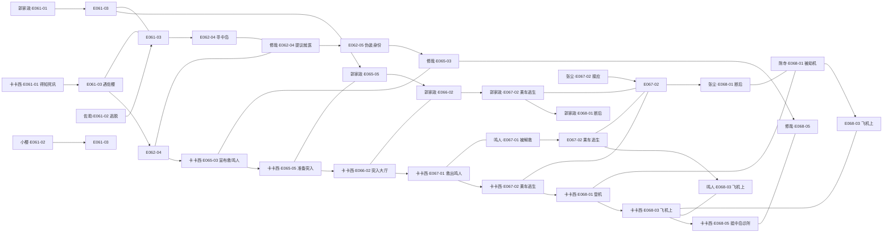

```mermaid
graph TD
    subgraph "北京老罗家"
        E061-01["E061-01：郭家政告知卡卡西鸣人不可逆昏迷及鹿丸龙也死讯"]
    end
    subgraph "北京Cozco外"
        E061-02["E061-02：佐助开须佐带小樱逃脱；大和与佐井留下做内应"]
        E067-02["E067-02：卡卡西老郭遇重兵追击，张尘驾车引爆炸弹接应逃亡"]
    end
    subgraph "北京某楼顶"
        E061-03["E061-03：佐樱逃出与卡卡西老郭会合；佐助对卡卡西有杀意"]
        E061-04["E061-04：老郭求佐助处理尸体，佐助用天照烧毁"]
    end
    subgraph "北京刘云天车内"
        E062-01["E062-01：魏初因失业诉苦，刘云天暗示对折原家的不满"]
    end
    subgraph "日本某处"
        E062-02["E062-02：刘云天回忆正义与吴夏弦争论正义并拒绝升职"]
    end
    subgraph "日本某店外"
        E062-03["E062-03：吴夏弦遇柳絮并提出资助其上学"]
    end
    subgraph "东京修哉公寓"
        E062-04["E062-04：卡卡西带佐樱来修哉家，修哉提议找中岛医治佐助"]
        E062-05["E062-05：众人慌忙为佐樱伪装身份骗过刚回家的柳絮"]
        E065-02["E065-02：修哉伪造清华文凭给柳絮报名，柳絮感到特权不适"]
        E065-03["E065-03：卡卡西向修哉宣布独自潜回Cozco救鸣人，修哉反对"]
    end
    subgraph "自述空间"
        E063-01["E063-01：周泽以第一人称自述自己为钱犯罪并最终自首的动机"]
    end
    subgraph "山本澈办公室"
        E063-02["E063-02：Leonard向山本澈汇报中国转移佐井大和及佐助逃脱"]
    end
    subgraph "东京中岛诊所"
        E064-01["E064-01：卡卡西等带佐樱见中岛，中岛质疑佐樱的跨次元存在"]
        E065-01["E065-01：中岛向某人通报卡卡西回国并向佐樱提及起因"]
        E068-05["E068-05：卡卡西带鸣人赶到中岛诊所求医，中岛答应尝试"]
    end
    subgraph "东京街头归途"
        E064-02["E064-02：卡卡西向修哉坦白对原世界的迷茫并表示绝对信任"]
    end
    subgraph "飞往瑞典飞机"
        E065-04["E065-04：大和与佐井飞往瑞典，佐井感到无力并觉得被抛弃"]
    end
    subgraph "北京某楼顶工厂"
        E065-05["E065-05：老郭拦住欲夜闯Cozco的卡卡西并带其挑选武器结盟"]
    end
    subgraph "东京集英社"
        E066-01["E066-01：秋人问岸本对笔下人物来到现实的期待，岸本答坚持大义"]
    end
    subgraph "北京Cozco一楼"
        E066-02["E066-02：卡卡西与老郭高调突入Cozco大厅并击碎监控"]
    end
    subgraph "北京Cozco监控室"
        E066-03["E066-03：特警陈队下令击毙入侵者但部下有抵触情绪"]
    end
    subgraph "北京Cozco电梯"
        E066-04["E066-04：卡卡西通过电梯摆脱追兵并打晕一名队员"]
    end
    subgraph "北京Cozco某楼层"
        E066-05["E066-05：特警放水；老郭与狙击陈队对峙并表明目的后获放行"]
    end
    subgraph "北京Cozco病房"
        E067-01["E067-01：修哉干扰设备助卡卡西破楼，同情男子将鸣人托付卡卡西"]
    end
    subgraph "某机场"
        E068-01["E068-01：张尘持枪劫持陈寺飞机，卡卡西带鸣人登机飞往日本"]
    end
    subgraph "北京某角落"
        E068-02["E068-02：逃亡中张尘对杀戮崩溃，老郭陪伴并规划去慕尼黑"]
    end
    subgraph "飞往日本飞机"
        E068-03["E068-03：飞机上卡卡西谎称鸣人患脑癌骗过陈寺"]
    end
    subgraph "日本某车内"
        E068-04["E068-04：陈寺向源晃通报卡卡西赴日消息，源晃决定提前开会"]
    end
    subgraph "瑞典世界政府"
        E068-06["E068-06：考夫曼接待大和佐井并告知鸣人被救，大和开始查档案"]
    end
    subgraph "东京诊所屋顶"
        E069-01["E069-01：卡卡西向小樱坦白曾试图自杀并已接受现实不愿回去"]
    end
    subgraph "东京未开业店面"
        E069-02["E069-02：真纪开导柳絮并告知其父母的关切，柳絮大哭"]
    end

    E061-01 -->|"👤卡卡西, C.guojiazheng.WMAIN, 老罗, 老罗丈夫"| E061-03
    E061-03 -->|"👤卡卡西, C.guojiazheng.WMAIN, 佐助, 小樱"| E061-04
    E062-04 -->|"👤修哉, 卡卡西, 秋人, 佐助, 小樱"| E062-05
    E065-03 -->|"👤修哉, 卡卡西"| E065-05
    E065-05 -->|"👤卡卡西, C.guojiazheng.WMAIN"| E066-02
    E066-02 -->|"👤卡卡西, C.guojiazheng.WMAIN"| E066-03
    E066-03 -->|"👤特警陈队, 特警队员"| E066-05
    E066-04 -->|"👤卡卡西"| E067-01
    E067-01 -->|"👤卡卡西, 鸣人, 修哉, 男子"| E067-02
    E067-02 -->|"👤卡卡西, C.guojiazheng.WMAIN, 张尘, 鸣人"| E068-01
    E068-01 -->|"👤张尘, 陈寺, 卡卡西, C.guojiazheng.WMAIN, 鸣人"| E068-03
    E068-03 -->|"👤陈寺, 卡卡西, 鸣人"| E068-05
```

| event_uid | ch  | 场景           | 在场者                                                               | 动作                         | 动机      | 因果后果       | 知识变动                            | 物权/物件        | 干涉点候选            | canon_src         |
| --------- | --- | ------------ | ----------------------------------------------------------------- | -------------------------- | ------- | ---------- | ------------------------------- | ------------ | ---------------- | ----------------- |
| E061-01   | 61  | 北京老罗家·日      | C.kakashi.WMAIN, C.guojiazheng.WMAIN, ~老罗, ~老罗丈夫                  | 郭家政告知卡卡西鸣人不可逆昏迷及鹿丸龙也死讯     | 传达情报    | →E061-03   | C.kakashi.WMAIN ← 得知鸣人昏迷及鹿丸龙也死讯 |              |                  | n1-69:L1-L80      |
| E061-02   | 61  | 北京Cozco外·日   | ~佐助, ~小樱, ~大和, ~佐井                                                | 佐助开须佐带小樱逃脱；大和与佐井留下做内应      | 逃离政府控制  | 待续:佐井大和卧底  |                                 |              |                  | n1-69:L81-L180    |
| E061-03   | 61  | 北京某楼顶·日      | C.kakashi.WMAIN, C.guojiazheng.WMAIN, ~佐助, ~小樱                    | 佐樱逃出与卡卡西老郭会合；佐助对卡卡西有杀意     | 战友重逢与试探 | →E061-04   | C.kakashi.WMAIN ← 察觉佐助被催眠       |              | ◎佐助受催眠对卡卡西起杀心    | n1-69:L181-L341   |
| E061-04   | 61  | 北京某楼顶·日      | ~佐助, C.guojiazheng.WMAIN                                          | 老郭求佐助处理尸体，佐助用天照烧毁          | 毁尸灭迹    |            |                                 |              |                  | n1-69:L181-L341   |
| E062-01   | 62  | 北京刘云天车内·晚    | C.weichu.WMAIN, C.liuyuntian.WMAIN                                | 魏初因失业诉苦，刘云天暗示对折原家的不满       | 倾诉与试探   |            |                                 |              |                  | n1-69:L342-L420   |
| E062-02   | 62  | 日本某处·多年前     | ~折原正义, C.wuxiaxian.WMAIN, C.liuyuntian.WMAIN                      | 刘云天回忆正义与吴夏弦争论正义并拒绝升职       | 回忆往事    | 待续:折原正义的过去 |                                 |              | ◎折原正义坚守正义导致家庭不和  | n1-69:L421-L465   |
| E062-03   | 62  | 日本某店外·日      | C.wuxiaxian.WMAIN, ~柳絮                                            | 吴夏弦遇柳絮并提出资助其上学             | 资助与投资   | →柳絮上学      | ~柳絮 ← 获得学费资助                    |              |                  | n1-69:L466-L536   |
| E062-04   | 62  | 东京修哉公寓·日     | C.xiuzai.WMAIN, C.kakashi.WMAIN, C.akito.WMAIN, ~佐助, ~小樱          | 卡卡西带佐樱来修哉家，修哉提议找中岛医治佐助     | 寻求医治    | →E062-05   |                                 |              |                  | n1-69:L537-L600   |
| E062-05   | 62  | 东京修哉公寓·日     | C.xiuzai.WMAIN, C.kakashi.WMAIN, C.wuxiaxian.WMAIN, ~佐助, ~小樱, ~柳絮 | 众人慌忙为佐樱伪装身份骗过刚回家的柳絮        | 掩饰身份    |            | ~柳絮 ← 以为佐樱是兄妹                   |              |                  | n1-69:L601-L685   |
| E063-01   | 63  | 自述空间·无时      | ~周泽                                                               | 周泽以第一人称自述自己为钱犯罪并最终自首的动机    | 回忆与自白   | 待续:周泽的结局   |                                 |              | ◎周泽受山本澈影响选择死亡    | n1-69:L686-L856   |
| E063-02   | 63  | 山本澈办公室·日     | ~山本澈, ~Leonard                                                    | Leonard向山本澈汇报中国转移佐井大和及佐助逃脱 | 汇报情报    |            | ~山本澈 ← 获悉Cozco动向                |              |                  | n1-69:L835-L856   |
| E064-01   | 64  | 东京中岛诊所·日     | ~中岛医生, C.xiuzai.WMAIN, C.kakashi.WMAIN, ~佐助, ~小樱                  | 卡卡西等带佐樱见中岛，中岛质疑佐樱的跨次元存在    | 寻求医治与争辩 |            |                                 |              | ◎中岛对卡卡西充满忌惮      | n1-69:L857-L996   |
| E064-02   | 64  | 东京街头归途·日     | C.xiuzai.WMAIN, C.kakashi.WMAIN                                   | 卡卡西向修哉坦白对原世界的迷茫并表示绝对信任     | 袒露心声    | 待续:卡修羁绊加深  | C.xiuzai.WMAIN ← 卡卡西只信任自己       |              | ◎卡卡西坦白不再想回到漫画世界  | n1-69:L1006-L1110 |
| E065-01   | 65  | 东京中岛诊所·日     | ~中岛医生, ~佐助, ~小樱                                                   | 中岛向某人通报卡卡西回国并向佐樱提及起因       | 通报情报    | 待续:中岛的秘密   |                                 |              |                  | n1-69:L1111-L1171 |
| E065-02   | 65  | 东京修哉公寓·日     | C.xiuzai.WMAIN, C.kakashi.WMAIN, ~柳絮                              | 修哉伪造清华文凭给柳絮报名，柳絮感到特权不适     | 办理入学    |            | ~柳絮 ← 获得伪造清华文凭                  | 伪造清华文凭: 交给柳絮 | ◎柳絮对不公平特权感到迷茫    | n1-69:L1171-L1242 |
| E065-03   | 65  | 东京修哉公寓·日     | C.xiuzai.WMAIN, C.kakashi.WMAIN                                   | 卡卡西向修哉宣布独自潜回Cozco救鸣人，修哉反对  | 宣布决定    | →E065-05   | C.xiuzai.WMAIN ← 卡卡西决定独自救鸣人     |              |                  | n1-69:L1243-L1317 |
| E065-04   | 65  | 飞往瑞典飞机·日     | ~佐井, ~大和                                                          | 大和与佐井飞往瑞典，佐井感到无力并觉得被抛弃     | 转移目的地   |            |                                 |              |                  | n1-69:L1318-L1361 |
| E065-05   | 65  | 北京某楼顶工厂·晚    | C.kakashi.WMAIN, C.guojiazheng.WMAIN                              | 老郭拦住欲夜闯Cozco的卡卡西并带其挑选武器结盟  | 结盟准备    | →E066-02   | C.kakashi.WMAIN ← 老郭与其结盟        |              |                  | n1-69:L1362-L1470 |
| E066-01   | 66  | 东京集英社·日      | C.akito.WMAIN, ~岸本齐史                                              | 秋人问岸本对笔下人物来到现实的期待，岸本答坚持大义  | 探寻作者意图  |            | C.akito.WMAIN ← 岸本希望人物坚持大义      |              |                  | n1-69:L1471-L1535 |
| E066-02   | 66  | 北京Cozco一楼·日  | C.kakashi.WMAIN, C.guojiazheng.WMAIN                              | 卡卡西与老郭高调突入Cozco大厅并击碎监控     | 突入敌阵    | →E066-03   |                                 |              |                  | n1-69:L1536-L1615 |
| E066-03   | 66  | 北京Cozco监控室·日 | ~特警陈队, ~特警队员                                                      | 特警陈队下令击毙入侵者但部下有抵触情绪        | 下达命令    | →E066-05   |                                 |              |                  | n1-69:L1616-L1649 |
| E066-04   | 66  | 北京Cozco电梯·日  | C.kakashi.WMAIN                                                   | 卡卡西通过电梯摆脱追兵并打晕一名队员         | 突破防线    | →E067-01   |                                 |              |                  | n1-69:L1650-L1671 |
| E066-05   | 66  | 北京Cozco某楼层·日 | C.guojiazheng.WMAIN, ~狙击陈队, ~特警陈队                                 | 特警放水；老郭与狙击陈队对峙并表明目的后获放行    | 对峙与放行   |            | ~狙击陈队 ← 老郭目的不是杀人                |              |                  | n1-69:L1672-L1819 |
| E067-01   | 67  | 北京Cozco病房·日  | C.kakashi.WMAIN, ~鸣人, C.xiuzai.WMAIN, ~男子                         | 修哉干扰设备助卡卡西破楼，同情男子将鸣人托付卡卡西  | 成功解救    | →E067-02   |                                 |              | ◎内部人员倒戈帮助卡卡西     | n1-69:L1820-L1913 |
| E067-02   | 67  | 北京Cozco外·日   | C.kakashi.WMAIN, C.guojiazheng.WMAIN, C.zhangchen.WMAIN, ~鸣人      | 卡卡西老郭遇重兵追击，张尘驾车引爆炸弹接应逃亡    | 突围逃生    | →E068-01   |                                 |              |                  | n1-69:L1914-L2124 |
| E068-01   | 68  | 某机场·日        | C.zhangchen.WMAIN, ~陈寺, C.kakashi.WMAIN, C.guojiazheng.WMAIN, ~鸣人 | 张尘持枪劫持陈寺飞机，卡卡西带鸣人登机飞往日本    | 劫机逃亡    | →E068-03   |                                 |              | ◎张尘与老郭留下断后       | n1-69:L2125-L2187 |
| E068-02   | 68  | 北京某角落·日      | C.zhangchen.WMAIN, C.guojiazheng.WMAIN                            | 逃亡中张尘对杀戮崩溃，老郭陪伴并规划去慕尼黑     | 崩溃与扶持   | 待续:前往慕尼黑   |                                 |              |                  | n1-69:L2188-L2290 |
| E068-03   | 68  | 飞往日本飞机·日     | ~陈寺, C.kakashi.WMAIN, ~鸣人                                         | 飞机上卡卡西谎称鸣人患脑癌骗过陈寺          | 掩饰身份    | →E068-05   | ~陈寺 ← 以为鸣人患脑癌                   |              |                  | n1-69:L2291-L2344 |
| E068-04   | 68  | 日本某车内·日      | ~陈寺, ~源晃                                                          | 陈寺向源晃通报卡卡西赴日消息，源晃决定提前开会    | 通报行踪    | 待续:世界政府会议  | ~源晃 ← 得知卡卡西赴日                   |              |                  | n1-69:L2345-L2382 |
| E068-05   | 68  | 东京中岛诊所·日     | C.kakashi.WMAIN, C.xiuzai.WMAIN, ~中岛医生, ~小樱, ~佐助                  | 卡卡西带鸣人赶到中岛诊所求医，中岛答应尝试      | 寻求医治    |            |                                 |              |                  | n1-69:L2383-L2424 |
| E068-06   | 68  | 瑞典世界政府·日     | ~大和, ~佐井, ~费恩·考夫曼                                                 | 考夫曼接待大和佐井并告知鸣人被救，大和开始查档案   | 抵达总部    | 待续:大和查档案   | ~佐井 ← 得知鸣人被救                    |              |                  | n1-69:L2425-L2492 |
| E069-01   | 69  | 东京诊所屋顶·日     | C.kakashi.WMAIN, ~小樱, C.xiuzai.WMAIN                              | 卡卡西向小樱坦白曾试图自杀并已接受现实不愿回去    | 坦白心声    |            | ~小樱 ← 卡卡西已接受现实                  |              | ◎卡卡西坦白曾试图自杀被修哉阻止 | n1-69:L2493-L2765 |
| E069-02   | 69  | 东京未开业店面·日    | ~柳絮, ~真纪, C.wuxiaxian.WMAIN                                       | 真纪开导柳絮并告知其父母的关切，柳絮大哭       | 情感宣泄    |            | ~柳絮 ← 父母依然关切自己                  |              |                  | n1-69:L2766-L2857 |

## 跨度生命线图 (Mermaid)

## 时序图

## 时序图

