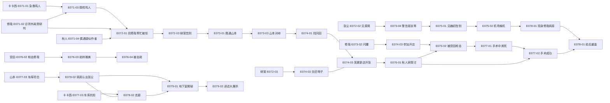

```mermaid
graph TD
    subgraph "东京中岛诊所"
        E071-01["E071-01：卡卡西送重伤昏迷的鸣人急救，中岛表示伤情极度严重"]
        E074-02["E074-02：佐助拒绝小樱同行及中岛医生开导，鸣人仍昏迷"]
    end
    subgraph "中岛诊所外"
        E071-02["E071-02：真纪向修哉说明局势，修哉展示张尘留信"]
    end
    subgraph "中岛诊所病房"
        E071-03["E071-03：修哉交出张尘留信，卡卡西震惊于鸣人异常自愈与张尘决绝"]
    end
    subgraph "秋人公寓/街头"
        E071-04["E071-04：秋人审视虚实界限，在街头偶遇疑似岸本齐史"]
    end
    subgraph "东京秋人家"
        E072-01["E072-01：卡卡西求修哉追踪张尘遭拒"]
        E076-01["E076-01：秋人为卡卡西画图并探讨漫画家心态"]
    end
    subgraph "东京某茶室"
        E072-02["E072-02：张尘主动现身与源晃暗流交锋，展示压迫感"]
    end
    subgraph "东京吴夏弦店面"
        E072-03["E072-03：卡卡西探寻张尘无果，柳絮表达独立决心"]
    end
    subgraph "日本某电子公司外"
        E073-01["E073-01：卡卡西回到公司偶遇山本澈受邀面谈"]
    end
    subgraph "东京修哉公寓"
        E073-02["E073-02：秋人探望闪腰的修哉并探讨虚拟与现实"]
    end
    subgraph "日本某电子公司内"
        E073-03["E073-03：山本澈坦诚监视并在听到张尘时忆起达斯特"]
    end
    subgraph "北京某街道"
        E073-04["E073-04：张尘临行前警告斑驳等人见红光躲避"]
    end
    subgraph "东京某咖啡厅"
        E074-01["E074-01：卡卡西从冈田处打听到山本早年网友DU_ST"]
    end
    subgraph "东京吴夏弦新店"
        E074-03["E074-03：众人穿COS服助吴夏弦开店，柳絮交还哨子告别"]
    end
    subgraph "日本某轿车内"
        E074-04["E074-04：李寺与源晃通话商议追踪宫田及防备张尘"]
    end
    subgraph "北京某写字楼"
        E075-01["E075-01：张尘向魏初告别并陷入回忆痛苦挣扎"]
    end
    subgraph "北京某机场"
        E075-02["E075-02：张尘在机场陷入自责动摇，郭家政誓死追随"]
    end
    subgraph "秋人家门外楼道"
        E076-02["E076-02：精神崩溃的宫田枪击修哉，卡卡西暴怒重创宫田"]
    end
    subgraph "某地下室及外围"
        E076-03["E076-03：宫田劫持雅美并将其错认为死去的沙沙，雅美假意配合"]
    end
    subgraph "急救中心/地下室外"
        E076-04["E076-04：雅美逃跑致宫田追出被源晃秘书击毙，修哉被抢救"]
    end
    subgraph "急救中心/建筑顶端"
        E077-01["E077-01：修哉心跳骤停濒死，郭家政狙杀源晃秘书向源晃示威"]
    end
    subgraph "东京某医院重症室"
        E077-02["E077-02：修哉手术成功脱险，卡卡西与秋人感慨生命"]
    end
    subgraph "某医院地下车库"
        E077-03["E077-03：山本向卡卡西坦白过去与中岛的谎言，卡卡西抗拒离去"]
    end
    subgraph "东京某医院病房"
        E078-01["E078-01：修哉苏醒与众人谈笑，张尘携花突然造访"]
    end
    subgraph "某医院病房/走廊"
        E078-02["E078-02：山本震惊认出张尘并试探修哉父兄往事"]
    end
    subgraph "东京街头/地下室"
        E078-03["E078-03：郭家政枪伤混混并在地下室确认部署，张尘招揽修哉"]
    end
    subgraph "日本某公司地下室通道"
        E079-01["E079-01：山本揭露卡卡西等人为人造实验体及修哉植入虚假记忆真相"]
    end
    subgraph "日本某公司地下室"
        E079-02["E079-02：山本讲述折原龙也毁掉研究所屠杀人造人及鸣人拼死保护卡卡西，卡卡西崩溃"]
    end

    E071-01 -->|"👤卡卡西, 鸣人, 中岛医生"| E071-03
    E071-02 -->|"👤真纪, 修哉"| E071-03
    E072-03 -->|"👤卡卡西, 真纪, 柳絮, C.wuxiaxian.WMAIN"| E074-03
    E073-01 -->|"👤卡卡西, 山本澈"| E073-03
    E076-02 -->|"👤修哉, 秋人, 卡卡西, 宫田拓也"| E076-04
    E076-03 -->|"👤宫田拓也, 佐佐木宪二, 源晃秘书, 源晃, 大场雅美"| E076-04
    E076-04 -->|"👤卡卡西, 秋人, 中岛医生, C.wuxiaxian.WMAIN, 真纪, 柳絮, 山本澈, 佐佐木宪二, 源晃秘书, 源晃, 大场雅美, 宫田拓也"| E077-01
    E077-01 -->|"👤修哉, 卡卡西, 中岛医生, C.wuxiaxian.WMAIN, 秋人, 真纪, 柳絮, 山本澈, 源晃秘书, 源晃, C.guojiazheng.WMAIN, 张尘"| E077-02
    E077-03 -->|"👤卡卡西, 山本澈, 中岛医生"| E079-01
    E078-01 -->|"👤修哉, 真纪, 卡卡西, C.wuxiaxian.WMAIN, 秋人, 医生, 张尘"| E078-02
    E079-01 -->|"👤卡卡西, 山本澈, 中岛医生, 修哉"| E079-02
```

# Ch71-79 细剖事件表

## 一、行 Schema

| event_uid | ch | 场景 | 在场者 | 动作 | 动机 | 因果后果 | 知识变动 | 物权/物件 | 干涉点候选 | canon_src |
|---|---|---|---|---|---|---|---|---|---|---|
| E071-01 | 71 | 东京中岛诊所·日 | C.kakashi.WMAIN, ~鸣人, ~中岛医生 | 卡卡西送重伤昏迷的鸣人急救，中岛表示伤情极度严重 | 急救同伴 | →E071-03 | | | | n70-87:L10± |
| E071-02 | 71 | 中岛诊所外·日 | ~真纪, C.xiuzai.WMAIN | 真纪向修哉说明局势，修哉展示张尘留信 | 局势研判 | →E071-03 | | | | n70-87:L122± |
| E071-03 | 71 | 中岛诊所病房·日 | C.kakashi.WMAIN, C.xiuzai.WMAIN | 修哉交出张尘留信，卡卡西震惊于鸣人异常自愈与张尘决绝 | 探视与交底 | 待续:鸣人异常体质 | C.kakashi.WMAIN ← 张尘决绝离开 | I.LETTER: 张尘留信交予卡卡西 | | n70-87:L236± |
| E071-04 | 71 | 秋人公寓/街头·日 | C.akito.WMAIN, ~岸本齐史 | 秋人审视虚实界限，在街头偶遇疑似岸本齐史 | 迷茫中寻求答案 | 待续:秋人漫画观 | | | | n70-87:L427± |
| E072-01 | 72 | 东京秋人家·日 | C.kakashi.WMAIN, C.akito.WMAIN, C.xiuzai.WMAIN | 卡卡西求修哉追踪张尘遭拒 | 寻找张尘下落 | | | | | n70-87:L495± |
| E072-02 | 72 | 东京某茶室·日 | C.zhangchen.WMAIN, ~源晃 | 张尘主动现身与源晃暗流交锋，展示压迫感 | 威慑与交易试探 | | ~源晃 ← 张尘知晓政府底牌 | | | n70-87:L652± |
| E072-03 | 72 | 东京吴夏弦店面·日 | C.kakashi.WMAIN, ~真纪, ~柳絮, C.wuxiaxian.WMAIN | 卡卡西探寻张尘无果，柳絮表达独立决心 | 探听消息与告别 | →E074-03 | | | | n70-87:L712± |
| E073-01 | 73 | 日本某电子公司外·日 | C.kakashi.WMAIN, ~山本澈 | 卡卡西回到公司偶遇山本澈受邀面谈 | 探寻真相与试探 | →E073-03 | | | | n70-87:L797± |
| E073-02 | 73 | 东京修哉公寓·日 | C.xiuzai.WMAIN, C.akito.WMAIN | 秋人探望闪腰的修哉并探讨虚拟与现实 | 关心与探讨 | | | | | n70-87:L832± |
| E073-03 | 73 | 日本某电子公司内·日 | C.kakashi.WMAIN, ~山本澈 | 山本澈坦诚监视并在听到张尘时忆起达斯特 | 逼问真相与摊牌 | 待续:山本澈过往 | C.kakashi.WMAIN ← 山本掌握自己动向 | | | n70-87:L906± |
| E073-04 | 73 | 北京某街道·日 | C.zhangchen.WMAIN, C.guojiazheng.WMAIN, ~斑驳, ~雨璇 | 张尘临行前警告斑驳等人见红光躲避 | 灾难预警与保护 | 待续:东方红光灾难 | | | ◎张尘预言的东方红光事件 | n70-87:L1011± |
| E074-01 | 74 | 东京某咖啡厅·日 | C.kakashi.WMAIN, ~冈田 | 卡卡西从冈田处打听到山本早年网友DU_ST | 追查山本底细 | | C.kakashi.WMAIN ← 山本网友为达斯特 | | | n70-87:L1122± |
| E074-02 | 74 | 东京中岛诊所·日 | ~佐助, ~小樱, ~中岛医生, ~鸣人 | 佐助拒绝小樱同行及中岛医生开导，鸣人仍昏迷 | 心理抵触与开导 | | | | | n70-87:L1179± |
| E074-03 | 74 | 东京吴夏弦新店·日 | C.wuxiaxian.WMAIN, ~真纪, ~柳絮, C.xiuzai.WMAIN, C.kakashi.WMAIN, C.akito.WMAIN | 众人穿COS服助吴夏弦开店，柳絮交还哨子告别 | 庆祝与心理蜕变 | | ~柳絮 ← 放下依赖追求独立 | I.WHISTLE: 柳絮将银哨子交还卡卡西 | | n70-87:L1243± |
| E074-04 | 74 | 日本某轿车内·日 | ~李寺, ~源晃 | 李寺与源晃通话商议追踪宫田及防备张尘 | 暗中合作防备 | | | | | n70-87:L1351± |
| E075-01 | 75 | 北京某写字楼·日 | C.zhangchen.WMAIN, C.weichu.WMAIN, C.guojiazheng.WMAIN | 张尘向魏初告别并陷入回忆痛苦挣扎 | 不舍与决断 | | | | | n70-87:L1434± |
| E075-02 | 75 | 北京某机场·日 | C.zhangchen.WMAIN, C.guojiazheng.WMAIN | 张尘在机场陷入自责动摇，郭家政誓死追随 | 极度心理压力 | | | | | n70-87:L1635± |
| E076-01 | 76 | 东京秋人家·日 | C.akito.WMAIN, C.kakashi.WMAIN | 秋人为卡卡西画图并探讨漫画家心态 | 探讨创作理念 | | | | | n70-87:L1687± |
| E076-02 | 76 | 秋人家门外楼道·日 | C.xiuzai.WMAIN, C.akito.WMAIN, C.kakashi.WMAIN, ~宫田拓也 | 精神崩溃的宫田枪击修哉，卡卡西暴怒重创宫田 | 无差别杀戮与反击 | →E076-04 | | | | n70-87:L1793± |
| E076-03 | 76 | 某地下室及外围·夜 | ~宫田拓也, ~佐佐木宪二, ~源晃秘书, ~源晃, ~大场雅美 | 宫田劫持雅美并将其错认为死去的沙沙，雅美假意配合 | 妄想与求生 | →E076-04 | | | | n70-87:L1913± |
| E076-04 | 76 | 急救中心/地下室外·夜 | C.kakashi.WMAIN, C.akito.WMAIN, ~中岛医生, C.wuxiaxian.WMAIN, ~真纪, ~柳絮, ~山本澈, ~佐佐木宪二, ~源晃秘书, ~源晃, ~大场雅美, ~宫田拓也 | 雅美逃跑致宫田追出被源晃秘书击毙，修哉被抢救 | 击毙凶手与抢救 | →E077-01 | | | | n70-87:L2063± |
| E077-01 | 77 | 急救中心/建筑顶端·夜 | C.xiuzai.WMAIN, C.kakashi.WMAIN, ~中岛医生, C.wuxiaxian.WMAIN, C.akito.WMAIN, ~真纪, ~柳絮, ~山本澈, ~源晃秘书, ~源晃, C.guojiazheng.WMAIN, C.zhangchen.WMAIN | 修哉心跳骤停濒死，郭家政狙杀源晃秘书向源晃示威 | 强硬示威与生死一线 | →E077-02 | | | | n70-87:L2188± |
| E077-02 | 77 | 东京某医院重症室·夜 | C.kakashi.WMAIN, C.akito.WMAIN, C.wuxiaxian.WMAIN, ~中岛医生, ~山本澈, ~医生, C.xiuzai.WMAIN | 修哉手术成功脱险，卡卡西与秋人感慨生命 | 抢救成功与感慨 | | | | | n70-87:L2308± |
| E077-03 | 77 | 某医院地下车库·夜 | C.kakashi.WMAIN, ~山本澈, ~中岛医生 | 山本向卡卡西坦白过去与中岛的谎言，卡卡西抗拒离去 | 揭露部分真相 | →E079-01 | C.kakashi.WMAIN ← 中岛关于穿越的说法是谎言 | | | n70-87:L2449± |
| E078-01 | 78 | 东京某医院病房·日 | C.xiuzai.WMAIN, ~真纪, C.kakashi.WMAIN, C.wuxiaxian.WMAIN, C.akito.WMAIN, ~医生, C.zhangchen.WMAIN | 修哉苏醒与众人谈笑，张尘携花突然造访 | 劫后重逢与突兀造访 | →E078-02 | | | | n70-87:L2532± |
| E078-02 | 78 | 某医院病房/走廊·日 | C.zhangchen.WMAIN, C.xiuzai.WMAIN, C.kakashi.WMAIN, ~山本澈 | 山本震惊认出张尘并试探修哉父兄往事 | 试探与恐慌 | | | | | n70-87:L2595± |
| E078-03 | 78 | 东京街头/地下室·日 | C.guojiazheng.WMAIN, ~维多·邦纳赛拉, ~混混黄毛, C.xiuzai.WMAIN, C.zhangchen.WMAIN | 郭家政枪伤混混并在地下室确认部署，张尘招揽修哉 | 扫清障碍与布局 | | | | | n70-87:L2705± |
| E079-01 | 79 | 日本某公司地下室通道·日 | C.kakashi.WMAIN, ~山本澈, ~中岛医生, C.xiuzai.WMAIN | 山本揭露卡卡西等人为人造实验体及修哉植入虚假记忆真相 | 彻底摊牌与负罪感 | →E079-02 | C.kakashi.WMAIN ← 自身是植入漫画记忆的人造人 | | ◎卡卡西得知人造人身世的毁灭性打击 | n70-87:L2774± |
| E079-02 | 79 | 日本某公司地下室·日 | ~山本澈, C.kakashi.WMAIN, ~Leonard, ~中岛医生, ~折原龙也, ~鸣人 | 山本讲述折原龙也毁掉研究所屠杀人造人及鸣人拼死保护卡卡西，卡卡西崩溃 | 历史揭秘与情感重创 | 待续:卡卡西崩溃后续 | C.kakashi.WMAIN ← 龙也曾屠杀人造人且鸣人拼死保护自己 | | | n70-87:L3101± |

## 二、生命线图

## 时序图

## 时序图

