# Ch80-89细剖事件表

| event_uid | ch | 场景 | 在场者 | 动作 | 动机 | 因果后果 | 知识变动 | 物权/物件 | 干涉点候选 | canon_src |
|---|---|---|---|---|---|---|---|---|---|---|
| E080-01 | 80 | 研究所废墟·夜 | ~山本澈, C.ryuya.WMAIN, ~鸣人 | 山本回忆龙也放弃对未被加载杀戮意识的卡卡西痛下杀手 | 悲悯与反思 | 待续:卡卡西存活 | | | | n70-87:L3242± |
| E081-01 | 81 | 某公司保险库·日 | C.kakashi.WMAIN, ~山本澈, ~波风水门 | 山本带卡卡西见培养皿中的水门告知潜意识真相，卡卡西崩溃欲毁之被阻 | 揭露身世真相 | 待续:卡卡西崩溃 | C.kakashi.WMAIN ← 自己潜意识被篡改及水门存活 | | ◎卡卡西得知水门存活并面临认知崩溃 | n70-87:L3279± |
| E081-02 | 81 | 某医院重症室·日 | C.xiuzai.WMAIN, ~真纪 | 修哉担忧雨中未归的卡卡西并催促真纪找人 | 牵挂与不安 | | | | | n70-87:L3392± |
| E082-01 | 82 | 东京街头·雨 | C.kakashi.WMAIN, ~小泽, ~流浪狗 | 卡卡西失魂落魄游荡拒绝小泽关心，将伞留给流浪狗 | 绝望中渴望认同 | | | | | n70-87:L3412± |
| E082-02 | 82 | 旅馆·雨 | C.kakashi.WMAIN, ~柳絮 | 柳絮偶遇崩溃的卡卡西带至旅馆照顾，卡卡西恳求其呼唤名字入睡 | 拯救与心理依偎 | | | | | n70-87:L3464± |
| E082-03 | 82 | 建筑顶端·日 | C.kakashi.WMAIN, C.zhangchen.WMAIN | 张尘开导卡卡西接受自我，遭狙击后卡卡西带张尘跳楼开启神威逃生 | 重新振作与反击 | 待续:向政府反击 | | | ◎卡卡西重拾自我并使用神威 | n70-87:L3550± |
| E083-01 | 83 | 某公司保险库·日 | C.kakashi.WMAIN, ~山本澈, ~波风水门 | 卡卡西试图对水门使用雷切但最终减弱并跪地崩溃，山本澈出言劝阻解释人造人生命存在意义。 | 认知崩塌中的毁灭与挣扎 | →E082-01 | | | ◎卡卡西因身世真相而在水门前信念崩溃 | n70-87:L3564± |
| E084-01 | 84 | 东京某小巷·夜 | C.xiuzai.WMAIN | 修哉根据线索查阅资料得知龙也被世界政府算计，陷入绝望 | 追查真相 | | | | | n70-87:L3748± |
| E084-02 | 84 | 瑞典总部据点·日 | ~费恩, ~佐井, ~大和 | 费恩下达革命一号待机任务，透露张尘意图阻止计划 | 启动肃清计划 | →E085-04 | | | | n70-87:L3789± |
| E084-03 | 84 | 东京集装箱上·夜 | C.zhangchen.WMAIN, C.xiuzai.WMAIN | 张尘向修哉传达龙也遗志，决意接受命运并摧毁它 | 传递遗志与结盟 | | C.xiuzai.WMAIN ← 龙也是为了阻止政府而死 | | | n70-87:L3869± |
| E085-01 | 85 | 东京D.S.据点·日 | C.kakashi.WMAIN, C.xiuzai.WMAIN, C.zhangchen.WMAIN | 卡卡西带修哉到据点，张尘要求修哉入侵天津卫星监控及电网 | 启动反击布局 | →E085-05 | | | | n70-87:L4036± |
| E085-02 | 85 | 天津市各处·日 | ~小社员, ~小妹妹, C.weichu.WMAIN, C.liuyuntian.WMAIN, ~老钱 | 天津市民照常生活，魏初等人看到东方天空泛红异样 | 日常被打破前兆 | | | | | n70-87:L4197± |
| E085-03 | 85 | 天津某中学·日 | ~敖斑驳, ~潘雨璇, ~黄天昊, ~钱老师 | 斑驳等人察觉异样通过全校广播呼吁全员避难 | 紧急避难呼吁 | | | | | n70-87:L4250± |
| E085-04 | 85 | 瑞典总部/天津上空·日 | ~费恩, ~佐井, ~大和, ~宇智波鼬 | 革命一号最后隔断开启，进入十分钟倒计时 | 实施毁灭打击 | | | | | n70-87:L4370± |
| E085-05 | 85 | 东京据点/天津市·日 | C.zhangchen.WMAIN, C.xiuzai.WMAIN | 张尘命令修哉十分钟内切断天津全城电网引发恐慌 | 争取生存几率 | 待续:天津市大停电 | | | | n70-87:L4403± |
| E085-06 | 85 | 天津市开发区·日 | ~小妹妹 | 倒计时结束，革命一号发射，小妹妹眼见周围人瞬间消失 | 毁灭性屠城 | 待续:天津市屠城惨状 | | | ◎革命一号发射导致天津市大屠杀 | n70-87:L4592± |
| E086-01 | 86 | 某教堂/回忆·日 | ~黄天昊, C.luojie.WMAIN | 黄天昊回忆在教堂遇到罗洁探讨信仰无力感 | 质疑信仰 | | | | | n70-87:L4603± |
| E086-02 | 86 | 天津某中学顶层·日 | ~黄天昊, ~敖斑驳, ~潘雨璇 | 黄天昊目睹屠城惨状极度崩溃，失控坠楼身亡 | 绝望与崩溃 | 待续:黄天昊死亡 | | | ◎黄天昊目睹惨状后坠楼身亡 | n70-87:L4656± |
| E086-03 | 86 | 天津救援现场·日 | ~费恩, ~佐井, ~大和, ~迪达拉 | 费恩带队伪装救援实则抹除叛徒，佐井偶遇实验体迪达拉 | 执行善后肃清 | | | | | n70-87:L4742± |
| E086-04 | 86 | 东京D.S.据点·日 | C.zhangchen.WMAIN, C.kakashi.WMAIN, C.xiuzai.WMAIN, ~山本澈 | 卡卡西等目睹屠城愤怒质问张尘，张尘解释世界政府目的与武器威力 | 揭示冷酷现实 | | | | | n70-87:L4799± |
| E087-01 | 87 | 东京D.S.据点·夜 | C.kakashi.WMAIN, C.xiuzai.WMAIN | 修哉分析张尘意在拉拢协助，卡卡西虽愤怒仍决定留下协助 | 确立同一阵线 | | | | | n70-87:L5021± |
| E087-02 | 87 | 瑞典总部实验室·日 | ~宇智波鼬, ~负责人 | 记忆错乱的鼬阅读佐助叛逃档案后被迫接受检测准备工作 | 沦为政府工具 | | ~宇智波鼬 ← 自身被加载虚假记忆及佐助叛逃 | | | n70-87:L5098± |
| E087-03 | 87 | 天津地铁站·夜 | ~卖保险的小哥, ~大叔, C.weichu.WMAIN, C.liuyuntian.WMAIN | 避难所恐慌，保险哥发辣条化解矛盾并带人出站探路 | 探索未知险境 | →E087-05 | | | | n70-87:L5151± |
| E087-04 | 87 | 东京D.S.据点·夜 | C.zhangchen.WMAIN, C.xiuzai.WMAIN | 修哉送饭致谢，张尘透露龙也最后遗言并独自背负罪孽 | 情感和解与宽慰 | | | | | n70-87:L5205± |
| E087-05 | 87 | 天津死城居民楼·夜 | ~卖保险的小哥, ~懒蛋 | 保险哥撬门救出幸存的肥猫懒蛋 | 绝境逢生 | | | | | n70-87:L5262± |
| E087-06 | 87 | 天津市街道·夜 | ~杨教授, ~政府执行员 | 逃出酒窖的杨教授被执行员抓住注射药物灭口 | 抹杀知情者 | | | | | n70-87:L5362± |
| E087-07 | 87 | 某教堂·夜 | C.zhangchen.WMAIN, C.kakashi.WMAIN | 张尘向卡卡西揭露政府永恒统治目的并推倒十字架露出地下通道 | 彻底反叛宣言 | →E087-08 | C.kakashi.WMAIN ← 世界政府的最终目的 | | | n70-87:L5541± |
| E087-08 | 87 | D.S.地下厅·夜 | C.zhangchen.WMAIN, C.kakashi.WMAIN, ~维多, C.guojiazheng.WMAIN | 张尘对部下发表演讲揭露独裁，众人以D.S.子弹誓言反抗命运 | 成立反抗军 | 待续:D.S.反抗军成立 | | I.BULLET: 铭刻D.S.符号的金色子弹 | ◎D.S.反抗军正式集结誓师 | n70-87:L5648± |
| E088-01 | 88 | 北京救援现场·日 | ~费恩, ~杨振国 | 费恩以教授资料试探逮捕背叛组织高层的杨振国，杨教授隐秘曝光。 | 清除叛逃高层的血脉 | | ~杨振国 ← 被告之父亲叛逃真相且自己被捕 | | | n88-107:L1± |
| E088-02 | 88 | 东京中岛诊所·日 | C.kakashi.WMAIN, ~中岛医生 | 中岛向卡卡西通报鸣人情况好转对外界有反应，卡卡西重新燃起对同伴的希望。 | 重现同伴生机与希望 | →E089-02 | | | | n88-107:L50± |
| E089-01 | 89 | 天津市避难所·日 | C.luojie.WMAIN, ~校长, ~救援队司机 | 老罗拒绝随校长专机撤离坚持等学生，回忆校长暗中策划的计划 | 坚守师德与愧疚 | | | | | n88-107:L1± |
| E089-02 | 89 | 天津避难所外·日 | C.luojie.WMAIN, C.zhangchen.WMAIN | 老罗认领黄天昊烧焦尸体，回忆起昔日与张尘的交往与愧疚 | 悲恸与反思 | | | | | n88-107:L50± |
| E089-03 | 89 | 天津市十六中·日 | C.luojie.WMAIN, ~佐井 | 老罗说服佐井同行离开避难所，巡视死城校园 | 寻求救赎之地 | →E089-05 | | | | n88-107:L100± |
| E089-04 | 89 | 国际机场专机·日 | ~校长 | 校长回忆是自己向政府推荐了张尘导致悲剧，深感懊悔 | 酿成大错的悔恨 | | | | | n88-107:L150± |
| E089-05 | 89 | 十六中池塘边·日 | C.luojie.WMAIN, ~佐井, ~费恩 | 老罗要求保证不伤害斑驳雨璇后跳塘自杀，佐井向费恩隐瞒两女行踪 | 殉道与保护 | | ~佐井 ← 斑驳雨璇的虚假死亡信息 | | ◎老罗跳塘自杀保护学生 | n88-107:L200± |

## 时序图

```mermaid
graph TD
    subgraph "研究所废墟"
        E080-01["E080-01：山本回忆龙也放弃对未被加载杀戮意识的卡卡西痛下杀手"]
    end
    subgraph "某公司保险库"
        E081-01["E081-01：山本带卡卡西见培养皿中的水门告知潜意识真相，卡卡西崩溃欲毁之被阻"]
        E083-01["E083-01：卡卡西试图对水门使用雷切但最终减弱并跪地崩溃，山本澈出言劝阻解释人造人生命存在意义"]
    end
    subgraph "某医院重症室"
        E081-02["E081-02：修哉担忧雨中未归的卡卡西并催促真纪找人"]
    end
    subgraph "东京街头"
        E082-01["E082-01：卡卡西失魂落魄游荡拒绝小泽关心，将伞留给流浪狗"]
    end
    subgraph "旅馆"
        E082-02["E082-02：柳絮偶遇崩溃的卡卡西带至旅馆照顾，卡卡西恳求其呼唤名字入睡"]
    end
    subgraph "建筑顶端"
        E082-03["E082-03：张尘开导卡卡西接受自我，遭狙击后卡卡西带张尘跳楼开启神威逃生"]
    end
    subgraph "东京某小巷"
        E084-01["E084-01：修哉根据线索查阅资料得知龙也被世界政府算计，陷入绝望"]
    end
    subgraph "瑞典总部据点"
        E084-02["E084-02：费恩下达革命一号待机任务，透露张尘意图阻止计划"]
    end
    subgraph "东京集装箱上"
        E084-03["E084-03：张尘向修哉传达龙也遗志，决意接受命运并摧毁它"]
    end
    subgraph "东京D.S.据点"
        E085-01["E085-01：卡卡西带修哉到据点，张尘要求修哉入侵天津卫星监控及电网"]
        E086-04["E086-04：卡卡西等目睹屠城愤怒质问张尘，张尘解释世界政府目的与武器威力"]
        E087-01["E087-01：修哉分析张尘意在拉拢协助，卡卡西虽愤怒仍决定留下协助"]
        E087-04["E087-04：修哉送饭致谢，张尘透露龙也最后遗言并独自背负罪孽"]
    end
    subgraph "天津市各处"
        E085-02["E085-02：天津市民照常生活，魏初等人看到东方天空泛红异样"]
    end
    subgraph "天津某中学"
        E085-03["E085-03：斑驳等人察觉异样通过全校广播呼吁全员避难"]
    end
    subgraph "瑞典总部/天津上空"
        E085-04["E085-04：革命一号最后隔断开启，进入十分钟倒计时"]
    end
    subgraph "东京据点/天津市"
        E085-05["E085-05：张尘命令修哉十分钟内切断天津全城电网引发恐慌"]
    end
    subgraph "天津市开发区"
        E085-06["E085-06：倒计时结束，革命一号发射，小妹妹眼见周围人瞬间消失"]
    end
    subgraph "某教堂/回忆"
        E086-01["E086-01：黄天昊回忆在教堂遇到罗洁探讨信仰无力感"]
    end
    subgraph "天津某中学顶层"
        E086-02["E086-02：黄天昊目睹屠城惨状极度崩溃，失控坠楼身亡"]
    end
    subgraph "天津救援现场"
        E086-03["E086-03：费恩带队伪装救援实则抹除叛徒，佐井偶遇实验体迪达拉"]
        E088-01["E088-01：费恩以教授资料试探逮捕背叛组织高层的杨振国，杨教授隐秘曝光"]
    end
    subgraph "瑞典总部实验室"
        E087-02["E087-02：记忆错乱的鼬阅读佐助叛逃档案后被迫接受检测准备工作"]
    end
    subgraph "天津地铁站"
        E087-03["E087-03：避难所恐慌，保险哥发辣条化解矛盾并带人出站探路"]
    end
    subgraph "天津死城居民楼"
        E087-05["E087-05：保险哥撬门救出幸存的肥猫懒蛋"]
    end
    subgraph "天津市街道"
        E087-06["E087-06：逃出酒窖的杨教授被执行员抓住注射药物灭口"]
    end
    subgraph "某教堂"
        E087-07["E087-07：张尘向卡卡西揭露政府永恒统治目的并推倒十字架露出地下通道"]
    end
    subgraph "D.S.地下厅"
        E087-08["E087-08：张尘对部下发表演讲揭露独裁，众人以D.S.子弹誓言反抗命运"]
    end
    subgraph "天津市避难所"
        E089-01["E089-01：老罗拒绝随校长专机撤离坚持等学生，回忆校长暗中策划的计划"]
    end
    subgraph "天津避难所外"
        E089-02["E089-02：老罗认领黄天昊烧焦尸体，回忆起昔日与张尘的交往与愧疚"]
        E088-02["E088-02：中岛向卡卡西通报鸣人情况好转对外界有反应，卡卡西重新燃起对同伴的希望"]
    end
    subgraph "天津市十六中"
        E089-03["E089-03：老罗说服佐井同行离开避难所，巡视死城校园"]
    end
    subgraph "国际机场专机"
        E089-04["E089-04：校长回忆是自己向政府推荐了张尘导致悲剧，深感懊悔"]
    end
    subgraph "十六中池塘边"
        E089-05["E089-05：老罗要求保证不伤害斑驳雨璇后跳塘自杀，佐井向费恩隐瞒两女行踪"]
    end

    E084-02 -->|"👤费恩, 佐井, 大和"| E085-04
    E085-01 -->|"👤卡卡西, 修哉, 张尘"| E085-05
    E087-03 -->|"👤卖保险的小哥, 大叔, 魏初, 刘云天"| E087-05
    E087-07 -->|"👤张尘, 卡卡西"| E087-08
    E089-03 -->|"👤C.luojie.WMAIN, 佐井"| E089-05
```

