```mermaid
graph TD
    subgraph "缅因州精神病院"
        E090-01["E090-01：莱纳德解救索恩并带他逃离精神病院"]
    end
    subgraph "修哉住处"
        E090-02["E090-02：修哉偷偷回家被真纪发现，真纪表达亲情"]
    end
    subgraph "天津避难所"
        E090-03["E090-03：刘云天阻拦德国人带走魏初被打"]
        E096-02["E096-02：刘云天从通风管逃出避难所"]
    end
    subgraph "避难所某房间"
        E090-04["E090-04：大和击退德国人救下魏初"]
    end
    subgraph "科技三角区"
        E091-01["E091-01：杰西接应莱纳德和索恩前往DS据点"]
    end
    subgraph "DS据点"
        E091-02["E091-02：张尘宣布对日本商场进行恐怖袭击"]
        E098-01["E098-01：卡卡西告知佐助宇智波鼬已抵达日本"]
    end
    subgraph "日本红灯区"
        E092-01["E092-01：卡卡西带被下药致幻的修哉离开"]
    end
    subgraph "日本警察署"
        E092-02["E092-02：张尘和郭家政假扮黑社会故意被捕入狱"]
    end
    subgraph "东京商场"
        E093-01["E093-01：修哉引爆东京商场炸弹引发连环爆炸"]
        E093-02["E093-02：修哉击败企图持枪制止他的新警员渡部"]
        E095-01["E095-01：佐佐木告知修哉折原正义当年抗争的真相"]
    end
    subgraph "世界政府总部"
        E094-01["E094-01：鼬受命前往日本销毁卡卡西左眼"]
    end
    subgraph "日本世界政府据点"
        E094-02["E094-02：张尘出狱后与维多、卡卡西在据点会合"]
        E097-01["E097-01：张尘与源晃谈判破裂"]
        E099-02["E099-02：鼬请求山崎改造机器人被拒"]
        E099-03["E099-03：源晃收到总部命令向DS宣战"]
    end
    subgraph "东京商场楼顶"
        E095-02["E095-02：卡卡西用雷切击毁直升机全灭先遣部队"]
        E095-03["E095-03：宇智波鼬抵达现场与卡卡西对峙"]
    end
    subgraph "天津街头"
        E096-01["E096-01：魏初逃跑时遇到同样逃出的斑驳和雨璇"]
        E098-02["E098-02：保险哥与化学老师用自制炸弹救下刘云天"]
    end
    subgraph "魏初公寓"
        E097-02["E097-02：魏初在家中遇到猫后晕倒"]
        E097-03["E097-03：刘云天和斑驳雨璇会合并安置昏迷的魏初"]
    end
    subgraph "日本街头"
        E099-01["E099-01：佐井向大和透露鹿丸之死真相"]
    end

    E090-01 -->|"👤C.luojie.WMAIN, 斯蒂芬·索恩"| E091-01
    E090-03 -->|"👤刘云天, 魏初, 德国人"| E090-04
    E090-04 -->|"👤大和, 魏初, 德国人"| E096-01
    E091-02 -->|"👤张尘, 修哉, 卡卡西, C.guojiazheng.WMAIN"| E093-01
    E092-02 -->|"👤张尘, C.guojiazheng.WMAIN"| E094-02
    E093-01 -->|"👤修哉"| E093-02
    E094-01 -->|"👤鼬, 负责人"| E095-03
    E095-02 -->|"👤卡卡西, 修哉"| E095-03
    E096-01 -->|"👤魏初, 斑驳, 雨璇"| E097-03
    E096-02 -->|"👤刘云天"| E097-03
    E097-02 -->|"👤魏初, 懒蛋"| E097-03
    E097-03 -->|"👤刘云天, 斑驳, 雨璇"| E098-02
```

# Ch90-99细剖事件表

| event_uid | ch | 场景 | 在场者 | 动作 | 动机 | 因果后果 | 知识变动 | 物权/物件 | 干涉点候选 | canon_src |
|---|---|---|---|---|---|---|---|---|---|---|
| E090-01 | 90 | 缅因州精神病院 | C.luojie.WMAIN, ~斯蒂芬·索恩 | 莱纳德解救索恩并带他逃离精神病院 | 救出索恩邀请其反击政府 | →E091-01 | | | | n88-107:L200± |
| E090-02 | 90 | 修哉住处 | C.xiuzai.WMAIN, ~真纪 | 修哉偷偷回家被真纪发现，真纪表达亲情 | 打消修哉顾虑 | | | | | n88-107:L300± |
| E090-03 | 90 | 天津避难所 | C.liuyuntian.WMAIN, C.weichu.WMAIN, ~德国人 | 刘云天阻拦德国人带走魏初被打 | 德国人欲带走魏初 | →E090-04 | | | | n88-107:L400± |
| E090-04 | 90 | 避难所某房间 | ~大和, C.weichu.WMAIN, ~德国人 | 大和击退德国人救下魏初 | 大和暗中保护魏初 | →E096-01 | | | | n88-107:L500± |
| E091-01 | 91 | 科技三角区 | C.luojie.WMAIN, ~斯蒂芬·索恩, ~杰西 | 杰西接应莱纳德和索恩前往DS据点 | 杰西负责接应 | | | | | n88-107:L600± |
| E091-02 | 91 | DS据点 | C.zhangchen.WMAIN, C.xiuzai.WMAIN, C.kakashi.WMAIN, C.guojiazheng.WMAIN | 张尘宣布对日本商场进行恐怖袭击 | 制造袭击吸引政府注意 | →E093-01 | | | | n88-107:L700± |
| E092-01 | 92 | 日本红灯区 | C.kakashi.WMAIN, C.xiuzai.WMAIN | 卡卡西带被下药致幻的修哉离开 | 修哉被下药致幻 | | | | | n88-107:L800± |
| E092-02 | 92 | 日本警察署 | C.zhangchen.WMAIN, C.guojiazheng.WMAIN | 张尘和郭家政假扮黑社会故意被捕入狱 | 故意被抓制造不在场 | →E094-02 | | | | n88-107:L900± |
| E093-01 | 93 | 东京商场 | C.xiuzai.WMAIN | 修哉引爆东京商场炸弹引发连环爆炸 | 执行恐怖袭击计划 | →E093-02 | | | | n88-107:L1000± |
| E093-02 | 93 | 东京商场 | C.xiuzai.WMAIN, ~渡部 | 修哉击败企图持枪制止他的新警员渡部 | 渡部试图阻止爆炸 | | | | | n88-107:L1100± |
| E094-01 | 94 | 世界政府总部 | ~鼬, ~负责人 | 鼬受命前往日本销毁卡卡西左眼 | 总部下达清除命令 | →E095-03 | ~鼬 ← 销毁卡卡西左眼命令 | | | n88-107:L1200± |
| E094-02 | 94 | 日本世界政府据点 | C.zhangchen.WMAIN, ~维多, C.kakashi.WMAIN, ~山崎聪 | 张尘出狱后与维多、卡卡西在据点会合 | 准备攻陷日本据点 | | | | | n88-107:L1300± |
| E095-01 | 95 | 东京商场 | ~佐佐木宪二, C.xiuzai.WMAIN | 佐佐木告知修哉折原正义当年抗争的真相 | 坦白过去以阻止修哉 | | C.xiuzai.WMAIN ← 父亲的真相 | | ◎修哉得知真相 | n88-107:L1500± |
| E095-02 | 95 | 东京商场楼顶 | C.kakashi.WMAIN, C.xiuzai.WMAIN | 卡卡西用雷切击毁直升机全灭先遣部队 | 掩护修哉 | →E095-03 | | | | n88-107:L1600± |
| E095-03 | 95 | 东京商场楼顶 | C.kakashi.WMAIN, ~鼬 | 宇智波鼬抵达现场与卡卡西对峙 | 鼬执行清除任务 | | | | | n88-107:L1700± |
| E096-01 | 96 | 天津街头 | C.weichu.WMAIN, ~斑驳, ~雨璇 | 魏初逃跑时遇到同样逃出的斑驳和雨璇 | 逃离避难所 | →E097-03 | | | | n88-107:L1800± |
| E096-02 | 96 | 天津避难所 | C.liuyuntian.WMAIN | 刘云天从通风管逃出避难所 | 寻找逃生出路 | →E097-03 | | | | n88-107:L1900± |
| E097-01 | 97 | 日本世界政府据点 | C.zhangchen.WMAIN, ~源晃 | 张尘与源晃谈判破裂 | 源晃为保护家人拒绝 | | | | | n88-107:L2000± |
| E097-02 | 97 | 魏初公寓 | C.weichu.WMAIN, ~懒蛋 | 魏初在家中遇到猫后晕倒 | 疲劳过度导致晕倒 | →E097-03 | | | | n88-107:L2100± |
| E097-03 | 97 | 魏初公寓 | C.liuyuntian.WMAIN, ~斑驳, ~雨璇 | 刘云天和斑驳雨璇会合并安置昏迷的魏初 | 在魏初住处碰面 | →E098-02 | | | | n88-107:L2200± |
| E098-01 | 98 | DS据点 | C.kakashi.WMAIN, ~佐助 | 卡卡西告知佐助宇智波鼬已抵达日本 | 提醒佐助其兄长动向 | | ~佐助 ← 鼬抵达日本 | | | n88-107:L2400± |
| E098-02 | 98 | 天津街头 | C.liuyuntian.WMAIN, ~保险哥, ~化学老师 | 保险哥与化学老师用自制炸弹救下刘云天 | 击退追捕刘云天的军人 | | | | | n88-107:L2600± |
| E099-01 | 99 | 日本街头 | ~佐井, ~大和 | 佐井向大和透露鹿丸之死真相 | 讨论世界政府和鹿丸 | | ~大和 ← 鹿丸之死真相 | | | n88-107:L2800± |
| E099-02 | 99 | 日本世界政府据点 | ~鼬, ~山崎聪 | 鼬请求山崎改造机器人被拒 | 试图解除查克拉抑制 | | | | | n88-107:L2900± |
| E099-03 | 99 | 日本世界政府据点 | ~源晃, ~鼬 | 源晃收到总部命令向DS宣战 | 总部决定全面清剿DS | | ~源晃 ← 总部宣战命令 | | | n88-107:L3100± |

## 时序图

## 时序图

